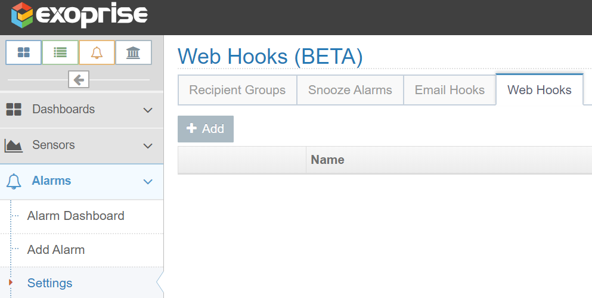
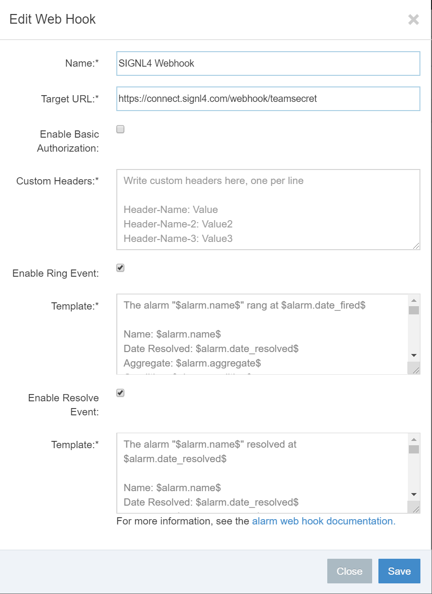
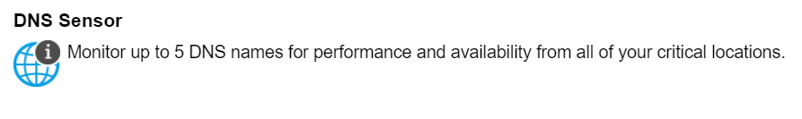
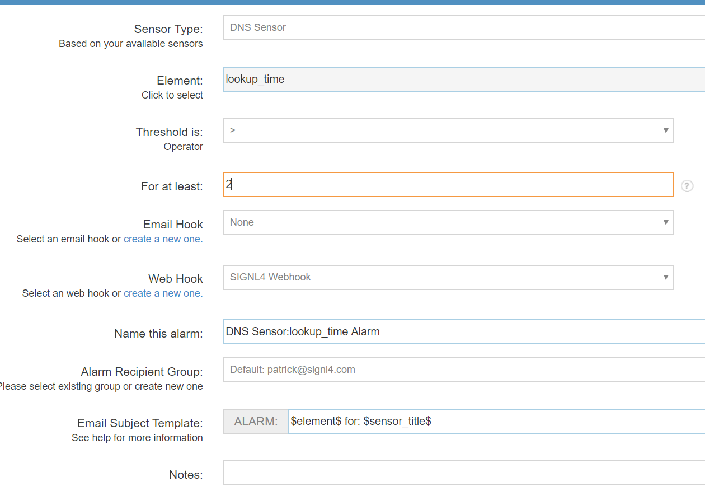
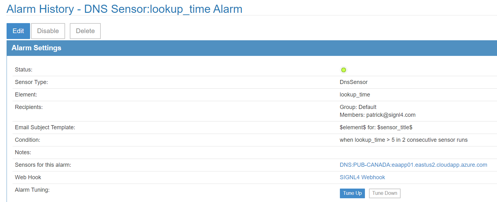

# SIGNL4 Integration with Exoprise

[Exoprise](https://secure.exoprise.com/) is a hybrid monitoring tool that detects, diagnoses and resolves issues related to applications, user management, server monitoring and much more. Exoprise will send out emails but where SIGNL4 comes in is the ease of managing an on-call team with instant collaboration and ownership of those alerts.   Persistent notifications and tier escalation within SIGNL4 ensures that critical alarms are not missed. Issues are taken beyond the dashboard and inbox and delivered via Push, SMS, and Voice.

In our example we are using Exoprise to monitor the DNS name of an application running on Azure servers.  We are forwarding alarm notifications to the SIGNL4 team via web hook to receive the alerts.

SIGNL4 is a mobile alert notification app for powerful alerting, alert management and mobile assignment of work items.  Get the app at [https://www.signl4.com](https://www.signl4.com/)

## Prerequisites

- A SIGNL4 ([https://www.signl4.com](https://www.signl4.com/)) account
- An Exoprise ([https://secure.exoprise.com/](https://secure.exoprise.com/) ) account

## How to Integrate

First let’s setup a webhook so that alarms from Exoprise can reach SIGNL4. Under Alarms, choose Settings and select the Web Hooks tab.

Click Add and populate the URL with the SIGNL4 webhook.

Now we will use the Ping Sensor to monitor our application. Cloud Ready Ping Sensors proactively monitor network connectivity, performance and up-time for up to 5 different network endpoints.  Under Sensors click add Sensor, choose Public Site and select DNS Sensor from the list.

Walk through the wizard inputting the URL of the application and follow the prompts.

Assign an alarm to the sensor choosing the SIGNL4 Webhook created earlier.

The next time the alarm triggers, it will send the data to the SIGNL4 team.

The alarm can be augmented into an easy read format using the Services & Systems section in the mobile app.

The alert in SIGNL4 might look like this.

