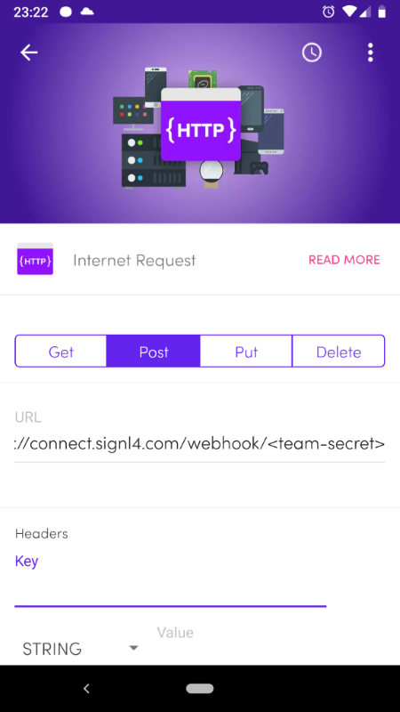
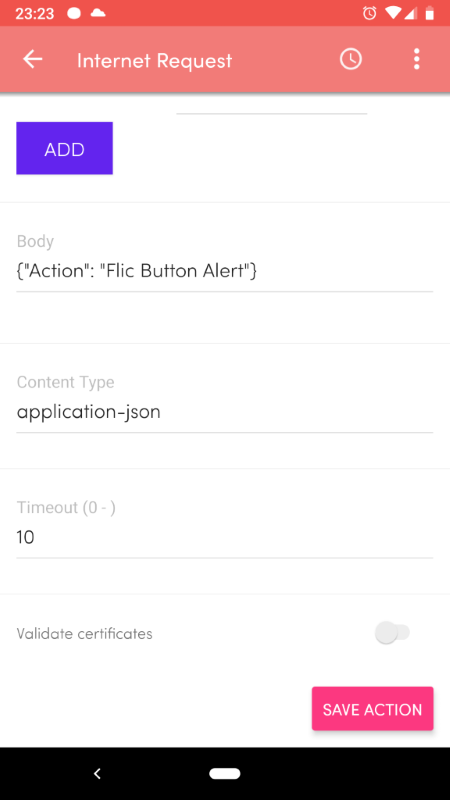
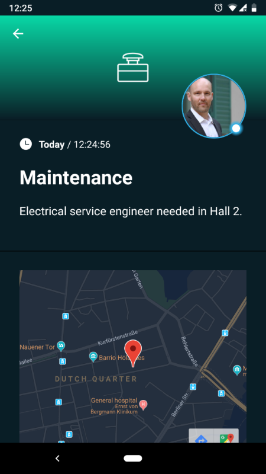

# SIGNL4 Integration with Flic Buttons

Flic buttons, provide a quick and simple possibility to trigger any kind of action at a push of a button. The button connects to the Flic hub or to an android phone via low-energy Bluetooth. Pairing one or more [Flic buttons](https://flic.io/) with SIGNL4 can enhance your daily operations with an extension to your mobile team in the field or on the shop floor.

In our example we use one Flic button to notify a team of service engineers about needed assistance on-site.

SIGNL4 is a mobile alert notification app for powerful alerting, alert management and mobile assignment of work items. Get the app at [https://www.signl4.com](https://www.signl4.com/).

Flic is a wireless (Bluetooth) button adaptable to almost any use case or application. It is combines reliability, security and speed. Find out more at [https://flic.io](https://flic.io/).

## Prerequisites

- A [SIGNL4](https://www.signl4.com/) account Access to the [Google Cloud Platform](https://console.cloud.google.com/)
- A [Flic button](https://flic.io/)
- An Android phone and the [Flic app](https://play.google.com/store/apps/details?id=io.flic.app)
- Alternatively to the Android app you can also use the [Flic Hub](https://flic.io/flic-hub)

## The SIGNL4 App

If not already available, download the SIGNL4 app for [Android](https://play.google.com/store/apps/details?id=com.derdack.signl4) or [iOS](https://apps.apple.com/us/app/signl4-mobile-alerting/id1100283480), register and invite your team members.

### Pair your Flic Button with your Android Phone

Get the Flic Android app and pair your Flic button with the app.

Alternatively you can also use the [Flic Hub](https://www.youtube.com/watch?v=YpfHPP9VQ8M).

## Configure your Actions in the Flic App

Now you can configure what shall happen if someone presses (or long-click, or double-click) the Flic button.

In the Flic app, select Internet Request and then choose HTTP Post.

As URL you enter your SIGNL4 REST API URL including the team secret.

The Body is any JSON you would like to pass as alert notification.

And the Content Type is application-json (application/json).

This is it.

## Test it

Now you can press the button and the SIGNL4 HTTP request is triggered. You will then receive the notification on your phone.

The alert in SIGNL4 might look like this.

