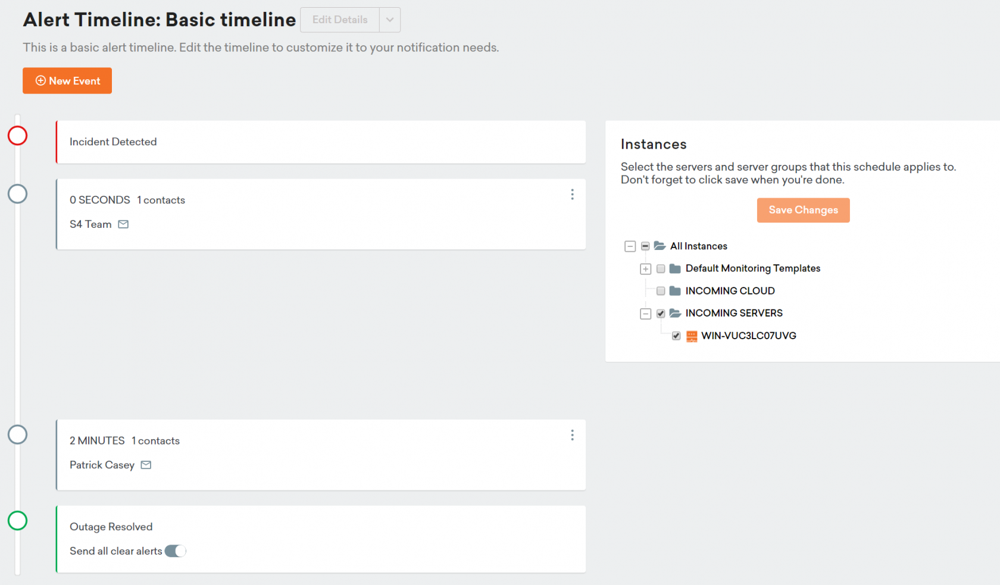
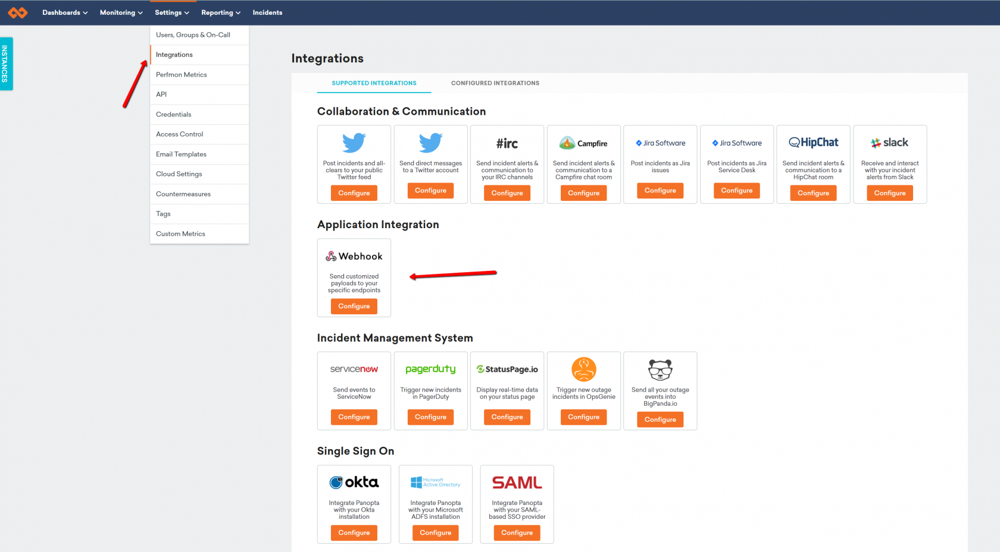
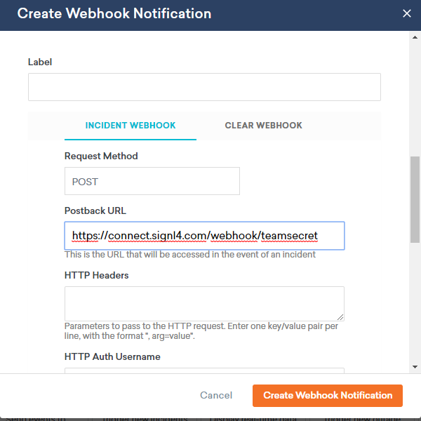
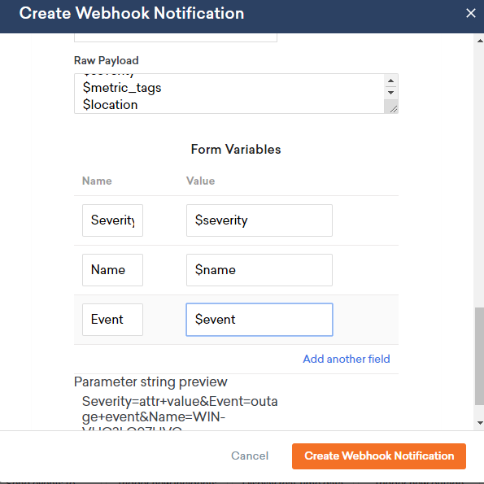
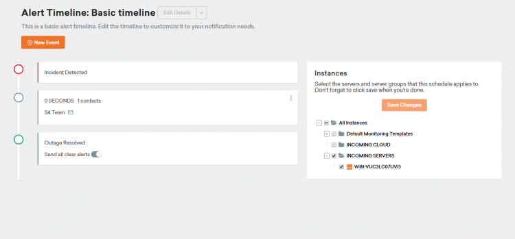

# SIGNL4 Integration with FortiMonitor

## How to Integrate

[FortiMonitor](https://www.fortinet.com/products/fortimonitor) by Fortinet can send out alerts, but all too often the emails that are sent from critical events are missed. SIGNL4 ensures that all on duty members receive, acknowledge and resolve those critical alerts, all from their smartphones. With persistent notifications and escalation chains there will never be a critical alert that goes unattended. SIGNL4 also offers ad-hoc collaboration between team members for each and every alert, so subject matter experts can be looped in to help resolve issues.

## Email Integration

First create a user within Panopta and provide that user with the SIGNL4 team email address.

Assign that user to an alert timeline.

Now Alerts that are triggers will be immediately sent to the SIGNL4 team.

## Webhook Integration

From the Integrations menu option you can select Webhook.

Select POST and put in the SIGNL4 webhook URL.

Using the parameters given in the webhook creation section will allow you specifically choose which data is import for SIGNL4 to receive.

Lastly, simply add this Webhook to an alert timeline.

[

Alerts can be augmented to display colors, icons and specific sounds.  These settings are found with the mobile app under Services & Systems.

The alert in SIGNL4 might look like this.

