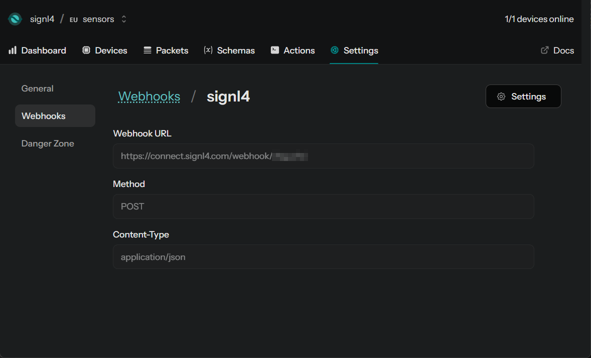
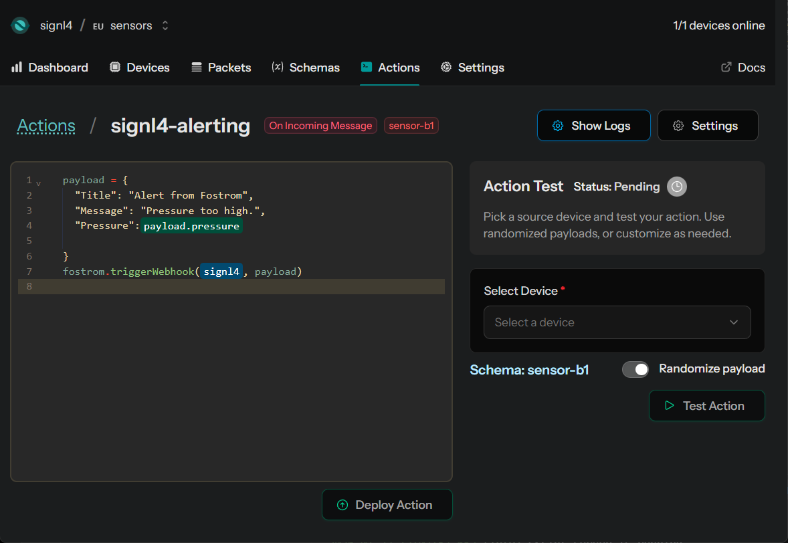

# SIGNL4 Integration with Fostrom

[Fostrom](https://fostrom.io/) is a developer-focused IoT cloud platform that helps you monitor and control fleets of connected devices – from microcontrollers to industrial hardware. It offers easy-to-use Device SDKs, type-safe data schemas, and programmable actions to build, automate, and manage real-world IoT systems securely and at scale.

SIGNL4 adds reliable mobile alerting to Fostrom via app push notifications, SMS text messages, or voice calls. It also supports escalations, on-call scheduling, and team collaboration.

## Prerequisites

- A [SIGNL4](https://www.signl4.com/) account
- A [Fostrom](https://fostrom.io/) account

## How to Integrate

Integrating SIGNL4 mobile alerting with Fostrom is straightforward and is done using a webhook. Here is how it works.

You can get a good first overview of how Fostrom works [here](https://fostrom.io/blog/introducing-fostrom).

### Webhook

First, create a SIGNL4 webhook in Fostrom. In your Fostrom web portal, go to Settings -> Webhooks and create a new webhook using your SIGNL4 webhook URL, the POST method, and the application/json content type.



### Action

Next, go to Actions and create a new action that sends the alert using the webhook configured in the previous step.



The code for sending the webhook could look like this:

```javascript
payload = {
  "Title": "Alert from Fostrom",
  "Message": "Pressure too high.",
  "Pressure":payload.pressure
  
}
fostrom.triggerWebhook(signl4, payload)
```

You can configure the JSON alert payload according to your needs. You can also add additional functionality, such as conditions or logic to control when alerts are triggered.

## Test it

That’s it. You can now test your action directly from the Actions page. You should then receive an alert in your SIGNL4 app.

The alert in SIGNL4 might look like this.


