# SIGNL4 Integration with Freshdesk

[Freshdesk](https://freshdesk.com/) is the sleek SaaS ticketing system from [Freshworks](https://www.freshworks.com/). This service allows teams to streamline their support channels and communicate effectively to solve issues as this happens. Support does not have to end at the dashboard. Integrate Freshdesk with SIGNL4 to extend your support team’s operations with actionable real-time alerting.

## Freshdesk: Getting started

The Freshdesk connector app makes 2-way integration with Freshdesk a a child's play and responding to service desk tickets can be done conveniently via the SIGNL4 mobile app.

## Feature overview

- Forwarding tickets of your choice to SIGNL4 (via Freshdesk Automation Rule)
- Status synchronization between both systems (via Freshdesk Automation Rules)
- Agent assignment when Signl is acknowledged and or closed
- Ticket notes on status changes in SIGNL4
- User friendly display of linked items (e.g. products or company names)

## How does it work?

The connector app will provide a dedicated webhook that is used for communication from Freshdesk to SIGNL4. It is used in 3 Automation Rules to:

- Forward new tickets of your choice to SIGNL4
- Automatically acknowledge Signls when ticket is updated in Freshdesk
- Automatically close Signls when ticket is updated in Freshdesk

There is two more Automation Rules that control how tickets are updated (e.g. status change) in Freshdesk when

- Signls are acknowledged in SIGNL4
- Signls are closed in SIGNL4  
    Both rule trigger on a new note (interaction) on the ticket which in fact is added by this connector app on those Signl status changes.

All rules are created for your convenience fully automatically when the connector app is created.

The connector communicates with the Freshdesk REST API to read ticket details or to create automation rules. According permissions must be enabled in the role of the agent user account of which you want to let SIGNL4 use its API. It is recommended to create a dedicated agent account in Freshdesk for SIGNL4.

## Freshdesk: Setup and required permissions

When you create a new connector app instance in any of your SIGNL4 teams, you can configure some parameters or you leave it with the default values. In any case there is two fields that you need to specify and which do not have default values:

- **Freshdesk Instance URI**
    - This is simply the main URI of your Freshdesk account. An example is  
        [https://signl4.freshdesk.com/](https://signl4.freshdesk.com/)
- **API key**
    - SIGNL4 uses the Freshdesk REST API ([https://developers.freshdesk.com/api/)](https://developers.freshdesk.com/api/)) to setup some required assets in Freshdesk and to read ticket data or linked entities (e.g. retrieving the name of a company a ticket belongs to). Read through the next sections to learn how to create an awesome API key in Freshdesk so that you can enter it in the app configuration.

### How to create the API key in Freshdesk?

API keys in Freshservice belong to agent user accounts. Each agent can find his/her API key in the personal profile menu. The easiest thing you could do is to use the API key of the Freshservice account owner. That user has of cause all permissions and thus its API key is suitable for all API actions the connector app uses.

#### Creating an integration user account

However, this is most likely not what you want as you don't want to hand out such a "master" key to a 3rd party application like SIGNL4. Instead, what you want to do is creating a dedicated integration agent user account specifically for SIGNL4. A nice guide on how to add agents can be found here: [https://support.freshdesk.com/support/solutions/articles/37591-adding-new-support-agents-](https://support.freshdesk.com/support/solutions/articles/37591-adding-new-support-agents-)

_**Note**_: When you create the agent you must use an email address that you have access to because an activation link will be sent to that email address. You may need to register a temporary mailbox in order to accomplish that.

During agent creation, assign this user the agent role, we will change this later on.

#### Create a dedicated user role with streamlined permissions

Next, you'll create a new user role in Freshdesk specifically for SIGNl4. A great article how this can be done is available here: [https://support.freshdesk.com/support/solutions/articles/97077-how-to-create-a-new-custom-role-and-why-](https://support.freshdesk.com/support/solutions/articles/97077-how-to-create-a-new-custom-role-and-why-)

_**Note**_: The Agent Type of the role must be "Support agent".

All required permissions can be found in the screenshot below. It's recommended that in your role you tick the exact same boxes.

A few words on the required "Admin permissions":

- _Manage all agents (Assume identity)_
    - SIGNL4 adds notes to tickets, e.g. when mobile agents are adding some annotations in the SIGNL4 mobile app. If this box is ticked, SIGNL4 can impersonate these agents and the ticket activity log will show their profile picture with the notes that were added. This works for other agents but not for other admins (even with this box ticked, SIGNL4 cannot impersonate users with higher roles than it has itself)
- _Play God with Super Admin controls_
    - This option is required to be able to read ticket fields ([https://developers.freshdesk.com/api/#ticket-fields](https://developers.freshdesk.com/api/#ticket-fields)). The connector reads these fields and is then able to create very user friendly Signls in which you can read the name of a status (e.g. 'Pending') instead of its id. Same goes for priority, etc.

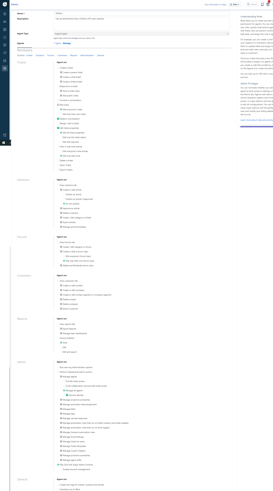

SIGNL4 does a lot of GET methods on the API (e.g. tickets, companies, products) to be able to compose user friendly tickets. It does the POST/PUT method on the ticket for agent assignment or adding notes. It however never does a DELETE method at all.

### Putting all pieces together

Once the agent account and user role has been created, it is very simple to get your API key:

- Open the details of the created agent user account for SIGNL4
- Remove all existing roles from it
- Add the recently created SIGNL4 user role to the agent user account
- Log in as the created agent
- Navigate to your profile details and extract your API key as described here: [https://support.freshdesk.com/support/solutions/articles/215517-how-to-find-your-api-key](https://support.freshdesk.com/support/solutions/articles/215517-how-to-find-your-api-key)
- Copy the key and paste it in the SIGNL4 connector app config in the "API key" field.
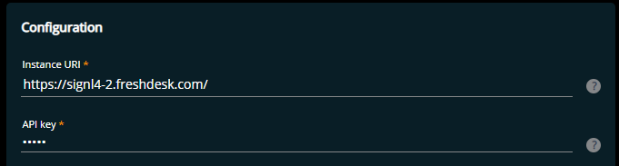

## Freshdesk:Which tickets are forwarded to SIGNL4?

The Freshdesk connector app creates a new automation rule in Freshdesk automatically when it is started for the first time. You can find all the details about that automation rule in this article.

### Understanding the default automation rule

By default this rule has the name "Forward to SIGNL4".

It triggers for newly created tickets only and created tickets must be of type "incident".

Whenever this criteria matches newly created tickets in your Freshdesk account, the rule action is executed which is a webhook call to SIGNL4. It basically communicates the id of a ticket that should be fetched by SIGNL4 and afterwards be notified to people on duty.

Do not change the URL or the composed body of that rule action.

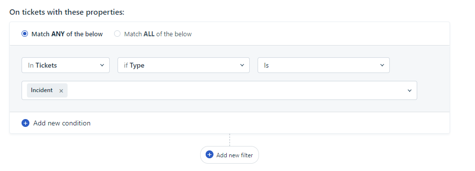

### Can I change the rule criteria?

Yes, you can. You can adjust the required ticket properties as you like. If you want to change it to a rule that triggers on ticket updates, you need to create a corresponding ticket update rule with the same name and remove the old rule.

### Can I rename the rule?

Yes, this is possible but you then need to make sure that the new rule name is updated in the connector configuration as well (entered in the field "_Automation Rule Name - Triggering Signls_")

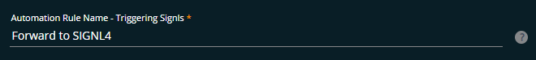

### Can I use multiple rules to forward tickets?

Yes, this is possible. But the first or originally created rule must remain and its name must always be configured in the connector app configuration field "_Automation Rule Name - Triggering Signls_". In other rules (for created or updated tickets) you need to configure the exact same webhook action to attach other forwarding rules to your connector app instance.

### Summary

You can adjust and configure which kind of tickets you what to forward to SIGNL4.

It is recommended to configure your ticket creation rule processing in a way that all matching rules are executed and not just the first one matching:

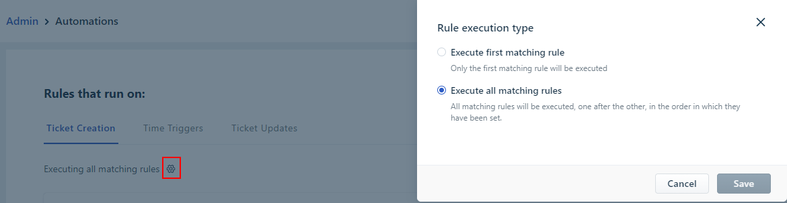

## Configure ticket updates when in Freshdesk Signls change status

When Signls are acknowledged or closed in SIGNL4, corresponding tickets in Freshdesk can be updated in a way you like. Read all details in this article.

### How it works

A Signl status change (acknowledged or closed) each triggers a dedicated automation rule in Freshdesk. These rules define how a ticket is changed in each of the cases. An exception here is adding agent notes or an agent assignment. These activities are done by the connector app directly and are not controlled by the automation rules.

In fact, the addition of a note in these cases servers each as the rule trigger. In other words, due to some technical limitations it is not possible to not add a note to a ticket but have its status changed when a Signl is acknowledged or closed.

The connector app creates both update trigger automation rules (default names "Was acknowledged in SIGNL4" and "Was closed in SIGNL4") automatically when it is starts for the first time.

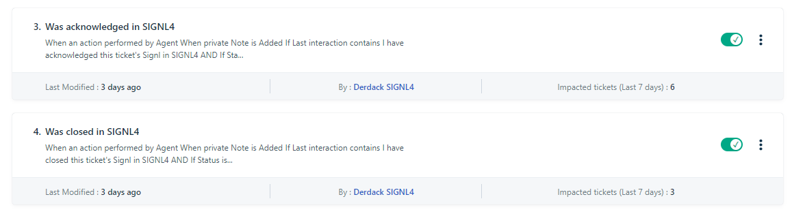

### Understanding and customizing automation rules

Both rules are created as 'ticket updated' automation rules. They both trigger on a new note being added to a ticket (recent interaction). This note is a static text that you each configure in the connector app configuration ("_Note on Signl acknowledged_" and "_Note on Signl closed_").

The action of both rules consist of each a ticket status change. The rule for an acknowledged Signl updates the ticket status to "Pending", the rule for Signl closed updates the status to "Resolved".

In both rules you can change the actions as you like. Examples are group assignments or updating to another ticket status.

However, do not change the rule criteria part and make sure that the note text matches the configured note in the connector app configuration.

If you don't want to work with these kind of ticket updates when a Signl is acknowledged or closed, you can simply uncheck "_Acknowledged in SIGNL4 -> Update in FD_" and/or "_Acknowledged in SIGNL4 -> Update in FD_" in the connector app configuration field "_Status mappings_"

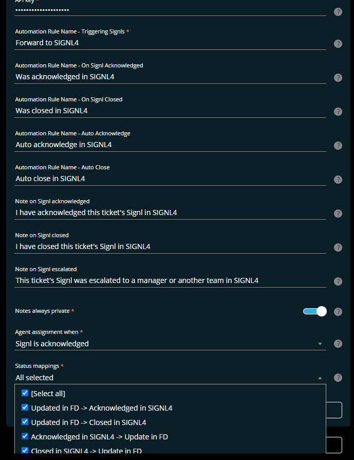

### Agent assignments

Assignments of agents that have acknowledged or closed Signls in SIGNL4 is done by the Freshdesk connector app directly and is not based on any automation rule in Freshdesk.

The connector app has an extra setting "_Agent assignment when_" which allows you to select Signl status changes that will also assign the according SIGNL4 user as agent to the ticket in Freshdesk. Users are matched by their email addresses in both systems.

If you don't want to work with agent assignments in your environment, simply deselect all items in the dropdown box.

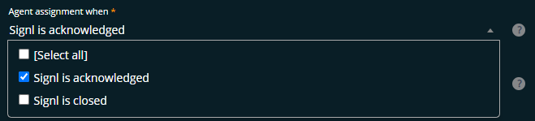

### Agent notes

When users in SIGNL4 add annotations to Signls, they will be added to the ticket as well. You can select if they should be visible to customers or not using the configuration option "_Notes always private_".

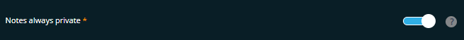

## Freshdesk: Configure automatic Signl status updates

When tickets change status in Freshdesk corresponding Signls in SIGNL4 can change their status well. Read all details in this article.

### How it works

When a ticket was forwarded to SIGNL4 (read details here) and its status is afterwards updated in Freshdesk, the triggered Signl can be auto-updated as well. These status updates are triggered by 2 dedicated automation rules wich are automatically created in Freshdesk when the connector app is started for the first time.

The ticket update automation rule "_Auto acknowledge in SIGNL4_" manages a Signl status update to "Acknowledged" while "_Auto close in SIGNL4_" closes a corresponding Signl in Signl.

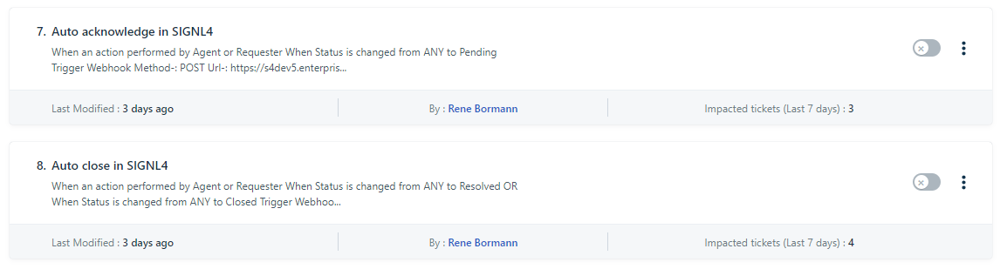

## Understanding and customizing automation rules

Both rules trigger on certain ticket status updates initiated by a requester or agent in Freshdesk. By default, they trigger when the ticket status is updated from any status to "Pending" (automatic acknowledgement of the Signl) or when it changes from any status to either "Resolved" or "Closed" (automatic closure of the Signl).

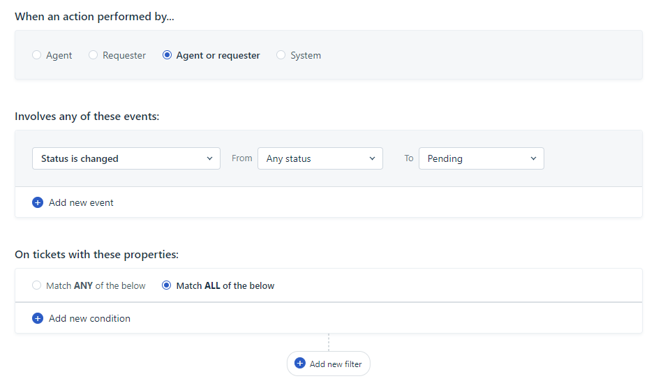

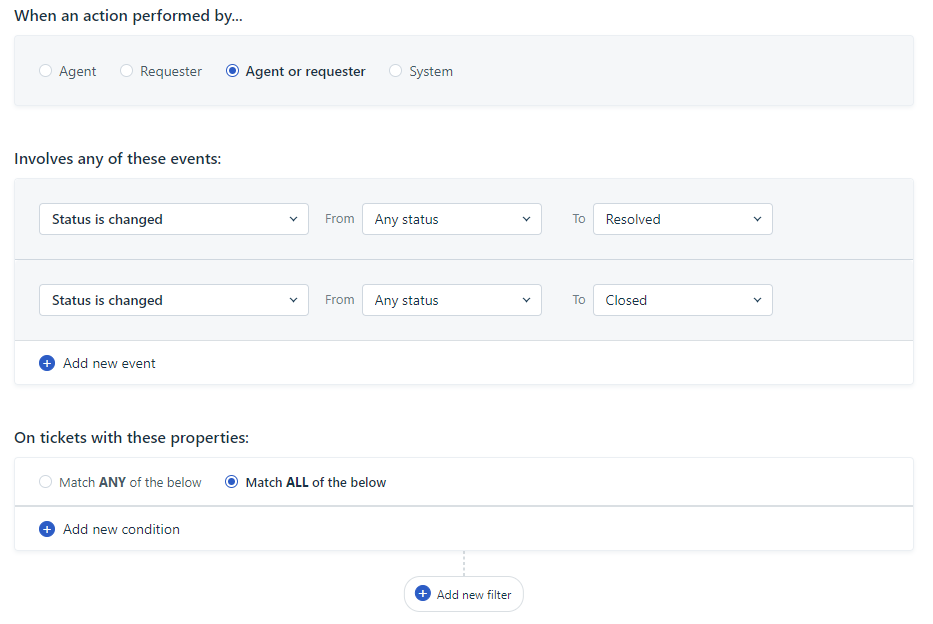

Both rules contain a dedicated webhook action that will auto acknowledge or auto close the Signl of that ticket in SIGNL4. Do not change the webhook action when you customize the rule.

If you want to change when Signls are automatically acknowledged or closed, you may adjust the events - and ticket properties section in the rules.

If you change the name of the rule, make sure you als update the corresponding connector app configuration fields "_Automation Rule Name - Auto Acknowledge_" and "_Automation Rule Name - Auto Close_" as well.

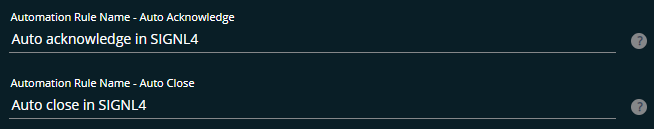

The alert in SIGNL4 might look like this.

