# SIGNL4 Integration with Freshservice

[Freshservice](https://freshservice.com/), the intuitive SaaS IT helpdesk system from [Freshworks](https://www.freshworks.com/), empowers teams to streamline support workflows and address issues efficiently. However, effective support shouldn’t stop at the dashboard. By integrating Freshservice with SIGNL4, you can elevate your support team’s capabilities with automated, real-time, actionable alerts directly to your mobile, keeping you informed and responsive anytime, anywhere.  
SIGNL4’s Freshservice connector app simplifies 2-way integration with Freshservice, making it effortless to manage and resolve service desk tickets directly through the SIGNL4 mobile app.

## Key Benefits

- **Smart Ticket Forwarding**: Automatically forward selected tickets to SIGNL4 via the Freshservice Automator, ensuring critical issues are never missed.
- **Seamless Status Synchronization**: Keep both systems in sync with automatic updates via Freshservice Automators, ensuring real-time visibility across platforms.
- **Agent Assignment**: Assign agents automatically when a SIGNL4 alert (Signl) is acknowledged or closed, enhancing accountability and efficiency.
- **Detailed Ticket Notes**: Capture and log status changes in SIGNL4, ensuring a comprehensive audit trail.
- **Clear Display of Linked Items**: Easily access related details such as products or company names for better context and faster resolution.

By integrating SIGNL4 and Freshservice, your team can resolve incidents faster, meet critical SLAs with ease, and free up staff to focus on what truly matters, ensuring seamless and uninterrupted service delivery.

## How does it work?

The SIGNL4 connector app provides a dedicated webhook to facilitate communication between Freshservice and SIGNL4. This webhook is utilized in three key Automators:

- **Forward New Tickets**: Automatically forward selected tickets to SIGNL4.
- **Acknowledge Signls**: Automatically acknowledge Signls when a ticket is updated in Freshservice.
- **Close Signls**: Automatically close Signls when a ticket is updated in Freshservice.

Additionally, two more Automation Rules handle ticket updates in Freshservice based on Signl status changes:
- **Acknowledged in SIGNL4**: Update ticket status in Freshservice when Signls are acknowledged in SIGNL4.
- **Closed in SIGNL4**: Update ticket status in Freshservice when Signls are closed in SIGNL4.

These rules are triggered by new notes (interactions) added to the ticket, which are generated by the connector app during Signl status changes.

### Manual Creation of Automators

All Automators in Freshservice must be manually created as they cannot be managed via the REST API. The connector communicates with the Freshservice REST API to read ticket details and update tickets. To ensure proper functionality, the agent user account used by SIGNL4 for API communication must have the necessary permissions. It is recommended to create a dedicated agent account in Freshservice for SIGNL4.

### Setup Step 1: User Role and API Key in Freshservice

SIGNL4 uses the Freshservice REST API ([https://api.freshservice.com/](https://api.freshservice.com/)) to access ticket data and linked entities. Follow these steps to set up an API key:

#### About API Keys

API keys in Freshservice are tied to agent user accounts. Each agent can find their API key in the personal profile menu. While you can use the API key of the Freshservice account owner, creating a dedicated agent account for SIGNL4 is recommended for security and organizational purposes. SIGNL4 encrypts and securely stores the API key, and it does not perform any delete operations on the API.

#### Creating a Dedicated Integration User Account

1. Create an agent account in Freshservice using an accessible email address (e.g., a temporary mailbox if needed). Refer to the guide here: [Managing Agents in Freshservice](https://support.freshservice.com/support/solutions/articles/204591-managing-agents-in-freshservice) [https://support.freshservice.com/support/solutions/articles/204591-managing-agents-in-freshservice](https://support.freshservice.com/support/solutions/articles/204591-managing-agents-in-freshservice)
2. Assign this account a custom role with streamlined permissions.

#### Creating a Custom Role for SIGNL4

1. Navigate to Settings -> Roles in Freshservice.
2. 2.	Add a new role named "SIGNL4."
3. Enable the following permissions:
    1. **Tickets**  
        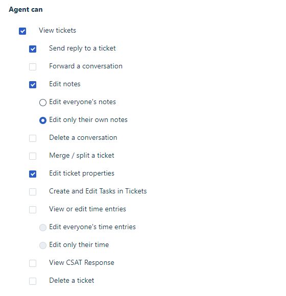
    2. **Problems** (view permission required to display names of linked problems)  
        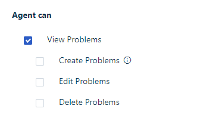
    3. **Inventory** (view permission required to display names of linked assets)  
        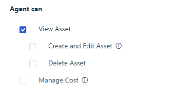
    4. **Contracts** (view permission required to display names of linked contracts)  
        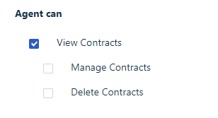
    5. **Administration** (agent management required for ticket assignments)  
        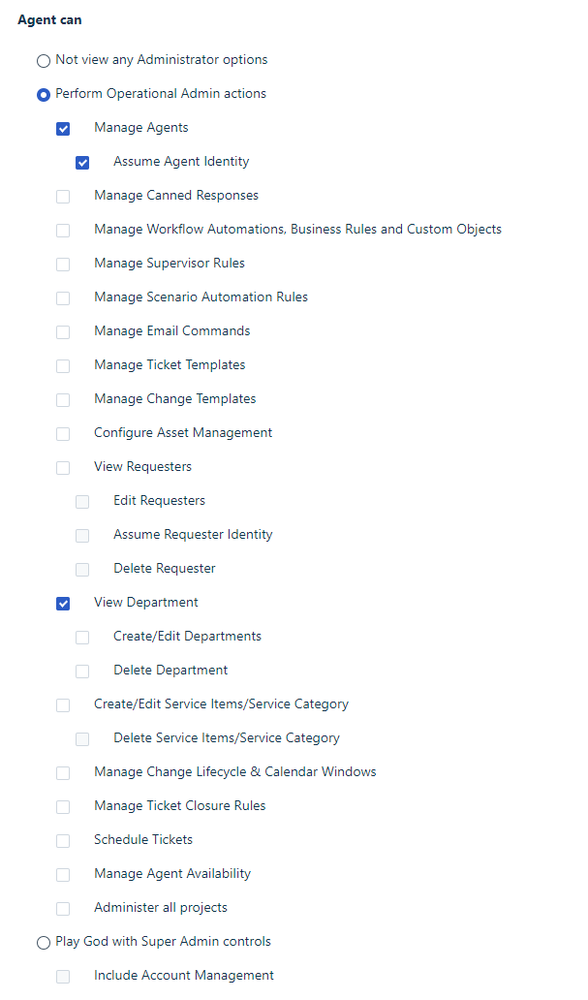
4. Save the new role.

#### Assigning the Role and Noting the API Key

Perform these steps to glue agent account and role together and to note your API key:

1. Go to Admin -> User Management -> Agents and locate the agent created for SIGNL4.
2. Edit the agent details and assign the "SIGNL4" role.  
    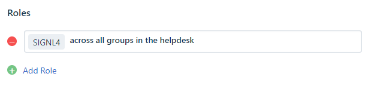
3. Refresh your browser or open a new window to login to your Freshservice instance using the SIGNL4 agent account.
4. Access the user profile settings on the top right and choose “Profile settings”.
5. Complete the CAPTCHA to retrieve the API key, then note it for us in the SIGNL4 app configuration as described in Setup Step 3.
    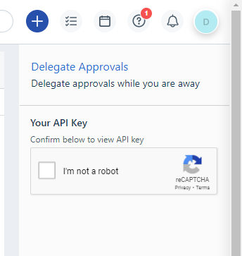

### Setup Step 2: Configure the Freshservice Connector App in SIGNL4

Once you have the API key, follow these steps to configure the SIGNL4 connector app:
1. Select the SIGNL4 team you want to connect to Freshservice.
2. Go to Apps and locate the Freshservice connector under app templates.  
    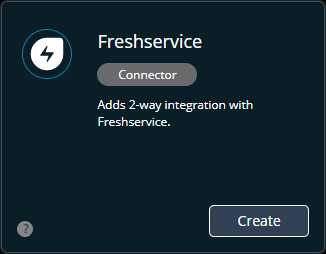
3. 3.	Create a new connector instance with a name and optional description (e.g., "Security Tickets").
4. Configure the connector properties:
    - **Instance URI**: The base URL of your Freshservice instance (e.g., https://my.freshservice.com).
    - **API Key**: The API key retrieved earlier.
    - **Notes**: Define notes for Signl acknowledgment, closure, and escalation, which are used to trigger Automators in Freshservice.
    - **Private Notes**: Optionally, make all notes visible only to agents.
    - **Agent Assignment**: Specify when SIGNL4 users should be assigned as agents to tickets.
    - **Status Mappings**: Configure status synchronization between SIGNL4 and Freshservice.
5. Save the configuration and copy the webhook URL provided by the connector app.
    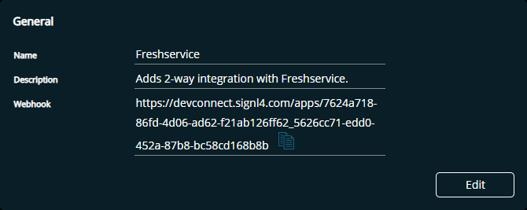

### Setup Step 3: Create Automators in Freshservice

Data exchange between Freshservice and SIGNL4 is driven by Automators that control integration workflows:

#### Automator 1: Forward to SIGNL4

- Trigger: Define which tickets should be forwarded to SIGNL4.
- Action: Add a webhook action using the SIGNL4 webhook URL.

Use this JSON as body for the webhook:


```json
{  
    "ticket_id": "{{ticket.id_numeric}}"  
}
```


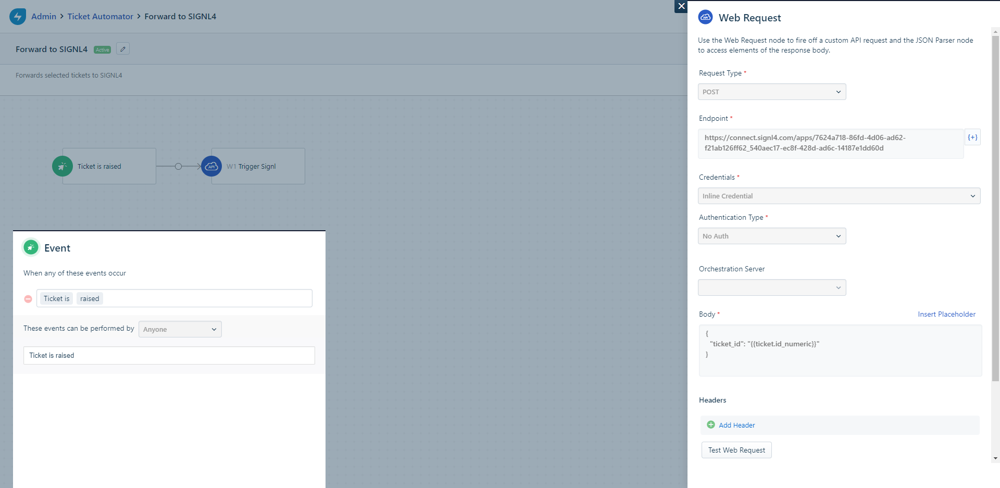

_**Note:**_ If you want to further filter which tickets are forwarded, feel free to insert a condition action between the trigger and the webhook action.

#### Automator 2: Was Acknowledged in SIGNL4

- Trigger: Acknowledge the ticket when a Signl is acknowledged in SIGNL4.
- Action: Update ticket status or add additional actions as needed.


#### Automator 3: Was Closed in SIGNL4

- Trigger: Close the ticket when a Signl is closed in SIGNL4.
- Action: Update ticket status or add additional actions as needed.

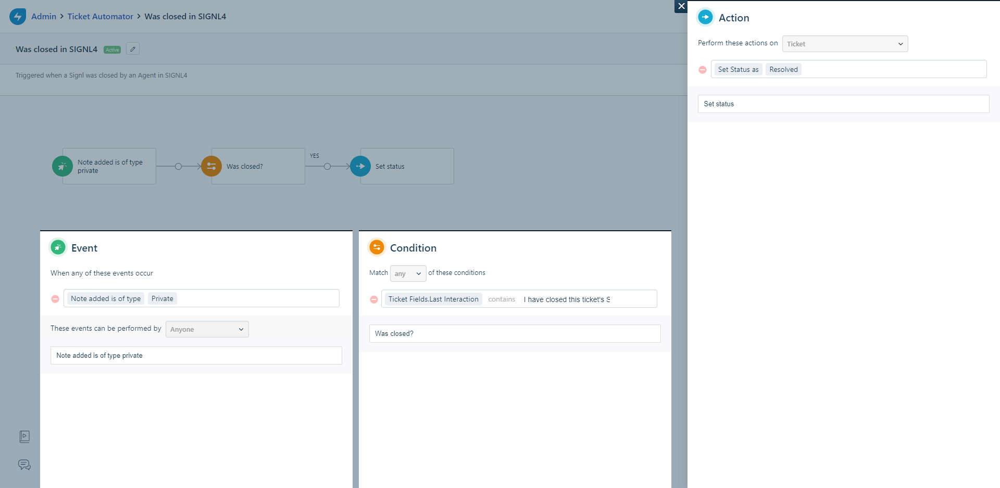

_**\*Note:**_ Feel free to change the actions that follow the condition in the workflow according to your needs.

#### Automator 4: Auto Acknowledge in SIGNL4

- Trigger: Acknowledge a Signl when a ticket is updated in Freshservice.
- Webhook Body:

```json
{
    "ticket_id": "{{ticket.id_numeric}}",
    "X-S4-Status": "Acknowledged"
}
```


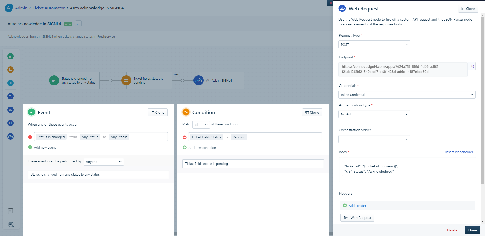

#### Automator 5: Auto Close in SIGNL4

- Trigger: Close a Signl when a ticket is updated in Freshservice.
- Webhook Body:

```json
{
    "ticket_id": "{{ticket.id_numeric}}",
    "X-S4-Status": "Resolved"
}
```


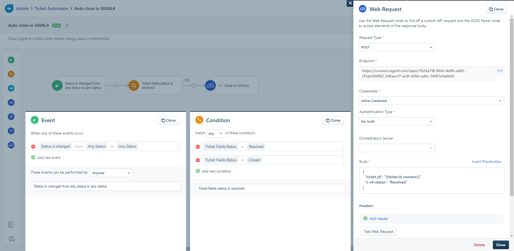

With these Automators in place, data synchronization between Freshservice and SIGNL4 is seamless, enabling efficient ticket management and faster incident resolution.


