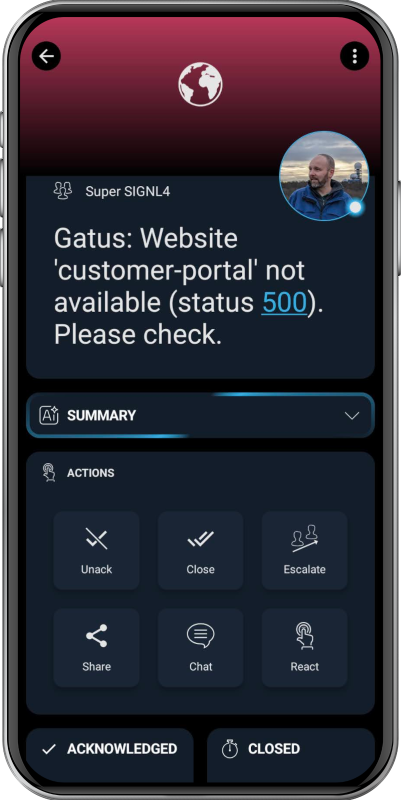

# SIGNL4 Integration with Gatus

[Gatus](https://gatus.io/) is an open-source, automated health dashboard and status page tool. It monitors services (HTTP, TCP, DNS, ICMP), evaluates custom conditions (status codes, latency, certificate expiry, response body, etc.), and triggers alerts via various channels including [SIGNL4](https://www.signl4.com/).

SIGNL4 adds reliable mobile alerting to Gatus with features like mobile app, push notifications, SMS messaging, voice calls, automated escalations, and on-call duty scheduling. SIGNL4 ensures that critical alerts reliably reach the responsible personnel – anytime, anywhere.

## Prerequisites
A SIGNL4 (https://www.signl4.com) account
A Gatus (https://gatus.io/) instance

## How to Integrate

The integration of SIGNL4 with Gatus is straightforward. This is how it works.

### Web UI

In Gatus you need to confifure the following parameter:
- Team Secret (or Endpoint Secret): Your unique SIGNL4 team secret (found in the SIGNL4 web portal under Integrations -> Inbound Webhooks)

When an alert is triggered, SIGNL4 will send an alert to your team. The alert includes detailed endpoint status information. If the endpoint alert has the "Send on resolved" parameter set to "true", another event will be sent to SIGNL4 in order to close the alert.

### Configuration File

Alternatively you can also configure Gatus' configuration file config.yaml.

| Parameter                           | Description                                                                                | Default       |
|:------------------------------------|:-------------------------------------------------------------------------------------------|:--------------|
| `alerting.signl4`                   | Configuration for alerts of type `signl4`                                                  | `{}`          |
| `alerting.signl4.team-secret`       | SIGNL4 team secret (part of webhook URL)                                                   | Required `""` |
| `alerting.signl4.default-alert`     | Default alert configuration. <br />See [Setting a default alert](#setting-a-default-alert) | N/A           |
| `alerting.signl4.overrides`         | List of overrides that may be prioritized over the default configuration                   | `[]`          |
| `alerting.signl4.overrides[].group` | Endpoint group for which the configuration will be overridden by this configuration        | `""`          |
| `alerting.signl4.overrides[].*`     | See `alerting.signl4.*` parameters                                                         | `{}`          |

```yaml
alerting:
  signl4:
    team-secret: "your-team-secret-here"

endpoints:
  - name: website
    url: "https://twin.sh/health"
    interval: 5m
    conditions:
      - "[STATUS] == 200"
    alerts:
      - type: signl4
        send-on-resolved: true
```

That's it.

You can find more information on how to configure SIGNL4 mobile alerting in Gatus [here](https://gatus.io/docs/alerting-signl4).

The alert in SIGNL4 might look like this.


