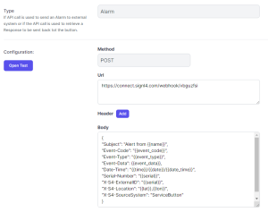
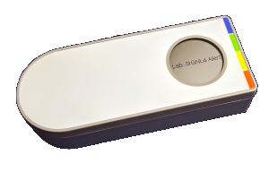
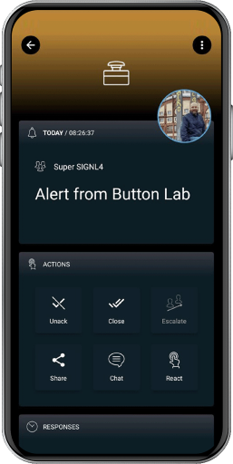

# SIGNL4 Integration with Gimasi Service Button

[Gimasi](https://www.gimasi.com/)‘s Service Button sends information to the Gimasi Cloud when it is pressed. There, the status is displayed in the form of an alarm, but it is only when embedded in business processes that this device unfolds its full potential. The addition of SIGNL4 makes it possible to quickly alert service or security teams. The ability of SIGNL4 to alert multiple people on duty and obtain acknowledgement means that even classic service call scenarios, where one person acknowledges and takes over the job, can be implemented in minutes.

For integrating SIGNL4 with the Gimasi Service Button you can create a new REST Endpoint in the Service Button portal.

In your Service Button portal you create a new Endpoint under Endpoints -> Add and choose type REST.



Now you enter your SIGNL4 webhook URL including your team secret and enter a JSON body with the alert parameters. You can also use placeholders here.

The following shows a sample JSON for a SIGNL4 alert:


```json
{
    "Subject": "Alert from {{name}}",
    "Event-Code": "{{event_code}}",
    "Event-Type": "{{event_type}}",
    "Event-Data": {{event_data}},
    "Date-Time": "{{time}}/{{date}}/{{date_time}}",
    "Serial-Number": "{{serial}}",
    "X-S4-ExternalID": "{{event_id}}",
    "X-S4-Location": "{{lat}},{{lon}}",
    "X-S4-SourceSystem": "ServiceButton"
}
```


Now save and go to your configured buttons at Buttons -> Actions -> Alarm Endpoints. Add the Alarm Endpoint you have previously created and save.

Two-way integration:  
It is also possible to update the status of a button alarm in the Service Button portal when an alert is acknowledged or closed in SIGNL4.

In order to do so you need to make sure that the parameter “X-S4-ExternalID” is set to “{{event\_id}}” as in the above example. Also, you need to create an outbound webhook in SIGNL4 that sends back status updates to the Service Button. You can do this in the SIGNL4 web portal unter Integrations -> Gallery -> Webhook (Outbound). The URL to enter here is the following:

```
https://your\_tenant.api.servicebutton.com/api/signl4/event?api-token=api\_token
```

You need to replace your\_tenant with your tenant name and api\_token with your Service Button API token. You can create the API token in the Service Button portal by clicking on the user menu and then going to the API Settings menu.

That’s it. Now your SIGNL4 team gets an alert when the service button has been pushed. If you have configured the two-way integration the status of the button alarm is updated to confirmed or resolved when the alert in SIGNL4 is acknowledged or closed.



The alert in SIGNL4 might look like this.


