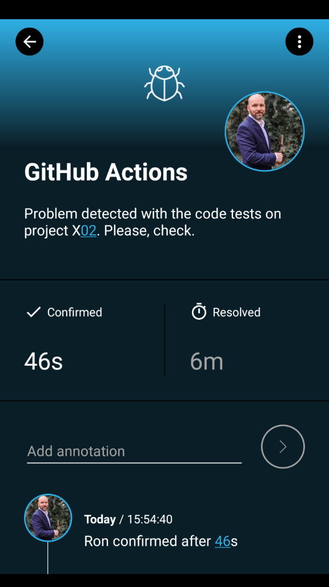

# SIGNL4 Integration with GitHub Actions

[GitHub Actions](https://github.com/features/actions) allow you to automate, customize, and execute your software development workflows right in your GitHub repository. Pairing GitHub Actions with SIGNL4 can enhance your daily operations with an extension to your team wherever it is.

The integration of SIGNL4 with GitHub Actions it described here:

[https://github.com/marketplace/actions/signl4-alerting](https://github.com/marketplace/actions/signl4-alerting)

**Integration via Actionsflow**

You can do create even more sophisticated workflows with [Actionsflow](https://actionsflow.github.io/docs/actions/) where you can use SIGNL4 as an alerting action, too.

The alert in SIGNL4 might look like this.

