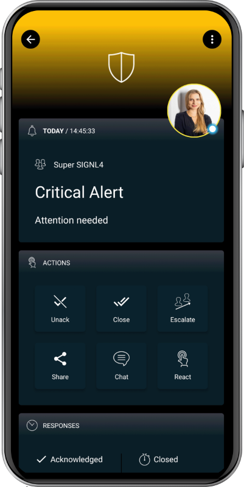

# SIGNL4 Integration with Google Forms

Do not sift through your email again to find a customer maintenance request. Instead, use SIGNL4 to receive reliable mobile alerts every time someone fills out your custom Google Form.

Responses from [Google Forms](https://docs.google.com/forms) will be forwarded to a SIGNL4 team in real-time so issues can be addressed via a simple Google Apps Script.

Edit our [sample script](https://www.signl4.com/blog/google-forms-push-voice-text-notification/) to push form entries to your SIGNL4 team.

The alert in SIGNL4 might look like this.

