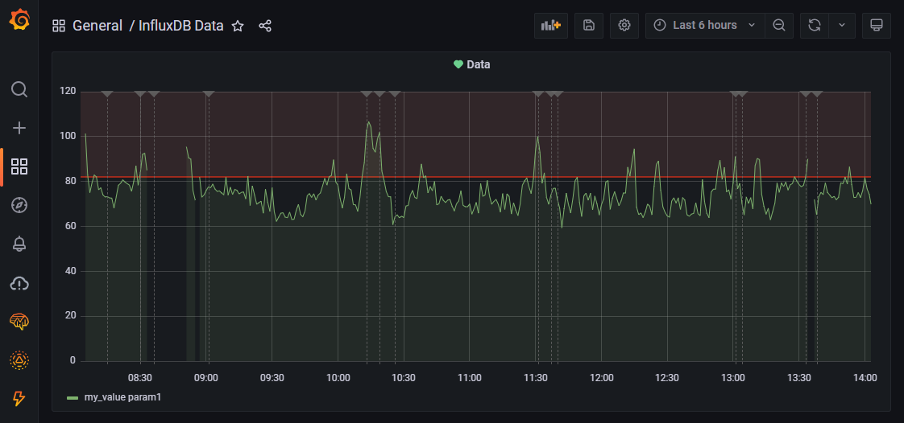
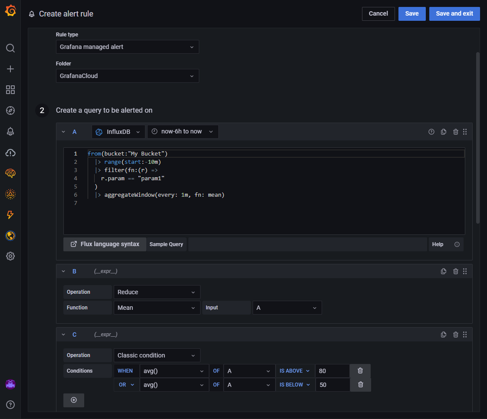
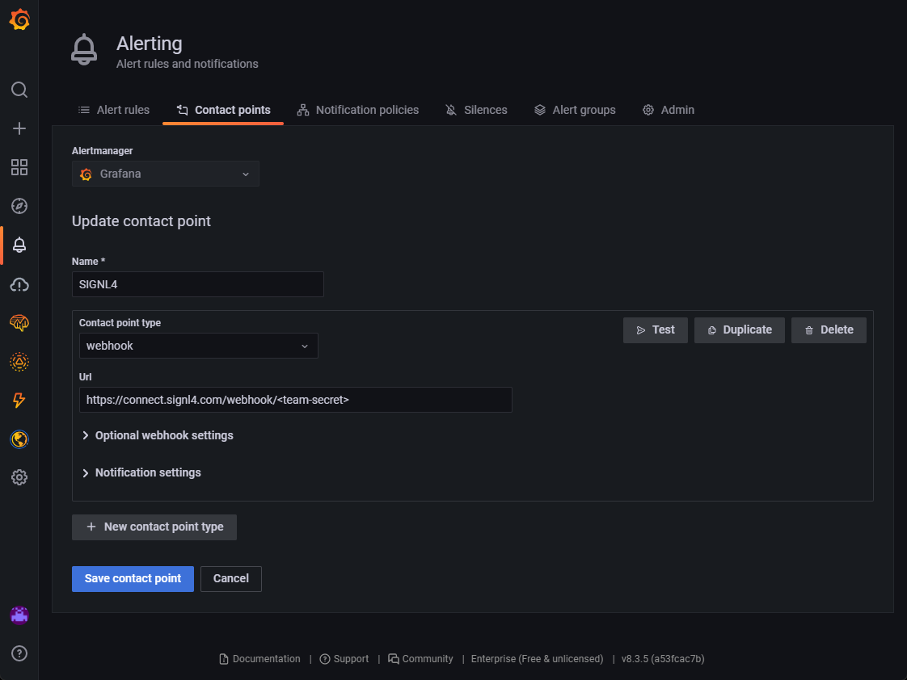
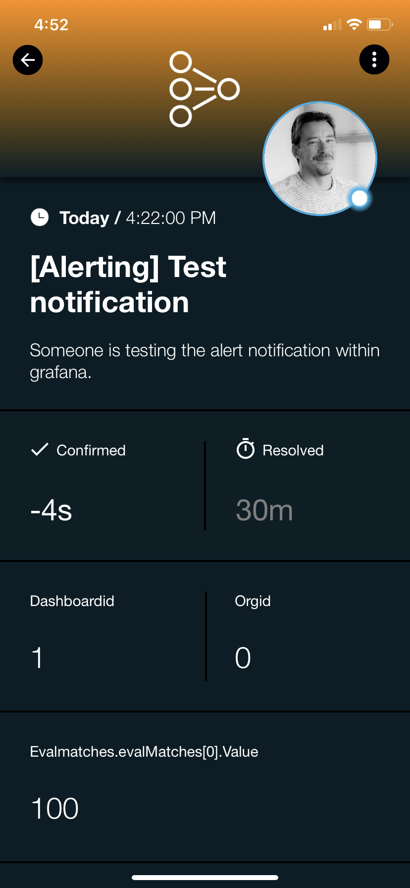

# SIGNL4 Integration with Grafana

[Grafana](https://grafana.com/) is a multi-platform open source analytics and interactive visualization software available since 2014. It provides charts, graphs, and alerts for the web when connected to supported data sources. Performance monitors are easy to configure, and notifications channels are configured with just a few clicks.

In our example we are using Grafana to display data from the time series database InfluxDB.  We are setting up a webhook to send alerts to the SIGNL4 team when a certain threshold is reached.

SIGNL4 is a mobile alert notification app for powerful alerting, alert management and mobile assignment of work items.  Get the app at [https://www.signl4.com](https://www.signl4.com/)

## Prerequisites

- A SIGNL4 ([https://www.signl4.com](https://www.signl4.com/)) account
- A Grafana ([https://grafana.com/](https://grafana.com/)) account (and / or installation)

In our example we use data from an InfluxDB source. If the value is above a certain threshold for a certain period of time we would like to trigger a SIGNL4 alert.



Under Alerting -> Alert rules we add a new alert rule. We give it a name and choose “Grafana managed alert”. Then, we enter the query and define a condition when the alert should trigger.



Under Alerting -> Contact points we create a new contact point for SIGNL4. The Url is the SIGNL4 webhook URL including team secret. You can send a test alert to make sure the settings are correct.

For supporting alert resolutions you might want to add the following to your SIGNL4 webhook URL:

```
?ExtIDParam=groupKey&ExtStatusParam=status&ResolvedStatus=resolved
```

That’s all and now your SIGNL4 team will be alerted when Grafana detects an overrun or underrun of the set threshold.



Alerts will be displayed in the mobile app and can be augmented with colors, icons and sounds.

The alert in SIGNL4 might look like this.


