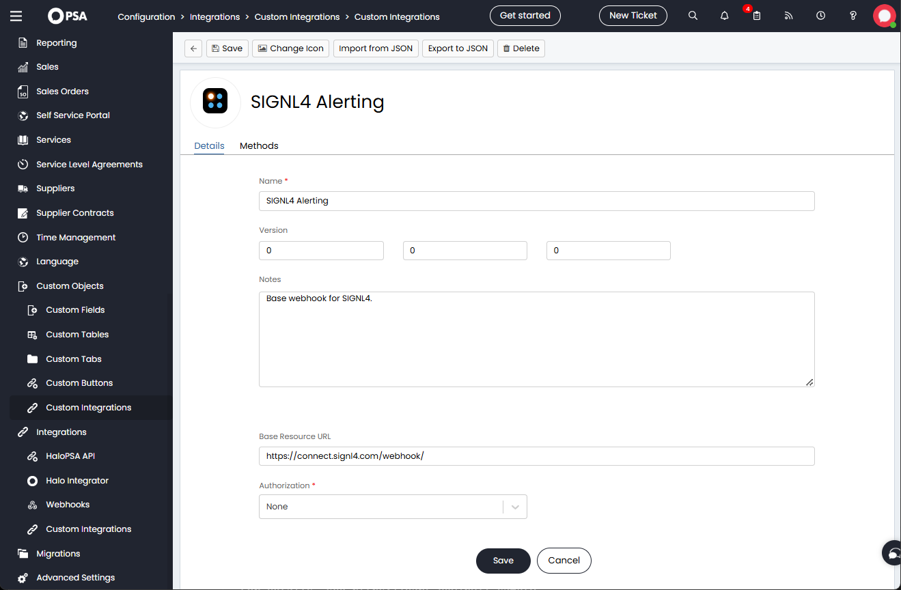
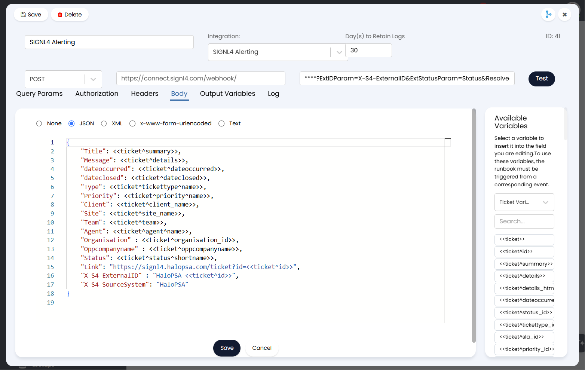
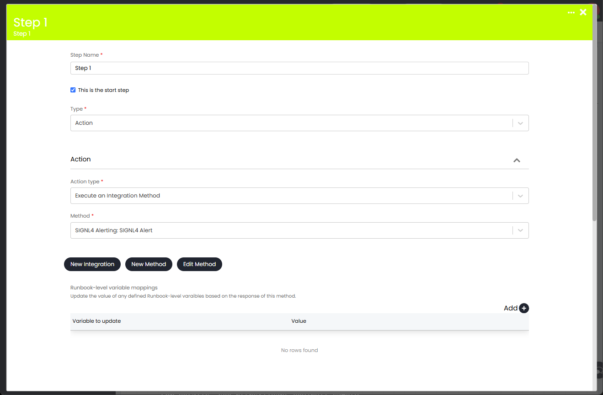
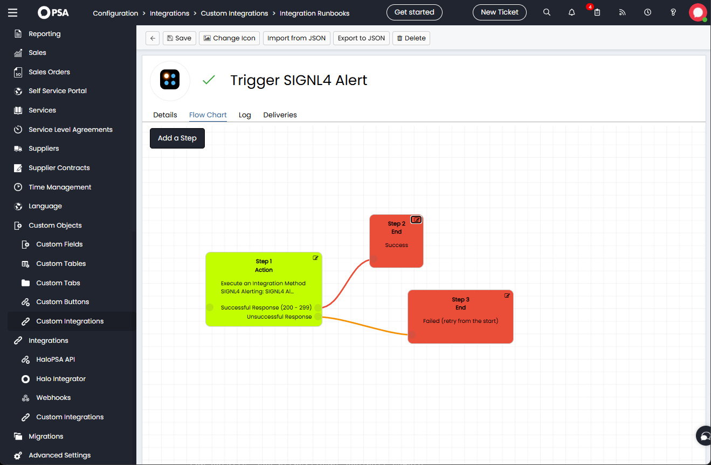
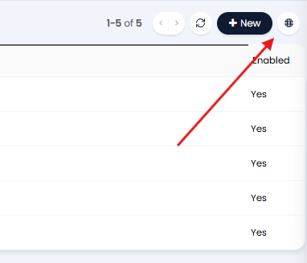
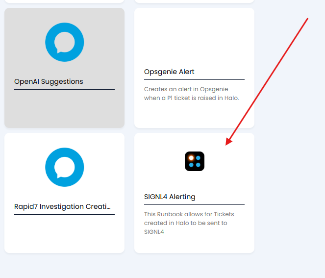
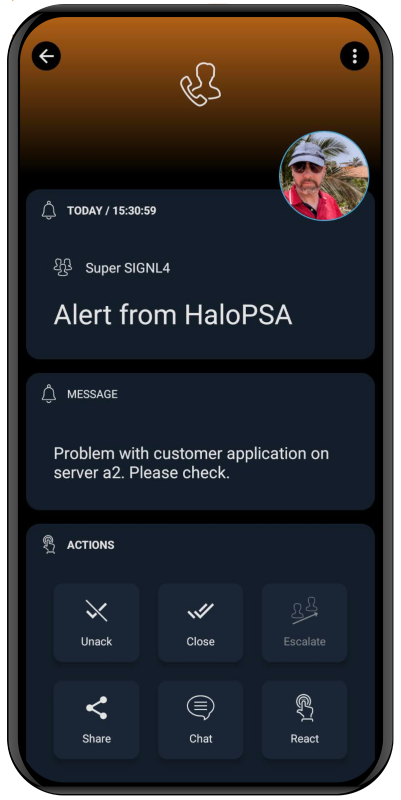

# SIGNL4 Integration with HaloPSA

[HaloPSA](https://halopsa.com/) is an all-in-one PSA software for service providers.

The integration of SIGNL4 with HaloPSA streamlines incident management by providing instant mobile alerts and enabling rapid response to critical events, ensuring operational efficiency and reducing downtime.

Receive SIGNL4 alerts on new tickets via app push, SMS text or voice calls, including escalation, duty scheduling and collaboration.

## Prerequisites

- A [SIGNL4](https://www.signl4.com/) account
- A [HaloPSA](https://halopsa.com/) instance

## How to Integrate

In order to trigger SIGNL4 alerts you just need create a custom integration in HaloPSA.

### Custom Integration

Under "Configuration" -> "Integrations" -> "Custom Integrations" go to "Custom Integrations" again and create a new custom integration. Give it a name and enter the SIGNL4 webhook URL without team / integration secret here. Note, that there is a slash ("/") at the end.



### Method

Under "Configuration" -> "Integrations" -> "Custom Integrations" go to "Methods" and create a new method. Give it a name and select your SIGNL4 integration from the previous step. You see the webhook URL. Now, enter your team / integration secret at the right. Also, choose POST as HTTP method.

To support not only triggering but also closing alerts when a ticket gets closes please use the following in the URL extension field:

{team-secret}?ExtIDParam=X-S4-ExternalID&ExtStatusParam=Status&ResolvedStatus=Closed

Where {team-secret} is your team or integration secret.

You can freely use the placeholders you need but make sure you leave the "X-S4-" fields unchanged.



Under Body select JSON and enter your JSON body.

```json
{
    "Title": <<ticket^summary>>,
    "Message": <<ticket^details>>,
    "dateoccurred": <<ticket^dateoccurred>>,
    "dateclosed": <<ticket^dateclosed>>,
    "Type": <<ticket^tickettype^name>>,
    "Priority": <<ticket^priority^name>>,
    "Client": <<ticket^client_name>>,
    "Site": <<ticket^site_name>>,
    "Team": <<ticket^team>>,
    "Agent": <<ticket^agent^name>>,
    "Organisation" : <<ticket^organisation_id>>,
    "Oppcompanyname" : <<ticket^oppcompanyname>>,
    "Status": <<ticket^status^shortname>>,
    "Link": "https://signl4.halopsa.com/ticket?id=<<ticket^id>>",
    "X-S4-ExternalID" : "HaloPSA-<<ticket^id>>",
    "X-S4-SourceSystem": "HaloPSA"
}
```

### Integration Runbook

Under "Configuration" -> "Integrations" -> "Custom Integrations" go to "Integration Runbooks" and create a new runbook. Give it a name, make sure it is enabled and add the condition "New Ticket Logged" under Events.

Then, go to Flow Chart. You see a step here. Edit this step and select your SIGNL4 method from the previous step as Method.



Save the step. You see two new steps now, one for success and one for error. Configure them accordingly to end the flow (Type: End) and specify Result: Success for the success step and Result: Failed (retry from start). Save the nodes.



That is it. Now your team receives a SIGNL4 alert when a new ticket is created in HaloPSA.

### Closing Alerts

The above is closing SIGNL4 alerts autoimatically when a ticket is closed.

For closing alerts from within separate runbooks you can use the following. Configure everything as above with a different name and with the following exceptions.

#### Method

The Method for the resolve case should have this JSON body:

```json
{
    "X-S4-ExternalID" : "HaloPSA-<<ticket^id>>",
    "X-S4-Status": "resolved"
}
```

#### Integration Runbook

In the new integration runbook you configure the events that should close the alert, for example add an event "Ticket Updated" with the criteria "Status | Is equal to | Closed". This will close a previously opened alert if the ticket goes in to status Closed.

### Handling Tickets from your Mobile

When you have received the SIGNL4 alert about a new HaloPSA ticket you can click the link to the ticket. This will automatically bring you to the HaloPSA ticket in web portal. You can also see and manage your tickets direktly from within the Halo ITSM, PSA, CRM app.

## Predefined Runbook

You can access the Online Repository for Runbooks by heading to Configuration -> Custom Objects -> Custom Integrations -> Integration Runbooks. Then you can click the below icon above the list.



This will then show the Online Repository for Runbooks, including the one for SIGNL4.


 
For your convenience, we offer the SIGNL4 custom integration and integration runbook for download [here](https://docs.signl4.com/integrations/halopsa/SIGNL4-HaloPSA.zip).

That is is. An alert in SIGNL4 might look like this.


