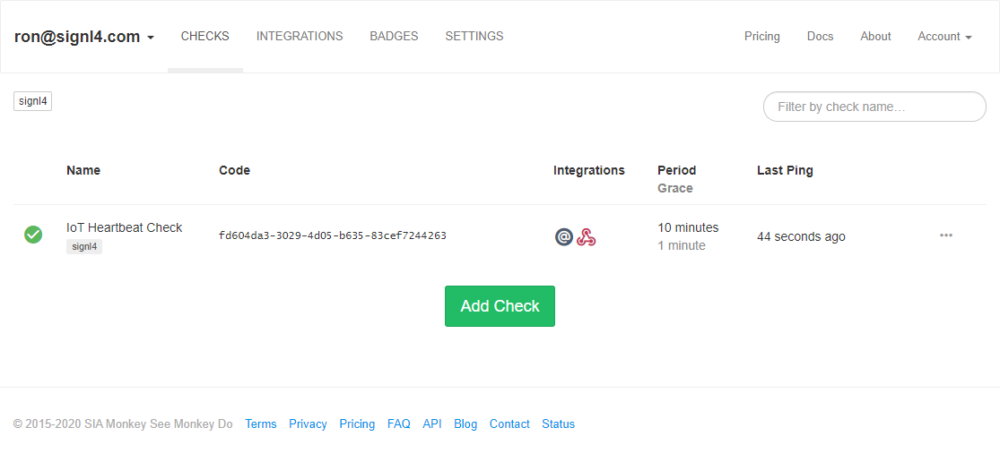
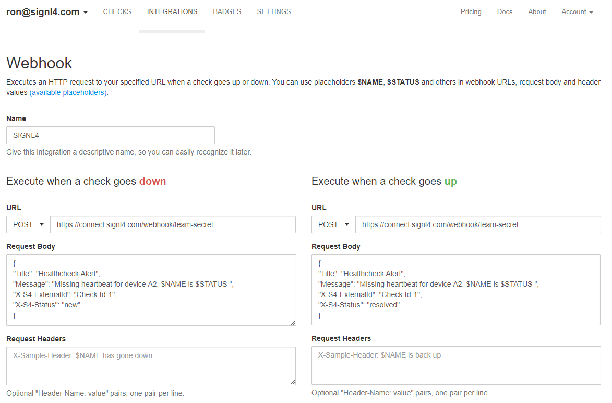

# SIGNL4 Integration with Healthchecks.io

[Healthchecks.io](https://healthchecks.io/) is an open-source con-job and heartbeat monitoring service for various IT and IoT use cases. It monitors is certain scheduled processes are running correctly or if certain systems are available. This can be scheduled backups, virus scans, batch jobs as well as status information from IoT sensors. It is even possible to monitor the availability of monitoring tools themselves. SIGNL4 easily enables Healthcheck.io to notify mobile teams in the field or on call in real-time. This speeds up their response significantly and frees resources in the operations.

The integration of Healthchecks.io and SIGNL4 is done using the Webhook in Healthchecks.io. In our example we send an HTTP request (ping) from a device at regular intervals. If this request is missing, an alarm should be sent to our SIGNL4 team.

## Prerequisites

- A SIGNL4 account ([https://www.signl4.com](https://www.signl4.com/))
- A Healthcheck.io account ([https://healthchecks.io](https://healthchecks.io/))

Go to Healthchecks.io and add a check.

This gives you an URL where you can send your requests to. Optionally, you can also send emails.

Now you go to Integrations and add a new Webhook integration. For the URL you choose POST and enter your SIGNL4 webhook URL including your team secret.

As Request Body you enter the JSON content representing your alert data. You can use $NAME, $STATUS as placeholders.

When you enter the above for the “down” event you will receive the alerts when an issue is detected. You can also use the “up” event to automatically close the alert in SIGNL4 when the issue is resolved.

Therefore, you need to use some additional parameters as described here: [https://www.signl4.com/blog/update-july-2020-resolve-alerts/](https://www.signl4.com/blog/update-july-2020-resolve-alerts/).

For the “down” and “up” events you need to specify the same “X-S4-ExternalId”. This can be a unique ID for this specific check. And, for the “up” event you need to specify “X-S4-Status” to be “resolved”.

That is it and now you can test the alert. You can for example simulate an alert by sending the HTTP request (Ping) from your web browser. If you do not do this for a time period longer than the one you specified for the check you will receive an alert in your SIGNL4 app.

The alert in SIGNL4 might look like this.

