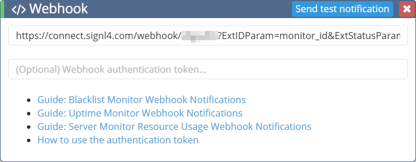
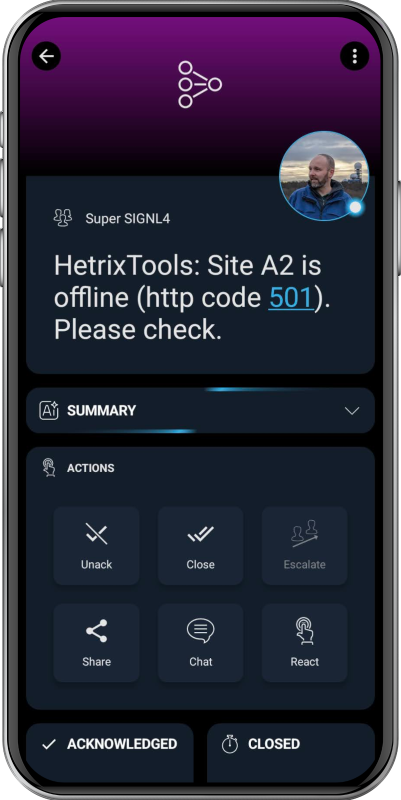

# SIGNL4 Integration with HetrixTools

[HetrixTools](https://hetrixtools.com/) offers a set of monitoring services aimed at maintaining website and server availability as well as email deliverability health. Its Uptime Monitor checks websites and servers at one-minute intervals to alert you of downtime. The Blacklist Monitor scans your email IPs and domains against hundreds of spam blacklists daily, helping ensure your email remains trusted.

SIGNL4 adds reliable mobile alerting to HetrixTools with features like mobile app, push notifications, SMS messaging, voice calls, automated escalations, and on-call duty scheduling. SIGNL4 ensures that critical alerts reliably reach the responsible personnel – anytime, anywhere.

## Prerequisites

- A SIGNL4 (<https://www.signl4.com>) account
- A HetrixTools (<https://hetrixtools.com/>) instance

## How to Integrate

Integrating SIGNL4 with HetrixTools is quick and easy.

In the HetrixTools web portal, navigate to **Contact List** and open the list you want to edit. In the **Edit Contact List** dialog, select the **Webhook** section and enter your SIGNL4 webhook URL.

Your webhook integration should now look similar to this:



To automatically close SIGNL4 alerts when a monitor returns to an OK state, use the following webhook URL with the additional URL parameters.

> Be sure to replace {team-secret} with your SIGNL4 team or integration secret.

```
https://connect.signl4.com/webhook/{team-secret}?ExtIDParam=monitor_id&ExtStatusParam=monitor_status&ResolvedStatus=online
```

> **Attention**: You can test the integration directly from the webhook settings. When doing so, make sure to use the SIGNL4 webhook URL without any additional parameters. Otherwise, if the monitor is in an OK state, no alert will be triggered.

You can still view the received test events in SIGNL4 under Integrations -> Events.

Below is the plain SIGNL4 webhook URL. Remember to replace {team-secret} with your SIGNL4 team or integration secret.

```
https://connect.signl4.com/webhook/{team-secret}
```

You can fine-tune the look and feel and rearrange the parameters within your SIGNL4 category settings.

That’s it. You will now start receiving SIGNL4 alerts automatically whenever HetrixTools detects an issue.

The alert in SIGNL4 might look like this.


