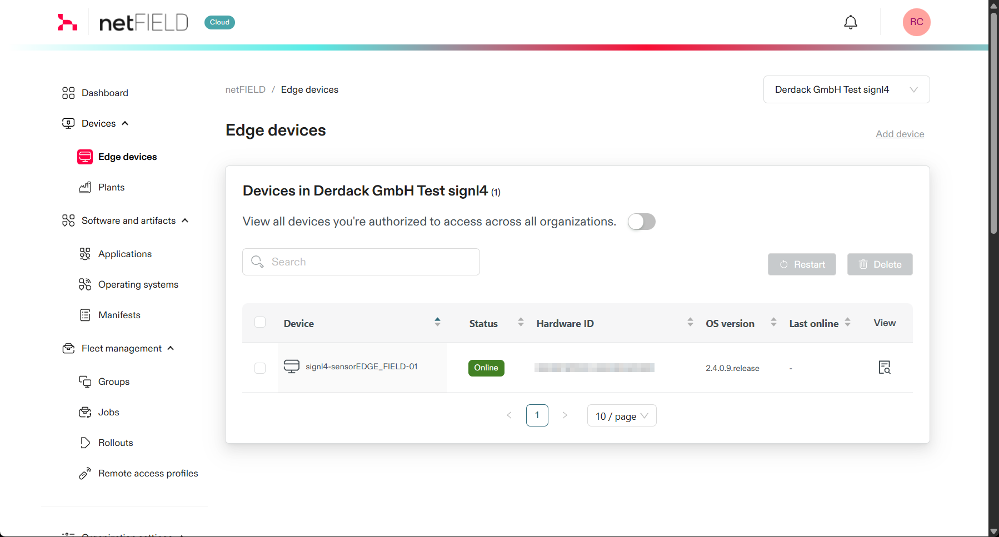
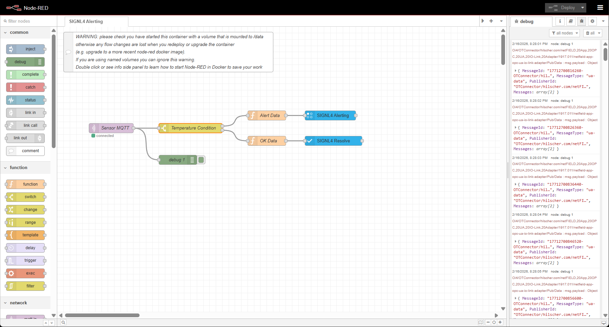

# SIGNL4 Integration with Hilscher

The integration of SIGNL4 with [Hilscher](https://www.hilscher.com/) enables production teams and service technicians to receive real-time alerts about detected or emerging issues—anytime, anywhere.

Hilscher is a specialist in industrial communication and automation solutions, enabling seamless sensor-to-network connectivity. In IO-Link, Hilscher offers IO-Link Masters and Wireless Masters that bridge sensors and actuators to Industrial Ethernet (e.g., PROFINET, EtherNet/IP, EtherCAT), supporting up to 16 devices with robust IP67-rated designs. These products simplify integration, diagnostics, and IIoT data flows used in setups like the SIGNL4 demo, where IO-Link data is routed through a gateway and MQTT into alert logic.

SIGNL4 adds reliable mobile alerting to Hilscher devices with features like mobile app, push notifications, SMS messaging, voice calls, automated escalations, and on-call duty scheduling.

## Integration with sensorEDGE FIELD – Edge IO-Link Master

In our first example, we connected a sensorEDGE FIELD – Edge IO-Link Master from Hilscher with SIGNL4. This powerful edge device can run Docker containers, allowing services such as an Eclipse Mosquitto MQTT broker and Node-RED to operate directly on the device – along with additional applications if required.

The connected sensors publish their data to the MQTT broker. Node-RED subscribes to this data, processes it, and evaluates defined conditions. If specific thresholds are exceeded (for example, if the temperature rises above a defined limit), a SIGNL4 alert is triggered automatically.

This setup provides a simple and efficient way to bridge the OT/IT gap and enables reliable mobile alerting across virtually any IIoT scenario.

The netFIELD Console allows you to centrally manage your netFIELD devices and their applications remotely.

Gain direct access to each device and view real-time sensor data at a glance.

You can use Node-RED to design your alerting workflow. First, add the [SIGNL4 nodes](https://flows.nodered.org/node/node-red-contrib-signl4) from the Node-RED palette and configure them with your SIGNL4 team or integration secret.

Within the flow, sensor data is received via MQTT, evaluated against defined conditions, and used to trigger a SIGNL4 alert when thresholds are exceeded. Alerts can also be automatically closed once the sensor returns to an OK state.

You can find the above sample flow [here](https://flows.nodered.org/flow/2bd2532ec04b6809717f183a655d460e).

## Multi-Component Show Case

In our second example, we use a demo setup that consists of several components and covers the entire range from sensor to user alerting.

A distance sensor is connected via IO-Link to an IO-Link Master, then the data is received from a PLC and from there it goes into the Hilscher Edge Gateway. Then an MQTT Broker is used to transfer the data to Node-RED. The Node-RED flow then checks the alerting conditions and then used the SIGNL4 node to send the alert to the SIGNL4 team (or close the alert when resolved).

This is how the Hilscher demo setup looks like.

The Node-RED sample flow gets the sensor data via MQTT and then sends (or closes) the alert using the SIGNL4 nodes.

The flow is available [here](https://flows.nodered.org/flow/6125cd1cc7f2bf49f1db05b70477ce25).

] 

The alert in SIGNL4 might look like this.

