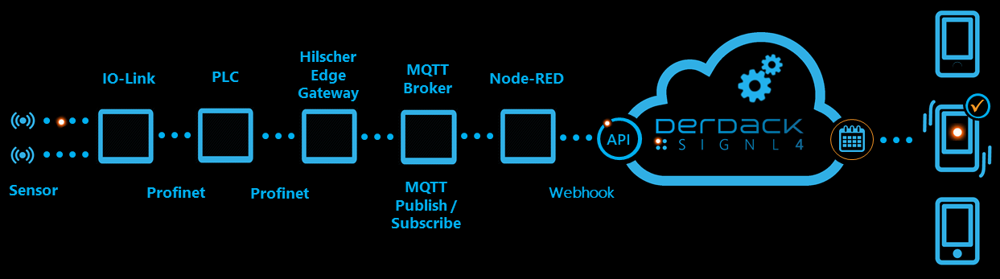
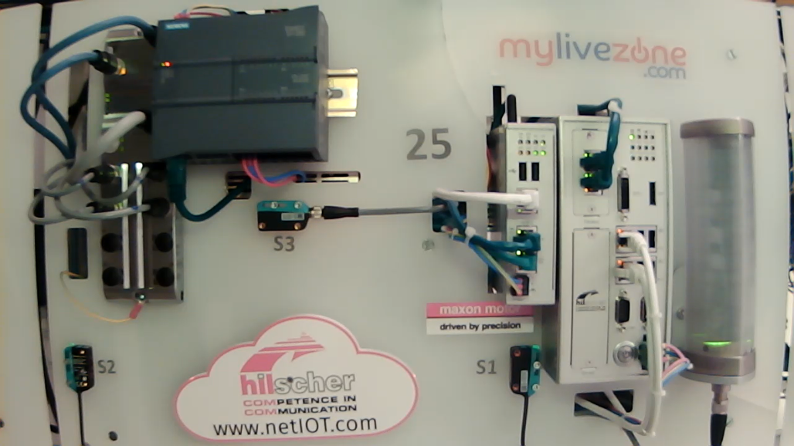
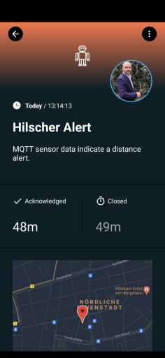

# SIGNL4 Integration with Hilscher

The integration of SIGNL4 with [Hilscher](https://www.hilscher.com/) enables production staff and service technicians to be alerted quickly and reliably when problems are detected or even before problems arise, no matter where they are.

In our example, we use a demo setup that consists of several components and covers the entire range from sensor to user alerting.

A distance sensor is connected via IO-Link to an IO-Link Master, then the data is received from a PLC and from there it goes into the Hilscher Edge Gateway. Then an MQTT Broker is used to transfer the data to Node-RED. The Node-RED flow then checks the alerting conditions and then used the SIGNL4 node to send the alert to the SIGNL4 team (or close the alert when resolved).

This is how the Hilscher demo setup looks like.

The Node-RED sample flow gets the sensor data via MQTT and then sends (or closes) the alert using the SIGNL4 nodes.

The flow is available [here](https://flows.nodered.org/flow/6125cd1cc7f2bf49f1db05b70477ce25).

] 
The alert in SIGNL4 might look like this.

