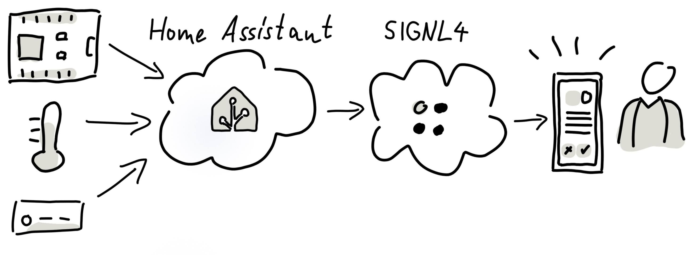
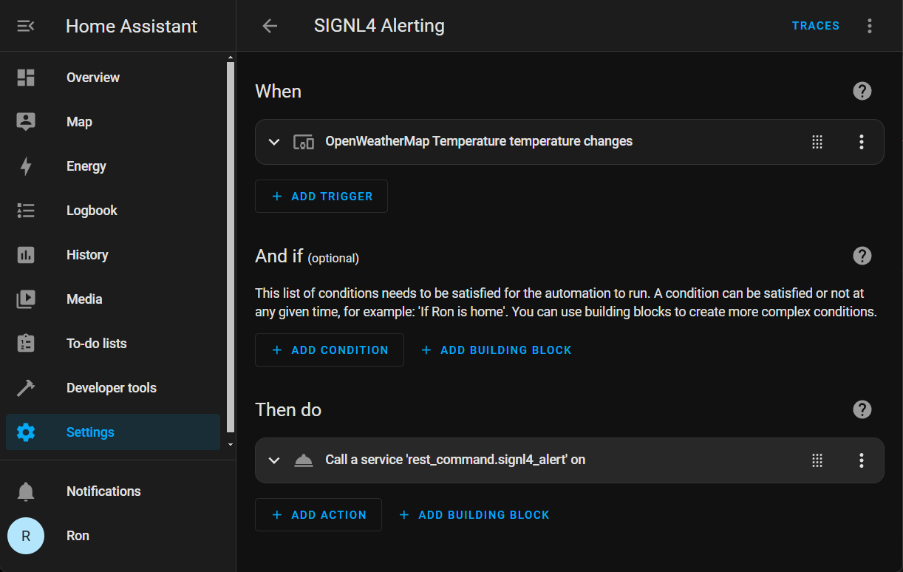
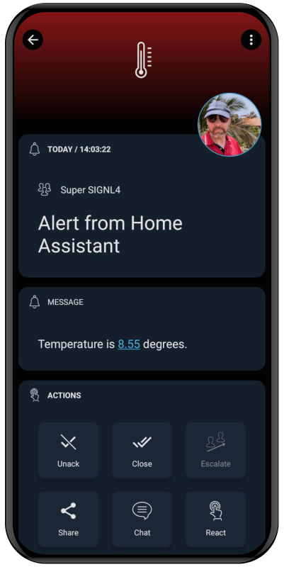

# SIGNL4 Integration with Home Assistant

[Home Assistant](https://www.home-assistant.io/) is an open source home-automation platform that puts local control and privacy first. Powered by a worldwide community of tinkerers and DIY enthusiasts.

Integrate Home Assistant with SIGNL4 for reliable mobile alerting via app push, SMS text or voice calls, including escalation, duty scheduling and collaboration.

Get alerted on your mobile if the temperature is too high or too low, if the doorbell rings and you are in the backyard, if an intruder was detected, or for any other sensor or device state.



## Prerequisites

- A [SIGNL4](https://www.signl4.com/) account
- A [Home Assistant](https://www.home-assistant.io/) installation

## How to Integrate

In order to trigger SIGNL4 alerts you need to send HTTP Post requests. This can be done by using the [RESTful Command](https://www.home-assistant.io/integrations/rest_command/) in Home Assistant

In your "configuration.yaml" file add the following lines.

```yaml
rest_command:
  signl4_alert:
    url: "https://connect.signl4.com/webhook/team-secret"
    method: post
    content_type: "application/json"
    payload: '{"Title": "Alert from Home Assistant", "Message": "{{ message }}"}'
```

Replace "team-secret" with your team or integration secret.

Then restart your Home Assistant.

You can now use this as an Action in your Automation.

Under "Settings" -> "Automations & scenes" you can create a new Automation. Set your "When" condition and under "Then do", add a new Action. Choose "Call service" and specify the SIGNL4 service from above, e.g. "RESTful Command: signl4_alert".



Edit the YAML representation of the Action in order to pass the respective parameters. For example the YAML representation of your Action might look like this.

```yaml
service: rest_command.signl4_alert
data:
  message: Temperature is {{ states('sensor.openweathermap_temperature') }} degrees.
```

In this example we send the temperature date from an OpenWeatherMap integration.

The alert in SIGNL4 might look like this.


 
