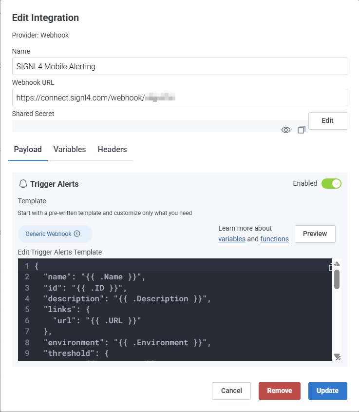
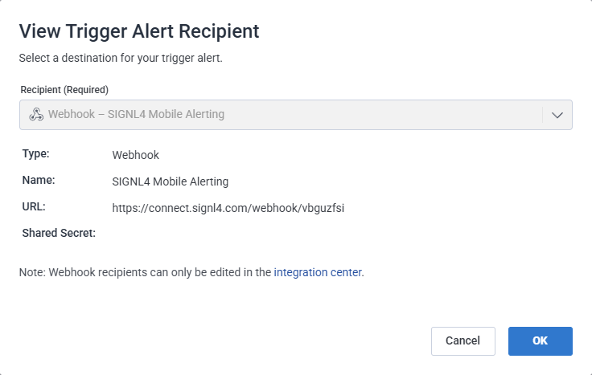
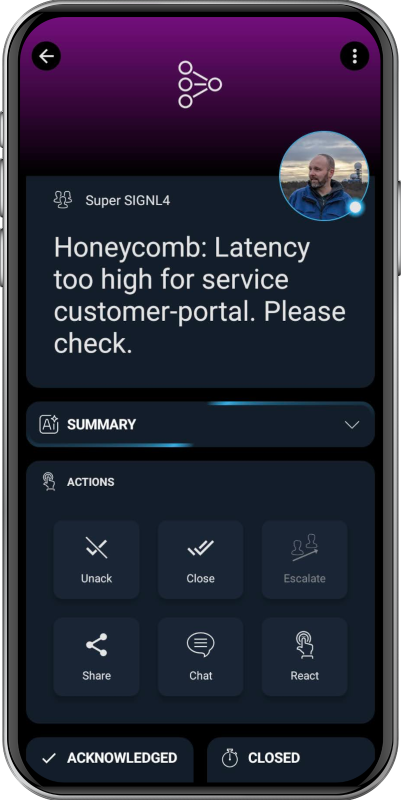

# SIGNL4 Integration with Honeycomb

[Honeycomb](https://www.honeycomb.io/) is an observability platform designed for distributed systems that unifies logs, metrics, and traces in a highly dimensional, queryable datastore. It enables engineering teams to explore, visualize, and troubleshoot complex systems in real time with no penalty for high-cardinality data.

SIGNL4 adds reliable mobile alerting to Honeycomb with features like mobile app, push notifications, SMS messaging, voice calls, automated escalations, and on-call duty scheduling. SIGNL4 ensures that critical alerts reliably reach the responsible personnel – anytime, anywhere.

## Prerequisites

- A SIGNL4 (<https://www.signl4.com>) account
- A Honeycomb (<https://www.honeycomb.io/>) instance

## How to Integrate

Integrating SIGNL4 with Honeycomb is quick and easy.

### SIGNL4 Webhook

First, create a webhook integration to trigger SIGNL4 alerts. In your Honeycomb web portal, navigate to Account -> Team settings -> Integrations. Add a new integration, select Webhook as the Provider, and then enter the following parameters.

- **Name**: e.g. SIGNL4 Mobile Alerting
- **Webhook** URL: Your SIGNL4 webhook URL including team or integration secret.
- **Shared Secret**: Can be left empty.
- **Trigger Alerts**: Enable this setting.

You can now click Generic Webhook to automatically populate the default JSON.

Your webhook integration should now look similar to this:



You can leave the JSON content as is.



```json
{
  "name": "{{ .Name }}",
  "id": "{{ .ID }}",
  "description": "{{ .Description }}",
  "links": {
    "url": "{{ .URL }}"
  },
  "environment": "{{ .Environment }}",
  "threshold": {
    "op": "{{ .Operator }}",
    "value": "{{ .Threshold }}"
  },
  "result": {
    "groupsTriggered": [
      {{- $numGroups := len .Result.GroupsTriggered -}}
      {{ range $i, $group := .Result.GroupsTriggered -}}
        {{- if $i -}},{{ end -}}{
          {{ range $g := .Group -}}
          "field": "{{ $g.Key }}",
          "value": {{ printf "%#v" $g.Value }},
          {{ end -}}
          "count": {{ .Result }}
        }
      {{- end }}
    ],
    "links": {
      "url": "{{ .Result.URL }}"
    }
  },
  "alert": {
    "instanceId": "{{ .Alert.InstanceID }}",
    "description": "{{ .Alert.Description }}",
    "status": "{{ .Alert.Status }}",
    "summary": "{{ .Alert.Summary }}",
    "isTest": {{ .Alert.IsTest }}
  }
}
```



Click **Add** to add the new integration.

### Closing Alerts

If you want to not only trigger alerts but also close them when the system returns to an OK state, add the following to your JSON payload.

Additions to trigger the alert:

```json
{
    ...

    "X-S4-ExternalID":"my_service_1234",
    "X-S4-Status": "new"
}
```

The string "my_service_1234" serves as a unique identifier and must remain the same when closing the alert. Use the following JSON payload to close the alert:

```json
{
    ...

    "X-S4-ExternalID":"my_service_1234",
    "X-S4-Status": "resolved"
}
```

### Honeycomb Triggers

Now you can add the SIGNL4 webhook integration as a recipient in your Honeycomb trigger. In the Honeycomb web portal, navigate to Triggers and either select an existing trigger or create a new one. Configure the queries and alert thresholds according to your needs.

At the bottom, click Add Recipient and select the SIGNL4 webhook you created earlier.



That’s it. You will now receive a SIGNL4 alert whenever your trigger fires.

The alert in SIGNL4 might look like this.


