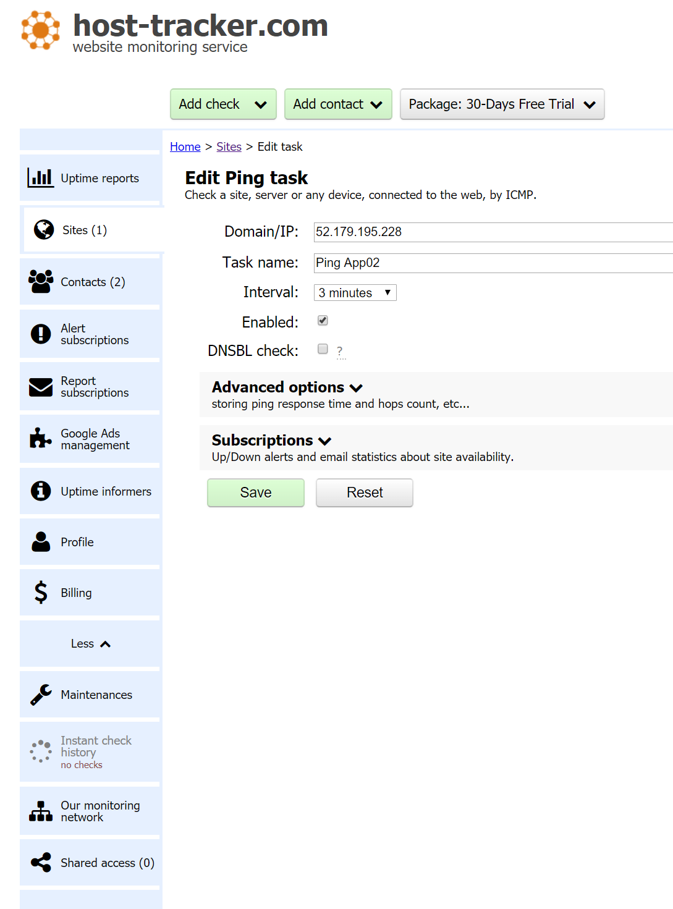
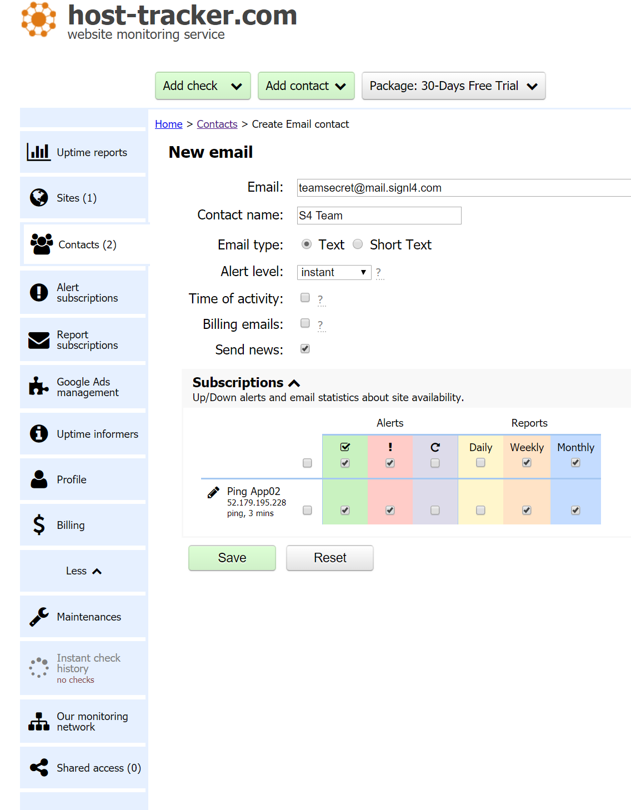
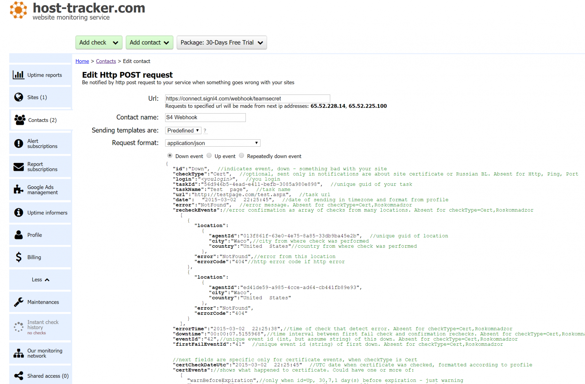
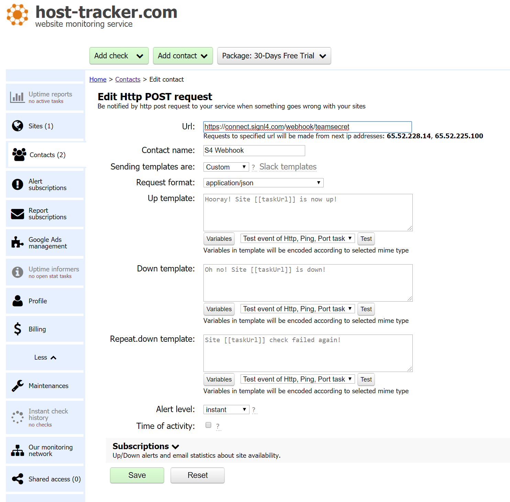

# SIGNL4 Integration with Host Tracker

[Host Tracker](https://www.host-tracker.com/) is a cloud-based website, server and performance monitor with easy to configure dashboards and user setup.  SIGNL4 ensures that all on duty members receive, acknowledge and resolve critical alerts, all from their smartphones. With persistent notifications and escalation chains there will never be a critical alert that goes unattended. SIGNL4 also offers ad-hoc collaboration between team members for each and every alert, so Subject Matter Experts can be looped in to help resolve issues.

In our example we are using Host Tracker to monitor the up-time of critical servers.  We are setting up a PING alert that will email the SIGNL4 team when a server is unreachable.

SIGNL4 is a mobile alert notification app for powerful alerting, alert management and mobile assignment of work items.  Get the app at [https://www.signl4.com](https://www.signl4.com/)

## Prerequisites

- A SIGNL4 ([https://www.signl4.com](https://www.signl4.com/)) account
- A Host Tracker ([https://www.host-tracker.com](https://www.host-tracker.com/)) account

## Preparation

Create a check within Host Tracker. In this example we use a Ping task.

## Email Integration

Create a SIGNL4 user using the team specific email address.

In the subscriptions section, assign Alerts and Reporting options you wish to go to the S4 team.

## Webhook Integration

Alternatively, you can use the SIGNL4 webhook.  Creating a contact and assigning the SIGNL4 team webhook URL will provide data via JSON format.

We used the predefined template but you can choose which parameters will be sent to SIGNL4 by selecting Custom in the drop down box.

These events are sent to the SIGNL4 team and alerts are raised immediately.

The alert in SIGNL4 might look like this.

