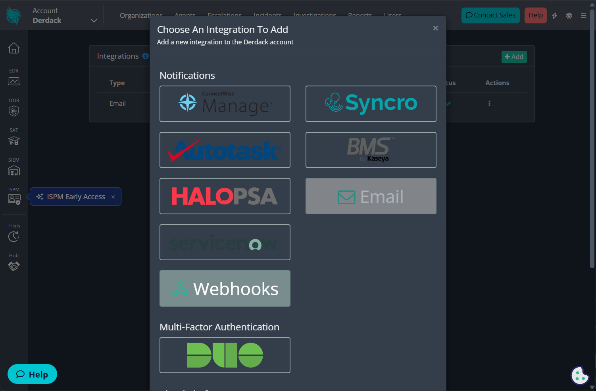
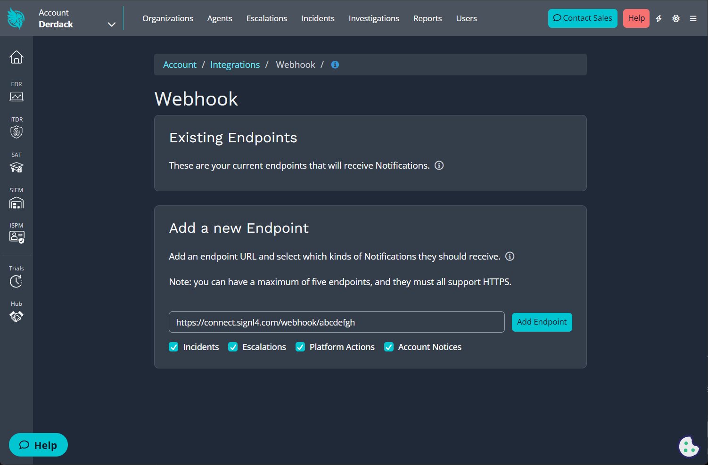
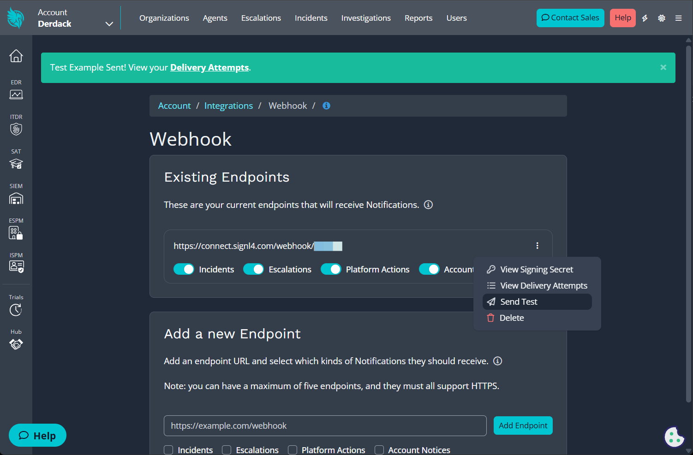
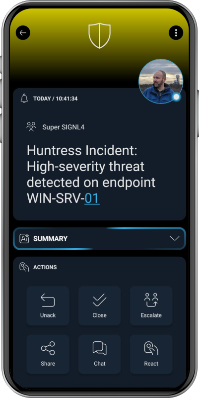

# SIGNL4 Integration with Huntress

[Huntress](https://www.huntress.com/) is a managed cybersecurity platform that helps organizations detect, investigate, and respond to threats across endpoints and identities. Huntress provides managed detection and response capabilities, incident reports, remediation guidance, and notifications for security-relevant events.

SIGNL4 enhances Huntress with reliable mobile alerting, including a mobile app, push notifications, SMS messages, voice calls, automated escalations, and on-call scheduling. SIGNL4 ensures that critical alerts reach the right people reliably – anytime, anywhere.

## Prerequisites
- A SIGNL4 (https://www.signl4.com) account
- A Huntress (https://www.huntress.com/) account

## How to Integrate

Integrating SIGNL4 with Huntress is straightforward. Huntress can send notifications to SIGNL4 by using a webhook endpoint.

In the Huntress Dashboard, open the hamburger menu in the top-right corner and go to Integrations. Click Add an Integration and select Webhooks under Notifications.

If you already have a webhook integration configured, Webhook will be listed in the integrations table.

Click Add Endpoint and configure the endpoint and add your SIGNL4 webhook URL as follows and then add the new endpoint.

The SIGNL4 endpoint now appears in the endpoint overview. To test the integration, open the three-dot menu for the endpoint and select Send Test. You should then receive a test alert in your SIGNL4 mobile app.

That’s it. SIGNL4 will now alert your team whenever new Huntress incidents are created.

The alert in SIGNL4 might look like this.

