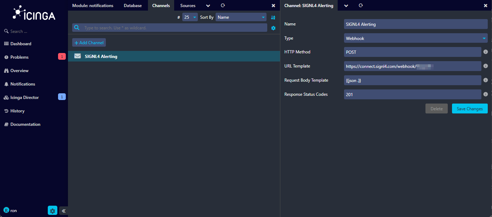
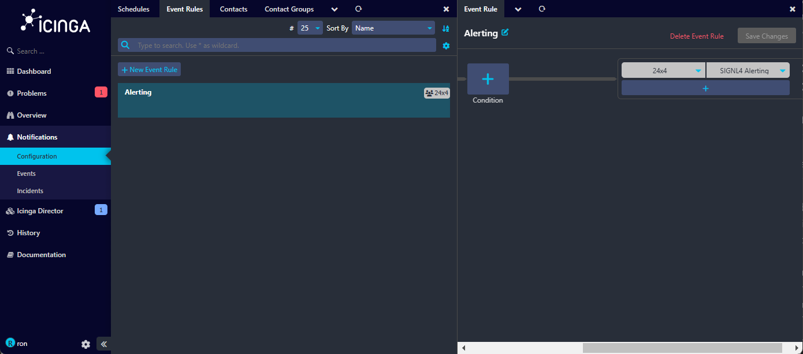

# SIGNL4 Integration with Icinga

[Icinga2](https://icinga.com/) is a monitoring tool that monitors availability and performance. It gives you simple access to relevant data. SIGNL4 enables Icinga2 to alert mobile teams in the field or on call in real-time. This speeds up their response significantly and frees resources in the operations.

## Option 1: Icinga Notifications

First, make sure you have [Icinga Notifications](https://icinga.com/docs/icinga-notifications/latest/) installed.

Attention: Please note that at the time of the writing, this is still in preview phase.

Under Configuration -> Modules -> notifications you go to Channels and add a nde channel for SIGNL4 alerting. Here you specify the following:  
Name:  Specify a name like SIGNL4 Alerting.  
Type: Webhook  
HTTP Method: POST  
URL Template: Your SIGNL4 webhook URL including team or integration secret, e.g. https://connect.signl4.com/webhook/-team-secret-
Request Body Template: Your JSON body for the alert content.
Response Status Codes: 201



That's it and now you can user your channel under Notifications -> Configuration -> Event Rules in your own event rule.



## Option 2: Script

We provide a ready-made alerting integration for Icinga2. The integration allows you to send alerts directly and automatically to your SIGNL4 team for issues detected by Icinga2.

### SIGNL4 Script

On the command line, we first add the SIGNL4 send script. To do this, we download it and move it to the appropriate directory:

```bash
wget https://raw.githubusercontent.com/signl4/signl4-integration-icinga2/master/signl4-notification.sh
chmod +x signl4-notification.sh
mv signl4-notification.sh /etc/icinga2/scripts/
```

### SIGNL4 Configuration

Now we can add the configuration file to the configuration directory and adjust it accordingly.

```bash
wget https://raw.githubusercontent.com/signl4/signl4-integration-icinga2/master/signl4-icinga2.conf
mv signl4-icinga2.conf /etc/icinga2/conf.d/
```

This file contains the alarm logic and creates the user “signl4”. In this user you still have to enter your SIGNL4 team secret in the field “pager”. This is the last part of your webhook URL or the first part of your SIGNL4 email address. To do this, you have to adjust the following line accordingly.

```
pager = "team-secret"
```

### Activate SIGNL4 Alerting

The file “templates.conf” in the directory “/etc/icinga2/conf.d/” contains entries “template Host” for “generic-host” and “generic-service”. Here you need to add the following line:

```
vars.enable_signl4 = true
```

This is an example:

```
template Host "generic-host" {
vars.enable_signl4 = true
}
```

```
template Service "generic-service" {
vars.enable_signl4 = true
}
```

### Service Restart

Now you can restart the Icinga2 service in order to apply the changes.

```
service icinga2 restart
```

### Test it

That is it and now you can test the alert. In the simplest case you can do this manually. To do this go to your Icinga2 dashboard and there for example go to a service. On the left side under Notifications you can now send a notification. Please activate the option “Forced”. You should now receive an alert in your SIGNL4 app.

You can find additional information on GitHub at:

[https://github.com/signl4/signl4-integration-icinga2.] (https://github.com/signl4/signl4-integration-icinga2)

## Two-way integration

For two-way communication there is an Icinga connector app available in SIGNL4 under Teams -> Apps -> Icinga. This connector app adds two-way functionality to SIGNL4 alerting in Icinga. It allows you to acknowledge, close or annotate Icinga events directly from within your SIGNL4 app.

In order to use the Connector you need to make sure you have the Icinga API enabled and SIGNL4 alerting activated. The configuration of the Icinga connector app is straightforward. You just need the Icinga API username, password and the public-facing URL to your Icinga server.


The alert in SIGNL4 might look like this.


