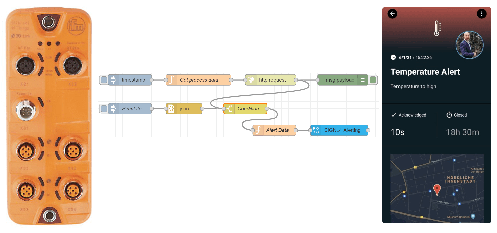

# SIGNL4 Integration with ifm IO-Link

The integration of SIGNL4 with [IO-Link](https://en.wikipedia.org/wiki/IO-Link) from [ifm electronic GmbH](https://www.ifm.com/de/en/category/055) enables production staff and service technicians to be alerted quickly and reliably when problems are detected or even before problems arise, no matter where they are.

In order to integrate ifm IO-Link with SIGNL4 we use [Node-RED](https://nodered.org/).

We use the device and documentations as listed here: [https://www.ifm.com/de/en/product/AL1350?tab=documents](https://www.ifm.com/de/en/product/AL1350?tab=documents)

In our example we use a temperature sensor connected to IO-Link. Node-RED polls the temperature at certain intervals and if the temperature exceeds a certain value an alarm is sent to SIGNL4. We use an HTTP request to retrieve the sensor data in JSON format.

The trigger node "Simulate" allows to simulate an event from IO-Link.

You can find the sample flow here: [https://flows.nodered.org/flow/9e2dd88fd526b293908b051e3af2292a](https://flows.nodered.org/flow/9e2dd88fd526b293908b051e3af2292a)

The alert in SIGNL4 might look like this.

