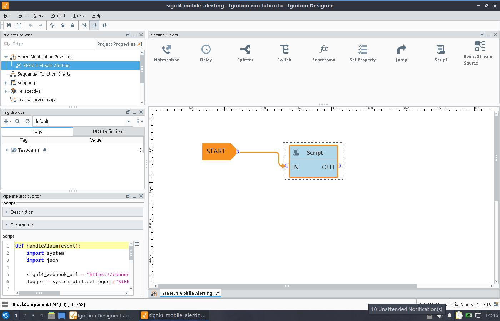
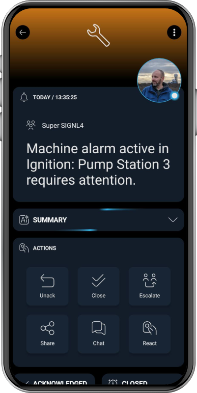

# SIGNL4 Integration with Ignition

[Ignition](https://inductiveautomation.com/ignition/) by [Inductive Automation](https://inductiveautomation.com/) is a universal industrial automation platform for SCADA, HMI, IIoT, MES, alarming, reporting, and more. It connects data across PLCs, databases, devices, and enterprise systems, enabling users to build and deploy scalable industrial applications with web-based tools and unlimited licensing.

SIGNL4 extends Ignition with reliable mobile alerting, including a mobile app, push notifications, SMS messages, voice calls, automated escalations, and on-call scheduling. SIGNL4 ensures that critical alerts reach the right people reliably – anytime, anywhere.

Some common use cases include:
- mobile alerting for Ignition alarms
- on-call notification for industrial maintenance teams
- escalation of SCADA, PLC, machine, or facility alarms
- mobile incident response for industrial operations

## Prerequisites
- A SIGNL4 (https://www.signl4.com/) account
- An Ignition (https://inductiveautomation.com/ignition/) instance

## How to Integrate

Integrating SIGNL4 with Ignition is straightforward. It uses a script that can be added to your Alarm Notification Pipelines.



A sample script can look as follows. Replace YOUR_SIGNL4_SECRET with your SIGNL4 team or integration secret to complete the webhook URL.

```python
def handleAlarm(event):
    import system
    import json

    signl4_webhook_url = "https://connect.signl4.com/webhook/YOUR_SIGNL4_SECRET"
    logger = system.util.getLogger("SIGNL4 Alarm Pipeline")

    logger.info("SIGNL4 pipeline script was called")

    def safe_get(prop_name, fallback=""):
        try:
            value = event.get(prop_name)
            if value is None:
                return fallback
            return str(value)
        except:
            return fallback

    alarm_name = safe_get("name", "Ignition Alarm")
    display_path = safe_get("displayPath", "")
    source = safe_get("source", "")
    priority = safe_get("priority", "")
    state = safe_get("state", "")
    timestamp = safe_get("eventTime", "")

    logger.info("Ignition alarm state received: %s" % state)

    # Stable correlation ID for SIGNL4.
    # Must be identical for new, acknowledged, and resolved.
    external_id = "%s:%s" % (source, alarm_name)

    state_lower = state.lower()

    if "clear" in state_lower or "normal" in state_lower:
        signl4_status = "resolved"
        title = "Resolved: %s" % alarm_name
        message = "Ignition alarm has cleared."

    elif "unack" in state_lower or "unacknowledged" in state_lower:
        signl4_status = "new"
        title = "Ignition alarm: %s" % alarm_name
        message = "Ignition alarm is active and unacknowledged."

    elif "acknowledged" in state_lower or "activeacked" in state_lower or "clearacked" in state_lower:
        signl4_status = "acknowledged"
        title = "Acknowledged: %s" % alarm_name
        message = "Ignition alarm has been acknowledged."

    else:
        signl4_status = "new"
        title = "Ignition alarm: %s" % alarm_name
        message = "Ignition alarm is active."

    payload = {
        "Title": title,
        "Message": message,
        "X-S4-ExternalID": external_id,
        "X-S4-Status": signl4_status,
        "Alarm Name": alarm_name,
        "Display Path": display_path,
        "Priority": priority,
        "State": state,
        "Source": source,
        "Timestamp": timestamp,
        "X-S4-SourceSystem": "Ignition"
    }

    try:
        response = system.net.httpPost(
            signl4_webhook_url,
            "application/json",
            json.dumps(payload)
        )

        logger.info(
            "Sent SIGNL4 event. ExternalID=%s Status=%s State=%s Response=%s"
            % (external_id, signl4_status, state, response)
        )

    except Exception as e:
        logger.error(
            "Failed to send SIGNL4 event. ExternalID=%s Status=%s State=%s Error=%s"
            % (external_id, signl4_status, state, str(e))
        )
```

This script supports triggering alerts and also acknowledging and closing them in your Alarm Notification Pipeline.

You can find more information and a complete sample project at [Ignition Exchange](https://inductiveautomation.com/exchange/).

That's it.

The alert in SIGNL4 might look like this.


