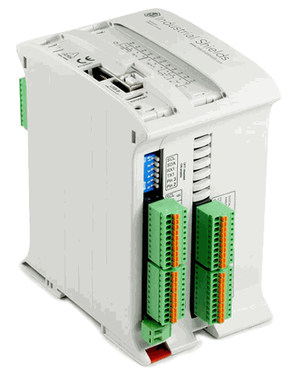
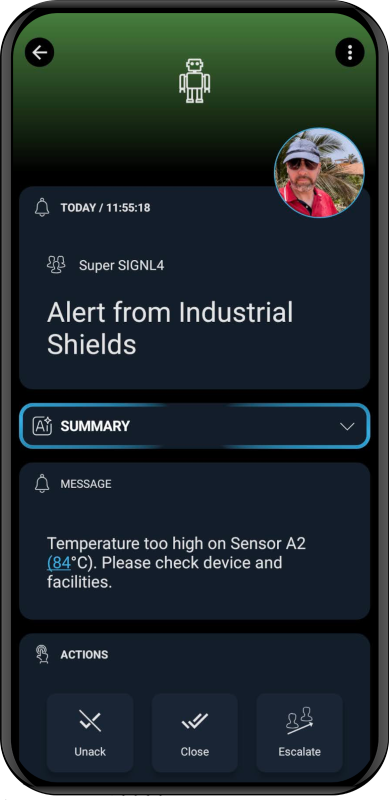

# SIGNL4 Integration with Industrial Shields

[Industrial Shields](https://www.industrialshields.com/) specializes in manufacturing and distributing industrial automation solutions based on open-source hardware such as Arduino, Raspberry Pi, and ESP32. Their product range includes programmable logic controllers (PLCs), human-machine interfaces (HMIs), and IoT devices, designed for cost-effective and flexible industrial applications. They cater to industries seeking customizable, scalable automation systems with the benefits of open-source technology.

SIGNL4 is a mobile alerting and incident management service for alerting responsible users or teams about critical situations as quickly and as reliably as possible. It supports app push, SMS test, voice calls, including escalation, shift planning and collaboration. Get the started at [https://www.signl4.com](https://www.signl4.com/).

Gathering events from IoT devices and sending team alerts in case of critical incidents is a rather vast field. Devices from Industrial Shields can help bridge the OT / IT gap. You can connect production facilities, PLCs, sensors, IoT devices, or dry contacts.

When a critical state, like a high temperature, has been detected SIGNL4 takes care about finding and alerting the right people so they can take care immediately.

THe integration of SIGNL4 with Industrial Shields devices is straightforward.

## Prerequisites
- A [SIGNL4](https://www.signl4.com/) account
- An [Industrial Shields](https://www.industrialshields.com/) device

## How to Integrate

### Node-RED

Node-RED is a low-code, open-source programming tool that enables users to easily connect hardware devices, APIs, and online services through a visual flow-based interface. You can run it on Industrial Shields devices and integrate SIGNL4 alerting easily. Find out how, [here](https://docs.signl4.com/integrations/node-red/node-red.html).

### Arduino

For Arduino-based devices you can follow our instructions [here](https://docs.signl4.com/integrations/arduino/arduino.html).

### Grafana

If you have Grafana installed and you would like to trigger alerts for certain thresholds from here you can use our [Grafana integration](https://docs.signl4.com/integrations/grafana/grafana.html).

### CODESYS

You can also trigger SIGNL4 alerts from CODESYS as described [here](https://docs.signl4.com/integrations/codesys/codesys.html). 

## SIGNL4 Alerting

The alert in SIGNL4 might look like this.

