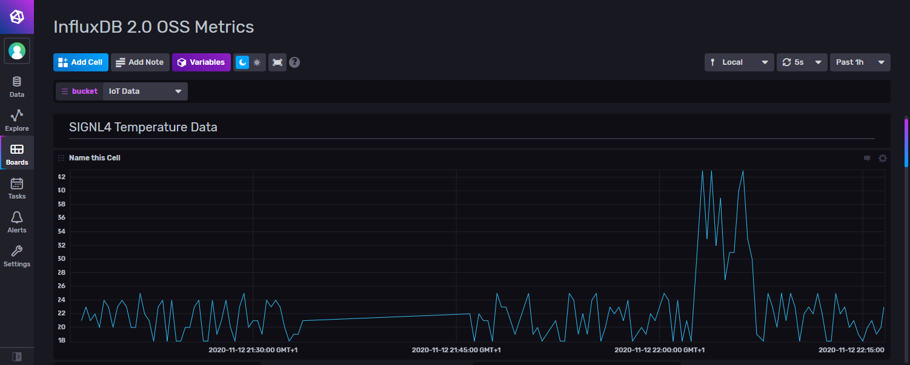
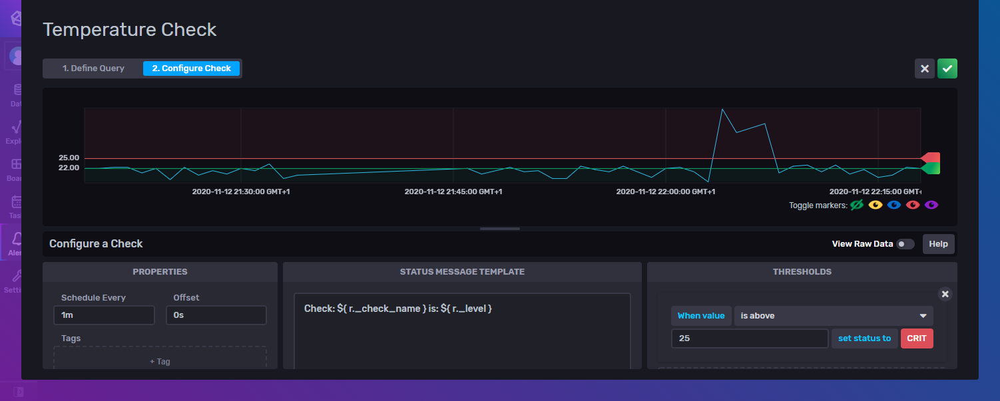
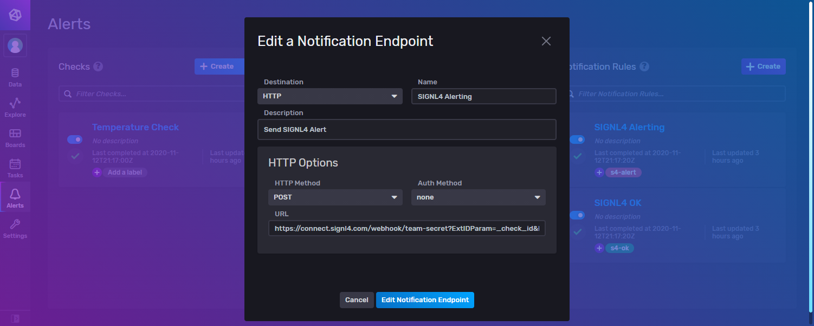

# SIGNL4 Integration with Autocode

[InfluxDB](https://www.influxdata.com/) is an open-source time series database developed by [InfluxData](https://www.influxdata.com/). It is optimized for fast, high-availability storage and retrieval of time series data in fields such as operations monitoring, application metrics, Internet of Things (IoT) sensor data, and real-time analytics.

The integration of InfluxDB and SIGNL4 is done using the HTTP Notification Endpoint.

## Prerequisites

- A SIGNL4 account ([https://www.signl4.com](https://www.signl4.com/))
- InfluxDB ([https://www.influxdata.com](https://www.influxdata.com/)), either on-premise or in the cloud

First, we configure a data source in InfluxDB. In our case we process temperature data from an IoT sensor. You can then display the real-time temperature data in a dashboard.



Now you configure the Alerts in InfluxDB.


Under Checks you configure the conditions. In our case we configure an critical situation if the temperature is above a certain value and an OK situation when the temperature is back below a certain value.



Under Notification Endpoints we configure the SIGNL4 webhook. Therefore, we select HTTP and enter our SIGNL4 webhook address including the team secret.

Under Notification Rules you configure when to send the alert. In our case we send the alert in case of a Critical situation and when the situation is OK again.



In order to support the resolution of alerts in SIGNL4 you can just add the following part to your SIGNL4 webhook URL:

```
?ExtIDParam=_check_id&ExtStatusParam=_level&ResolvedStatus=ok
```

So, the complete URL looks like this:

```
https://connect.signl4.com/webhook/team-secret?ExtIDParam=_check_id&ExtStatusParam=_level&ResolvedStatus=ok
```

Where “team-secret” is your SIGNL4 team secret.

You can find more information about the resolution of alerts in SIGNL4 here: [https://www.signl4.com/blog/update-july-2020-resolve-alerts/](https://www.signl4.com/blog/update-july-2020-resolve-alerts/).

That is it and now you can test the alert. You can for example simulate higher temperature and you should then receive an alert in your SIGNL4 app.

The alert in SIGNL4 might look like this.


