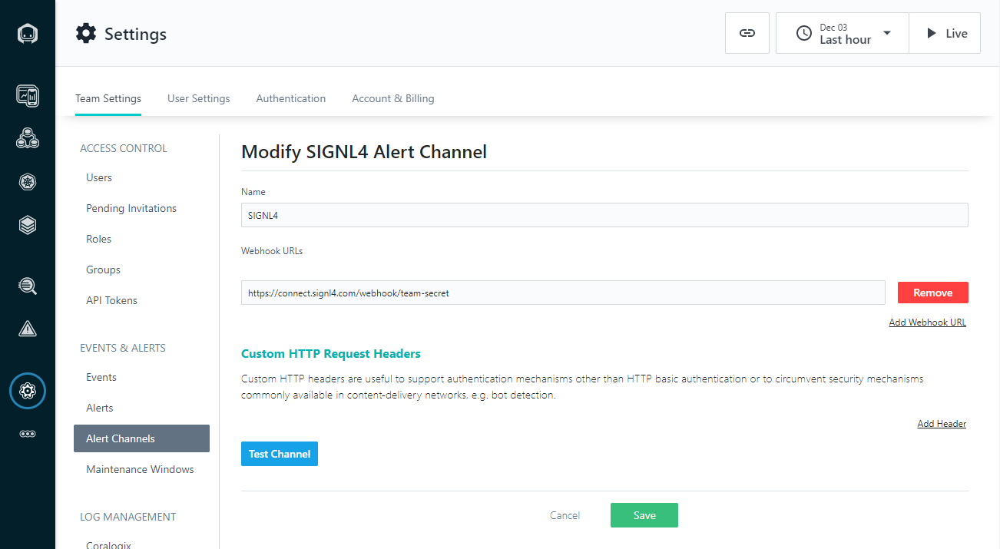

# SIGNL4 Integration with Instana

[Instana](https://www.instana.com/) is a monitoring platform for application performance monitoring, application performance analysis, root cause analysis and distributed tracing and analysis. Pairing Instana with SIGNL4 can enhance your daily operations with an extension to your team wherever it is. The integration does not only allow you to know when a critical issue has occurred but also when it was resolved no matter where you are.

The integration of Instana and SIGNL4 is done using the Alert Channel Generic Webhook in Instana. This one sends an HTTP request  to SIGNL4 in order to trigger the alert.

## Prerequisites

- A SIGNL4 account ([https://www.signl4.com](https://www.signl4.com/))
- A Instana account ([https://www.instana.com](https://www.instana.com/)) or an on-prem instance of Instana

## Integration

In the Instana portal go to Settings -> Alert Channels. Add a new alert channel and choose Generic Webhook. Here you just need to enter your SIGNL4 webhook URL including your team secret.

Under Settings -> Alerts you can now configure the alerts according to your needs. Make sure you use the SIGNL4 Alert Channel you have configured above.

That is it and now you can test the alert. You can do so either directly in the alerting channel by sending a test alert or you can simulate an issue and trigger the alert this way. As a result you will receive an alert in your SIGNL4 app.

The alert in SIGNL4 might look like this.

