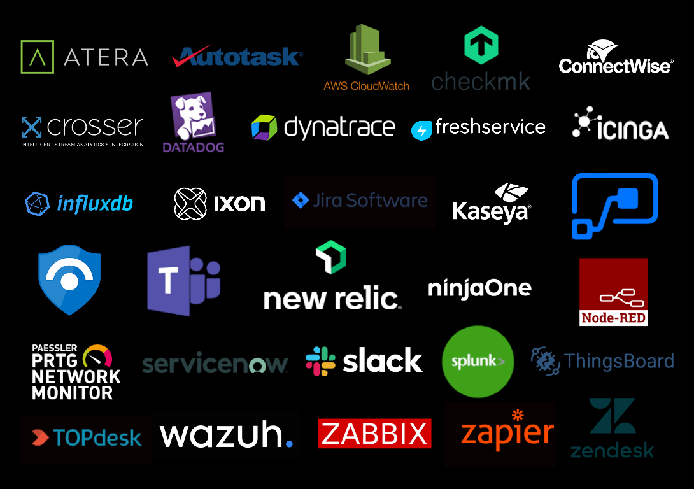

# SIGNL4 Integrations

It is easy to integrate SIGNL4 with almost any IT or IoT tool using standard interfaces like email or webhook (HTTP request). Here, we list a few integrations along with a technical description.

If you feel an integration is missing in this list, please feel free to let us know at hello [@] signl4.com. If you would like to create your own integration the documentation about the [inbound webhook](https://docs.signl4.com/integrations/webhook/webhook.html) is a good start. 
