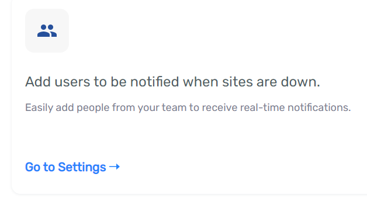
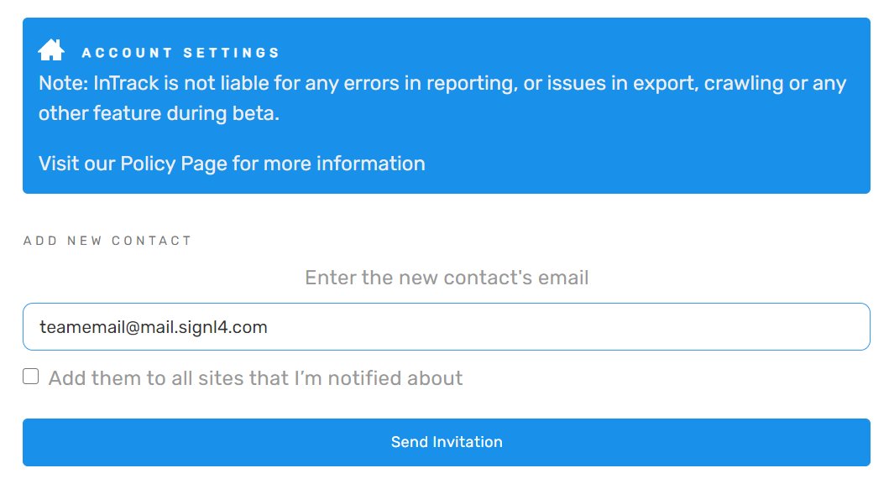
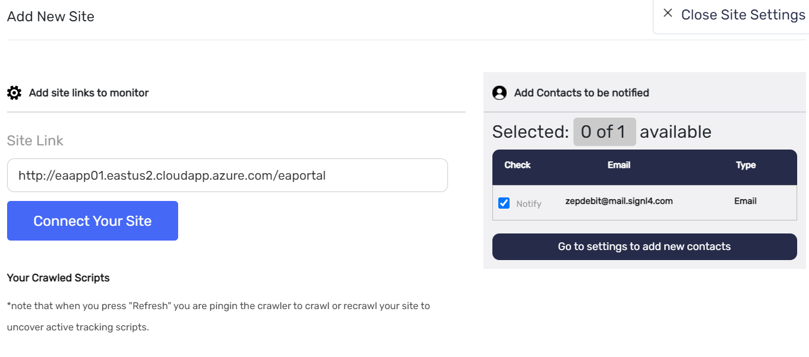
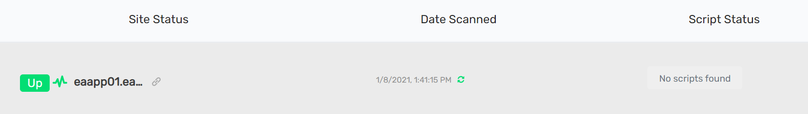
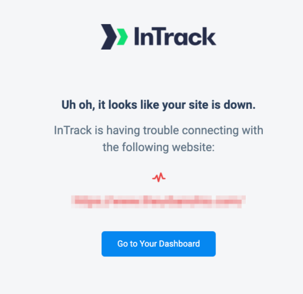

# SIGNL4 Integration with InTrack

[InTrack](https://www.intrack.app/) is a cloud based site monitoring solution that is very lightweight and easy to get started.  Performance monitors are easy to configure, and notifications are automatically sent to the email address who signed up for the account.  SIGNL4 ensures that all on duty members receive, acknowledge and resolve critical alerts, all from their smartphones. With persistent notifications and escalation chains there will never be a critical alert that goes unattended. SIGNL4 also offers ad-hoc collaboration between team members for each alert, so Subject Matter Experts can be looped in to help resolve issues.

In our example we are using InTrack to monitor the heartbeat of critical servers.  We are setting up a site monitor and will send alerts to the SIGNL4 team when the server is unreachable.

SIGNL4 is a mobile alert notification app for powerful alerting, alert management and mobile assignment of work items.  Get the app at [https://www.signl4.com](https://www.signl4.com/)

## Prerequisites

- A SIGNL4 ([https://www.signl4.com](https://www.signl4.com/)) account
- A InTrack ([https://www.intrack.app/](https://www.intrack.app/)) account

## How to Integrate

First, let’s add the SIGNL4 team as a user. From the InTrack dashboard click on Go to Settings.

Enter the email address for your SIGNL4 team and send invite. Your team will receive an alert with an activation link.  Clicking on this link will allow you to create an account via your smartphone.

Refreshing the User page you can see the account was created.

Second, let’s add a site. Click on the Add New Site button in InTrack.

Enter the URL of the site to be monitored and select the SIGNL4 team to be notified. Click Connect your Site.

The dashboard shows the site connected.

That’s it! The next time the site goes down an email is then sent to the SIGNL4 team. Notifications will go to the on-call duty members via push, sms and voice calls.

The email will look similar to this.

The alert in SIGNL4 might look like this.

