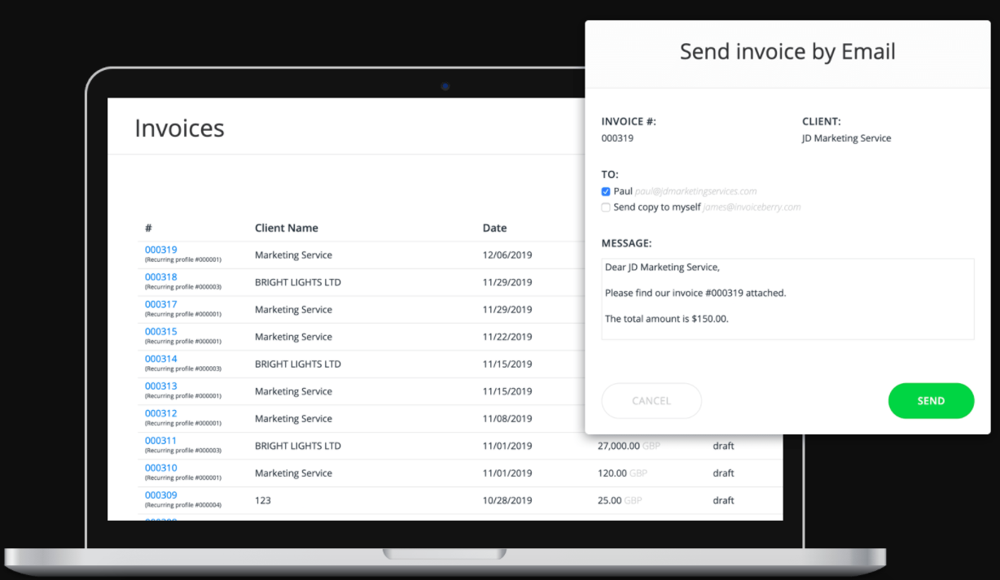
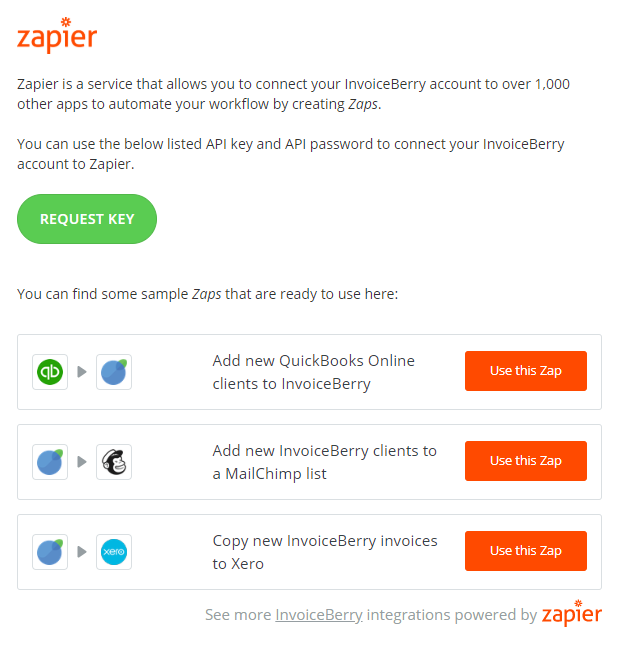

# SIGNL4 Integration with InvoiceBerry

[InvoiceBerry](https://www.invoiceberry.com/) is an online invoicing service that helps small businesses get paid faster. It simplifies invoices and expense tracking, helping you save time and money. Pairing this service with SIGNL4 can enhance your daily operations with an extension to your mobile team. For example you can inform service teams about new invoices or new clients in order to deliver work items, or about overdue payments in order to tact according action.

SIGNL4 is a mobile alert notification app for powerful alerting, alert management and mobile assignment of work items. Get the app at [https://www.signl4.com](https://www.signl4.com/).

## Prerequisites

- A [SIGNL4](https://www.signl4.com/) account
- An [InvoiceBerry](https://www.invoiceberry.com/) account

You can either send invoicing information to your SIGNL4 team manually. In this case you can create a SIGNL4 user with the email address of your SIGNL4 team. You can then use the email functionality in InvoiceBerry.

Another, powerful option is to send the information automatically using Zapier.

In order to do you you can combine the InvoiceBerry integrations ([https://zapier.com/apps/invoiceberry/integrations](https://zapier.com/apps/invoiceberry/integrations)) with the SIGNL4 integrations ([https://zapier.com/apps/signl4/integrations](https://zapier.com/apps/signl4/integrations)) in Zapier in order to create your suitable workflows.

The alert in SIGNL4 might look like this.

