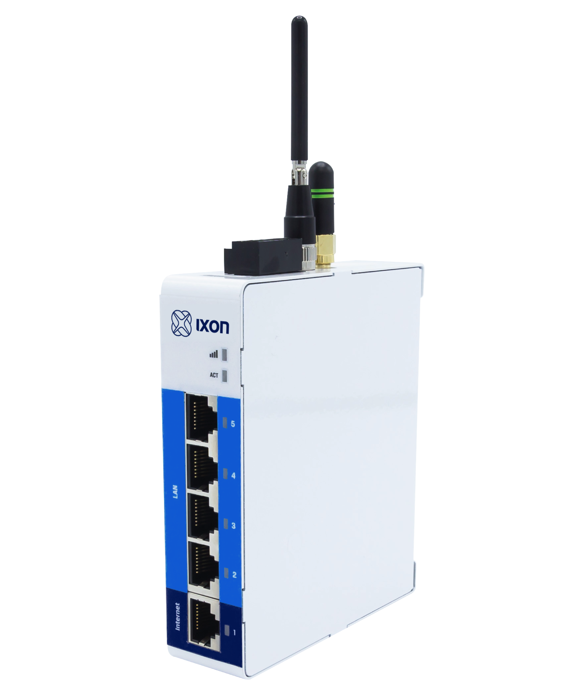
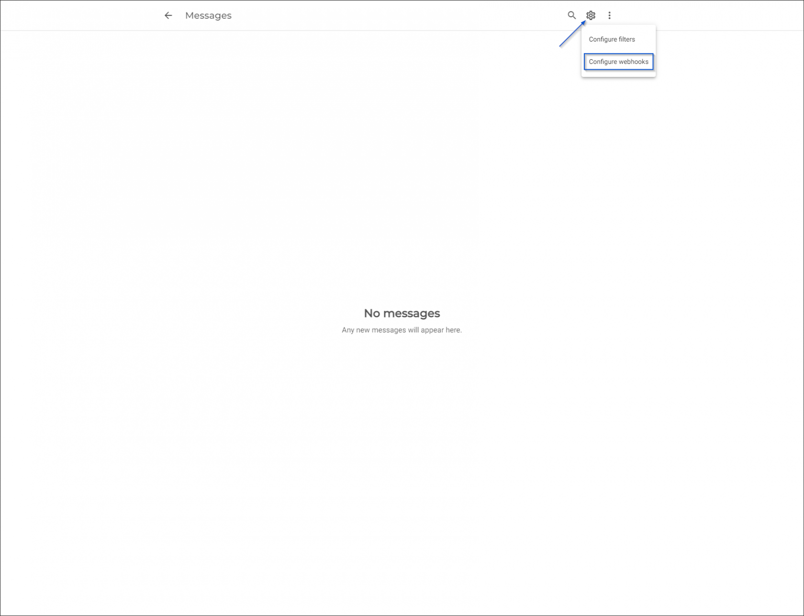
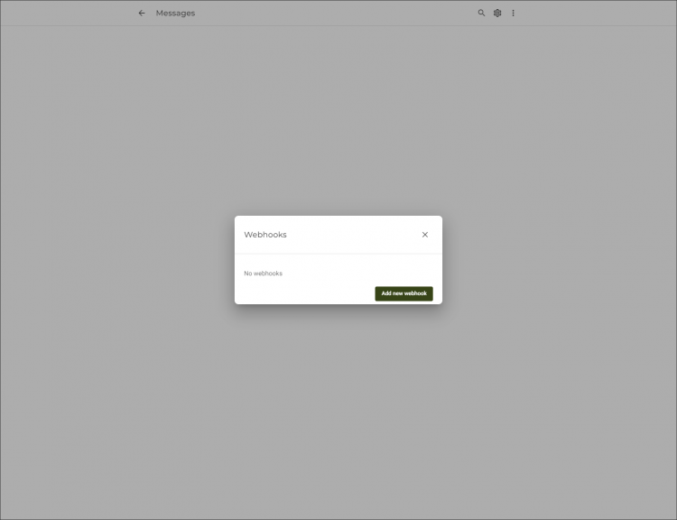
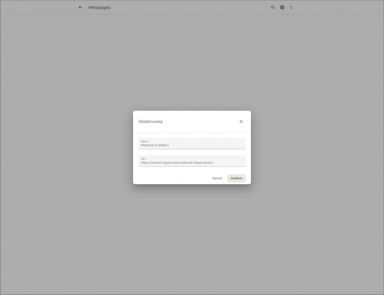

# SIGNL4 Integration with IXON Cloud

In our example we use the IXagent, the software agent for IXON Cloud, to simulate temperature data. When the temperature is too high we send an alert to our SIGNL4 team. You can use an IXrouter, IXON’s edge gateway as well.

SIGNL4 is a mobile alert notification app for powerful alerting, alert management and mobile assignment of work items. Get the app at [https://www.signl4.com](https://www.signl4.com).



## Prerequisites
- A SIGNL4 account (https://www.signl4.com)
- An IXON Cloud account (https://www.ixon.cloud)

An IXrouter (https://www.ixon.cloud/iiot-platform/connectivity-products/ixrouter-edge-gateway) or IXagent (https://www.ixon.cloud/iiot-platform/connectivity-products/ixagent-embedded-agent)

First of all you need to connect your device to the IXON Cloud. This can be the physical IXrouter or the embedded IXagent which is software. In our example we use the latter one and you can request the installer as well as a description on how to connect it here: https://www.ixon.cloud/iiot-platform/connectivity-products/ixagent-embedded-agent.

Once you have connected your device it will appear in your IXON Cloud platform.



In the IXON Cloud platform under Messages -> Settings -> Webhooks add a new webhook. You just need to configure your SIGNL4 webhook URL including your team secret here.





In order to add the data source you can go to your device in Fleet Manager, then to the Services section and add a new data source with the protocol LoggerAPI. Enter a name and IP address (can be random but you will need the IP address later) and a password (you will need the password later). Also add a variable to configure the alarm on.

Please note that this step might differ depending on the agent.

Now you need to configure Cloud Notify. Therefore, go to your device in Fleet Manager and then to Services > Data source name > Alarm triggers and add a new alarm. Here you can specify the conditions. You can even specify instructions on how to resolve the issue.

This is it. You can now test your IoT scenario by simulating the temperature change. You will then receive an alert in your SIGNL4 app.

The simulation might differ depending on the agent you use. In our example we use the following console commands to connect to the device and then to set the temperature values.

```
HELO Windows 10 Pro/18362 HP/HP EliteBook 840 G5 IXagent for Windows/1.0.4 (libixagent/0.8.0; OpenSSL/1.1.1b; OpenVPN/2.4.6 [OCC] [OpenSSL/1.1.0h via –version]; stunnel/5.49; libixlogger/0.4.0)

DEVC
DEVC OK

@1=44
@1=44
@1=42
@1=2
@1=44
@1=1
@1=44
@1=1
```

You can find a sample in GitHub:
[https://github.com/signl4/signl4-integration-ixon](https://github.com/signl4/signl4-integration-ixon)
