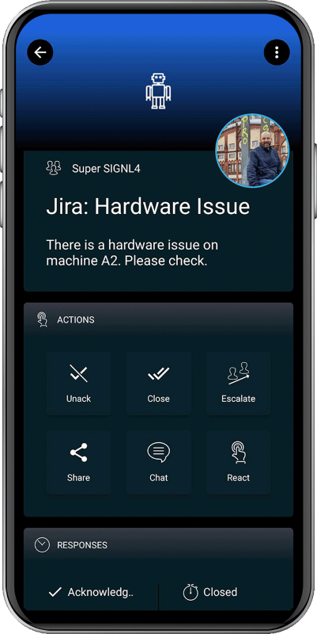

# SIGNL4 Integration with Jira Software

[Jira Software](https://www.atlassian.com/software/jira) is an issue tracking product developed by Atlassian. SIGNL4 offers a two-way connector app for Jira. When a new ticket is created in Jira, an alert is automatically sent to the corresponding SIGNL4 mobile team. If the alert is acknowledged, annotated or closed in the SIGNL4 app, these changes are also reflected in the Jira ticket. An update of the Jira ticket can also close an alarm in SIGNL4.

The Jira Service Management connector app makes 2-way integration with Jira Service Management a child’s play and responding to service desk tickets can be done conveniently via the SIGNL4 mobile app.

## Feature overview

- Forwarding tickets of your choice to SIGNL4
- Status synchronization between both systems
- Agent assignment when Signl is acknowledged and or closed
- Issue notes on status changes in SIGNL4
- User friendly display of linked items

## How does it work?

The connector communicates with the Jira Service Management API to read ticket details or to update them. According permissions must be enabled in the role that gets assigned to the user account that you create for SIGNL4 in Jira.

In SIGNL4 you create a new connector integration “Jira Service Management”. You find this one in the SIGNL4 web portal unter Integrations -> Gallery -> Jira Service Management. Here you configure the connector and enter your data. You will find a description as a tooltip directly on the configuration page. The following data is particularly important.

Instance URL: The URL of your Jira instance, for example: https://signl4.atlassian.net/

Email address: Your email address for your Jira account.

API token: An API token for the Jira account. More information about this can be found [here](https://support.atlassian.com/atlassian-account/docs/manage-api-tokens-for-your-atlassian-account/).

After saving, current (last hour) tickets are retrieved from Jira and an alert is sent to the appropriate SIGNL4 team.

### Tips and tricks

Please double check the field "Comment Visibility Role". For example it might be "Administrators" but also "Administrator" for the administrator role.

For Tasks you might want to add the following strings (comma-separated with no spaces):
- "Trigger new Signls for tickets with these Jira ticket statuses": Add "To do"
- "Auto-close Signls on these Jira ticket statuses": Add "Done"

The alert in SIGNL4 might look like this.

