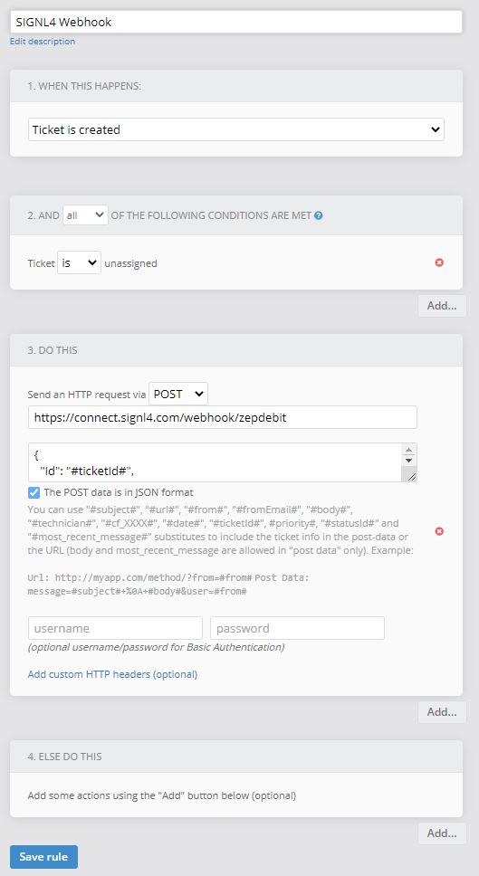
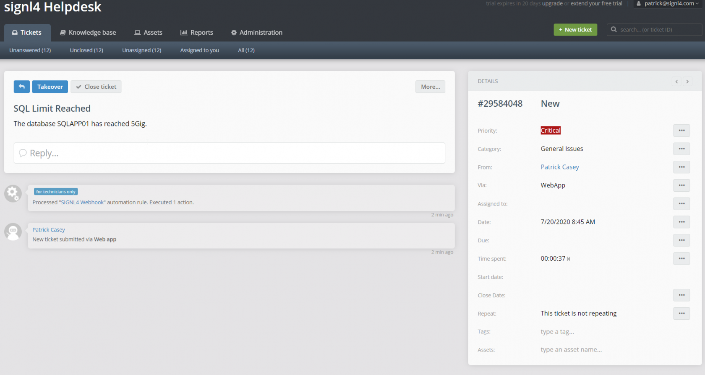

# SIGNL4 Integration with JitBit

[JitBit](https://www.jitbit.com/) is a cloud-based (or on-prem) ticketing system.  This tool is perfect for call centers and help desk to take incoming calls and log them in the portal.  The monitoring dashboard gives a great overview of your setup but where SIGNL4 comes in is at the alerting level.  JitBit has many integration methods for connecting to external applications. We will direct tickets to the right people at the right time using the SIGNL4 webhook.  With on-call duty scheduling and a tiered escalation to a manager, SIGNL4 ensures that the email will not be lost in a sea of emails.

In our example we are going to forward JitBit ticket via webhook to the SIGNL4 team.  This will alert all team members on duty via Push, SMS and Voice notifications.

SIGNL4 is a mobile alert notification app for powerful alerting, alert management and mobile assignment of work items.  Get the app at [https://www.signl4.com](https://www.signl4.com/)

## Prerequisites

- A SIGNL4 ([https://www.signl4.com](https://www.signl4.com/)) account
- An JitBit ([https://www.jitbit.com/](https://www.jitbit.com/)) account

## How to Integrate

In order to not disturb any of the current workflows you may already have setup, we are simply going to add a new rule that will forward JitBit ticket data to the SIGNL4 team upon creation.  To do this follow these steps:

1. Access the Administration Tab
2. Click on Automated Rules
3. Click Create
4. Populate the rule as shown in the screenshot



The JSON post should look as follows:

```json
{
    "Id": "#ticketId#",
    "Type": "#priority#",
    "Source": "#from#",
    "Message": "#body#",
    "State": "#statusId#"
}
```

Now the next time a ticket is created the priority, from address, body and status will display in the SIGNL4 mobile app.  The ticket history will show the automated rule triggering.



The alert in SIGNL4 might look like this.


