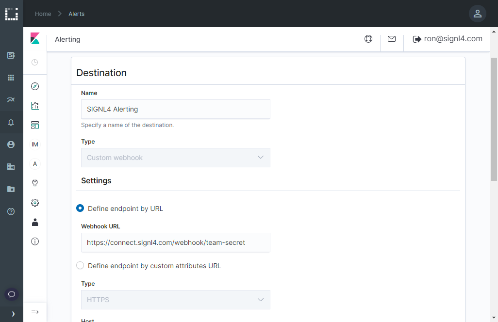
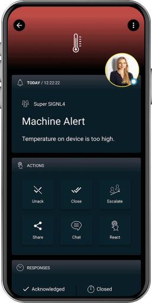

# SIGNL4 Integration with Kaa IoT

The integration of Kaa IoT and SIGNL4 is done using a webhook. In our example we monitor a temperature. If the temperature is too high we generate an alert and send it to our SIGNL4-Team.

## Prerequisites
- A SIGNL4 account ([https://www.signl4.com](https://www.signl4.com/))
- Kaa IoT (kaaiot.com) in the cloud or on premise

In our example we use a device connected to the IoT platform [Kaa IoT](http://kaaiot.com/) to get temperature data. You can find more information at [kaaiot.com](http://kaaiot.com/).


Kaa IoT uses the [Kibana dashboard](https://www.elastic.co/kibana) for visualization and alerting. On our [Kibana integration page](https://www.signl4.com/blog/portfolio_item/elasticsearch-kibana-mobile-alert-notification-duty-schedule-escalation/) you can find more information on how to integrate SIGNL4. In the following you can find a brief summary about the integration.



In the Kaa IoT portal go to Alerts -> Alerting and create a new Destination of the type Custom Webhook. The Webhook URL is your SIGNL4 webhook URL including your SIGNL4 team secret.

You can then configure a Device Monitor and a Trigger and specify your thresholds and conditions. In the Trigger you select your  SIGNL4 alert action as created above. As body you can specify the alert data. The following is an example.


```json
{
    "Title": "Kaa IoT Alert",
    "Message": "Monitor {{ctx.monitor.name}} just entered alert status. Please investigate the issue.",
    "Trigger": "{{ctx.trigger.name}}",
    "Severity": "{{ctx.trigger.severity}}",
    "PeriodStart": "{{ctx.periodStart}}",
    "PeriodEnd": "{{ctx.periodEnd}}"
}
```


That is it and now you can test the alert. You can for example simulate higher temperature and you should then receive an alert in your SIGNL4 app.

The alert in SIGNL4 might look like this.


