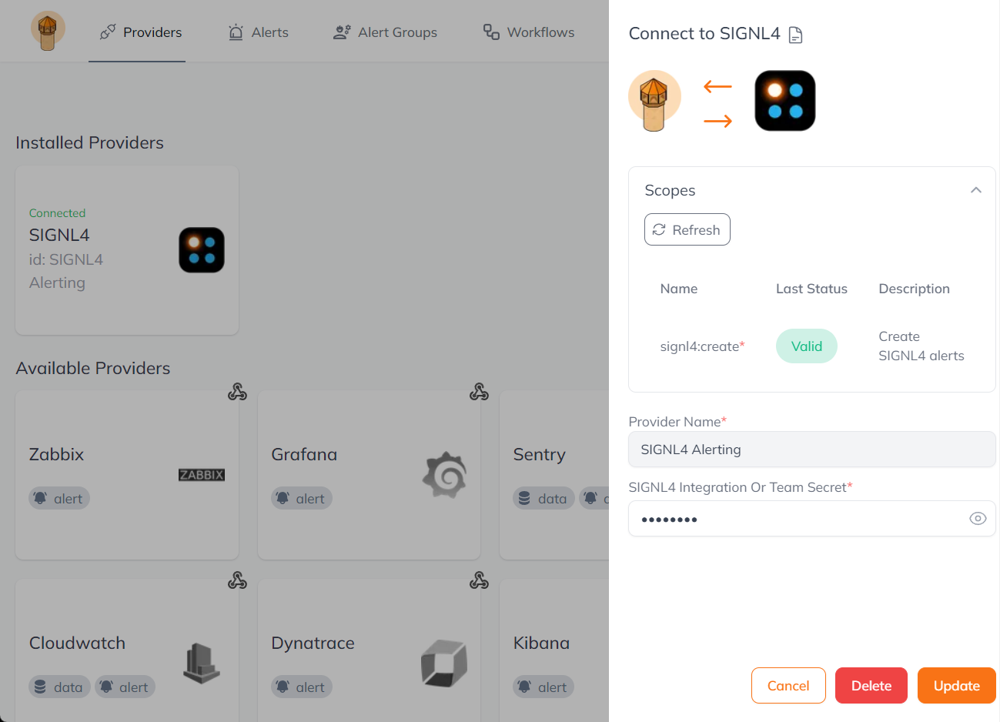
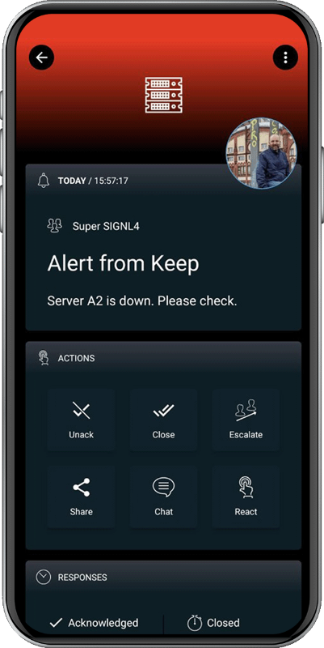

# SIGNL4 Integration with Keep

[Keep](https://www.keephq.dev/) is an open-source alerts management and automation platform that helps you to connect, automate, and analyze alerts for any part of your observability stack with GitHub Action-like interfaces.

The SIGNL4 integration is available as a Provider in Keep.

By sending automated alerts from Keep users can react to critical situations quickly and to take according action.

SIGNL4 is a mobile alert notification app for powerful alerting, alert management and mobile assignment of work items. Get the app at [https://www.signl4.com](https://www.signl4.com/).

To use SIGNL4 alerting in Keep, you first need to create the SIGNL4 Providers (Connect). Here you enter your SIGNL4 integration or team secret and click Connect.

## Send alerts

To send alerts, you can create a workflow under Workflows and integrate SIGNL4 there. You can find more information [here](https://docs.keephq.dev/providers/documentation/signl4-provider).

The alert in SIGNL4 might look like this.

