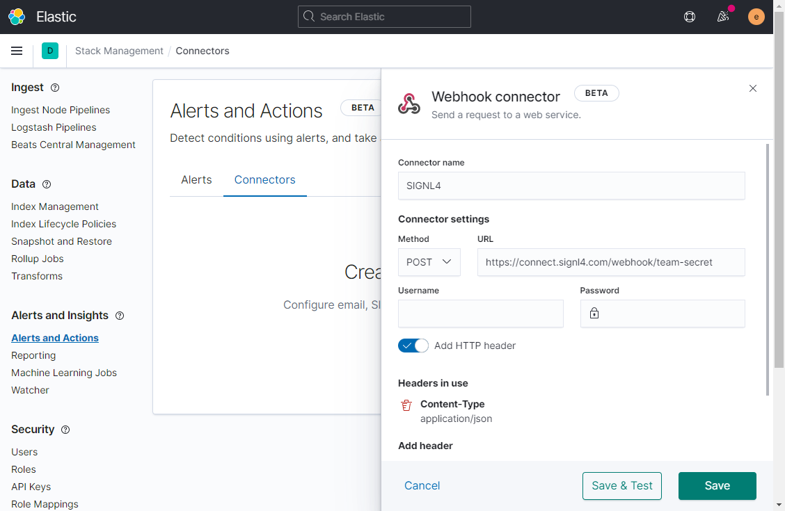
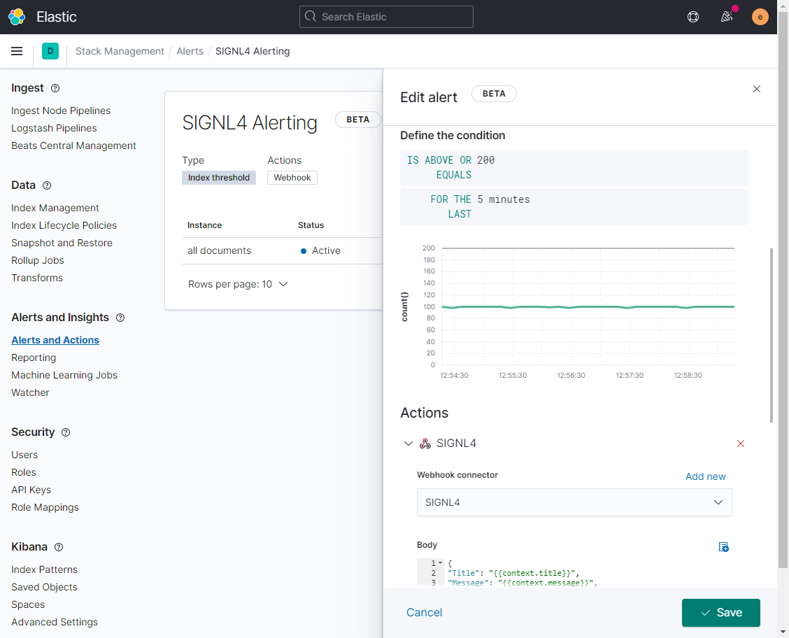

# SIGNL4 Integration with Kibana

[Kibana](https://www.elastic.co/kibana) is an open source data visualization dashboard for [Elasticsearch](https://www.elastic.co/elasticsearch/service). It provides allows users to create bar, line and scatter plots, or pie charts and maps for of large volumes of data. You can do anything from tracking query load to understanding the way requests flow through your apps.

Pairing Kibana with SIGNL4 can enhance your daily operations with an extension to your team wherever it is. The integration does not only allow you to know when a critical issue has occurred but also when it was resolved no matter where you are.

The integration of Kibana and SIGNL4 is done using a webhook. In our example we monitor a temperature. If the temperature is too high we generate an alert and send it to our SIGNL4-Team.

## Prerequisites

- A SIGNL4 account ([https://www.signl4.com](https://www.signl4.com/))
- Kibana ([https://www.elastic.co/kibana](https://www.elastic.co/kibana))

A data source (in our case we use Kaa IoT: [https://www.kaaproject.org](https://www.kaaproject.org/))

In our example we use the IoT platform [Kaa IoT](https://www.kaaproject.org/) with a connected device to get temperature data into Kabana. You can find more information at [https://www.kaaproject.org](https://www.kaaproject.org/).


In your Kabana portal you go to Alerts and Actions and then to Connectors. Here you create a new Webhook connector. The POST URL is your SIGNL4 webhook URL including your team secret. You can also add the header "Content-Type": "application/json".

You can now Save & Test and as body enter some test data:

```json
{
    "Title": "Kibana Alert",
    "Message": "Test",
}
```



Now go to Alerts in order to create a new Alert. Here you can specify the threshold and the condition and select the SIGNL4 alert connector you have created above. As body you enter the data in JSON format according to your needs. You can also add alert variables here. The following shows an example.


```json
{
    "Title": "{{context.title}}",
    "Message": "{{context.message}}",
    "Value": "{{context.value}}",
    "AlertId": "{{alertId}}"
}
```




That is it and now you can test the alert. You can for example simulate higher temperature and you should then receive an alert in your SIGNL4 app.

The alert in SIGNL4 might look like this.


