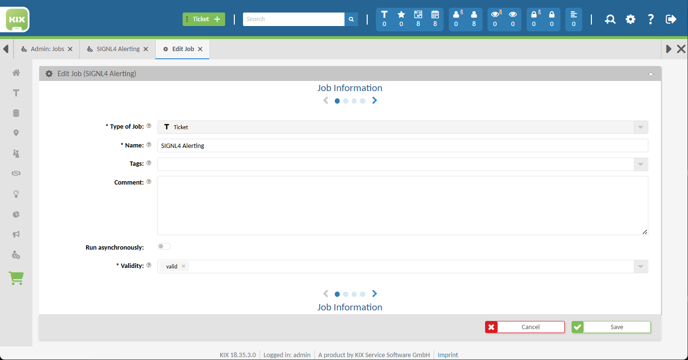
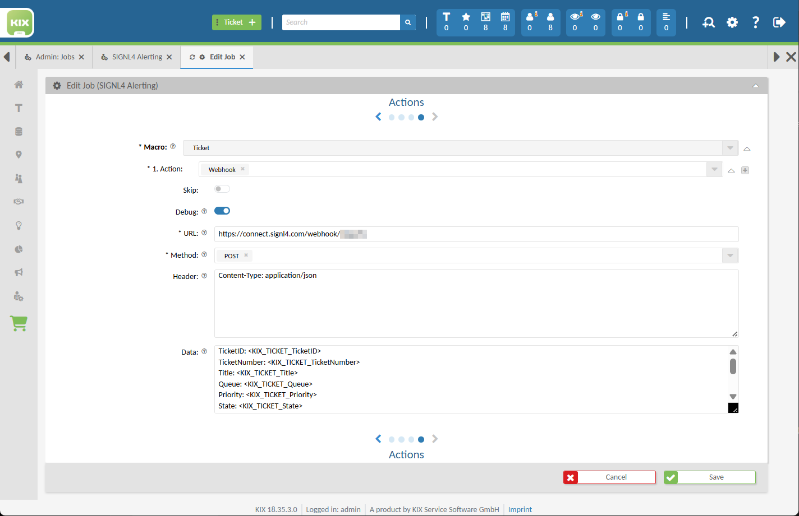
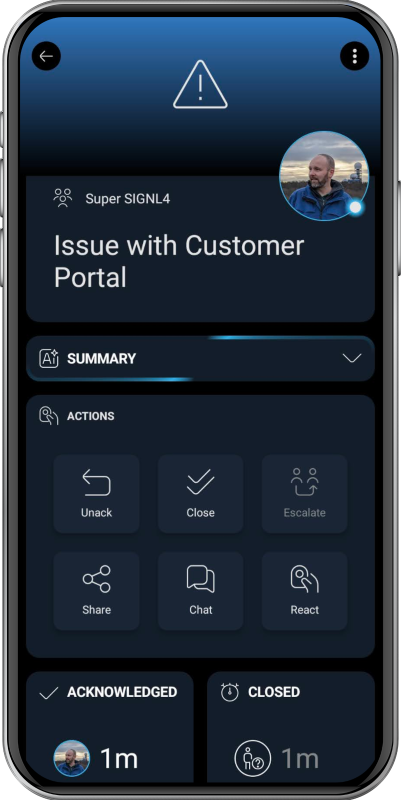

# SIGNL4 Integration with KIX

[KIX](https://www.kixdesk.com/en/) is an open-source ticketing and service management system for IT- and enterprise-wide support – covering ITSM (IT Service Management), ESM (Enterprise Service Management), help-desk and service-desk tasks. It offers ticketing, asset (CMDB) management, knowledge base, workflows, SLA tracking and a self-service portal. You can run it on-premises or in the cloud, and it is highly customizable thanks to its open-source nature.

SIGNL4 adds reliable mobile alerting to KIX with features like mobile app, push notifications, SMS messaging, voice calls, automated escalations, and on-call duty scheduling. SIGNL4 ensures that critical alerts reliably reach the responsible personnel – anytime, anywhere.

## Prerequisites

- A SIGNL4 (<https://www.signl4.com>) account
- A KIX (<https://www.kixdesk.com/en/>) instance, for webhook integration the Pro version plus Connect add-on is required

## How to Integrate

The integration of SIGNL4 with KIX is straightforward. This is how it works.

### Webhook Integration

In order to configure the webhook integration in your KIX portal go to Admin -> KIX -> Automation -> Jobs. Here, create a new Job.

Under Job Information you specify "Ticket" as "Type of Job" and gib the job a name.



On the next page you can leave the Execution Plan as is.

On the Filter page you can specify additional filters for the job to apply, e.g. only trigger the SIGNL4 alert for critical tickets.

On the Actions page choose a Macro of type Ticket and use Webhook as Action. Then, enter the following parameters:  
URL: Your SIGNL4 webhook URL, e.g. <https://connect.signl4.com/webhook/abcdef>  
Method: POST  
Header: Content-Type: application/json  
Data:

```
TicketID: <KIX_TICKET_TicketID>
TicketNumber: <KIX_TICKET_TicketNumber>
Title: <KIX_TICKET_Title>
Queue: <KIX_TICKET_Queue>
Priority: <KIX_TICKET_Priority>
State: <KIX_TICKET_State>
CustomerUserID: <KIX_TICKET_CustomerUserID>
Created: <KIX_TICKET_CreateTime>
URL: https://your-kix-system/ticket/<KIX_TICKET_TicketID>
X-S4-ExternalID: <KIX_TICKET_TicketID>
X-S4-Status: new
X-S4-SourceSystem: KIX
```

You can adapt the Data payload as you like but please leave the X-S4- parameters unchaned.



#### Closing Alerts

If you want to not only trigger alerts but also close them when the KIX ticket is closed, add a second Job with the close condition (Filter) and the following payload data.

```
X-S4-ExternalID: <KIX_TICKET_TicketID>
X-S4-Status: resolved
```

### Alternative via Email

Alternatively, or if you are using the KIX Start edition, you can integrate SIGNL4 via email. Simply create a user with your SIGNL4 team email address (e.g., <abcdef@mail.signl4.com>) and configure KIX to notify this user by email whenever a new ticket is created.

That's it. Now your SIGNL4 team gets alertig whenever there is a new ticket created in KIX.

The alert in SIGNL4 might look like this.


