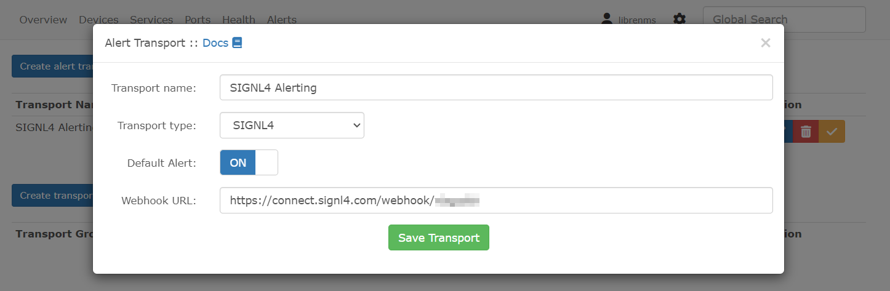
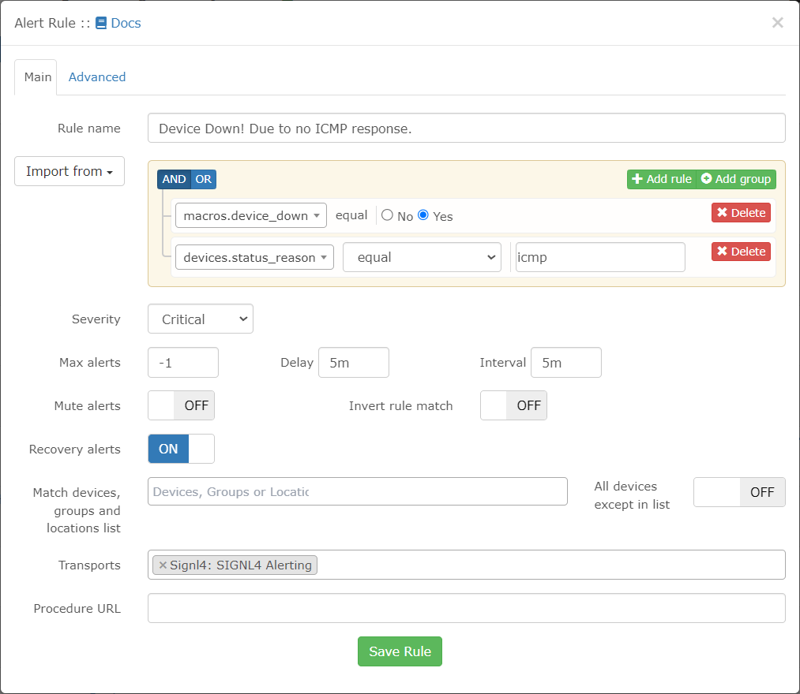
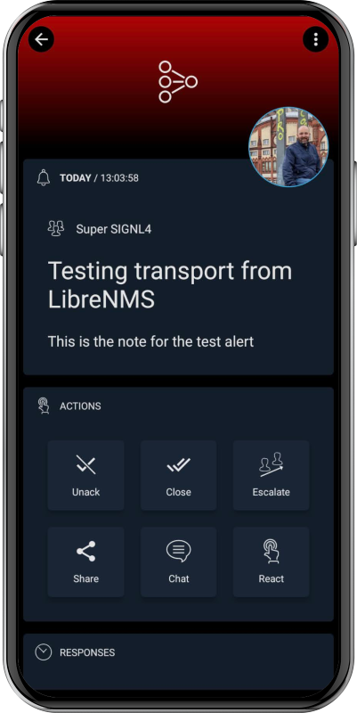

# SIGNL4 Integration with LibreNMS

[LibreNMS](https://www.librenms.org/) is a fully featured network monitoring system that provides a wealth of features and device support.

SIGNL4 offers critical alerting, incident response and service dispatching for operating critical infrastructure. It alerts you persistently via app push, SMS text, voice calls, and email including tracking, escalation, on-call duty scheduling and collaboration.

Integrating SIGNL4 with LibreNMS to forward critical alerts with detailed information to responsible people or on-call teams.

## Prerequisites

- A SIGNL4 ([https://www.signl4.com](https://www.signl4.com/)) account
- LibreNMS (download from [https://www.alertra.com/](https://www.alertra.com/))

## How to Integrate

You can configure the SIGNL4 integration with LibreNMS as follows.

In the LibreNMS portal go to Alerts -> Alert Transports. Here you create a new alert transport.

**Attention**: There is a dedicated SIGNL4 alert transport. If you cannot find it in the product you can copy this file ([Signl4.php](Signl4.php)) to your LibreNMS server to the folder LibreNMS\Alert\Transport as described [here](https://docs.librenms.org/Alerting/Creating-Transport/).

Then, when you create a new alert transport, select the transport type SIGNL4 and enter your SIGNL4 webhook URL including team or integration secret like this:

```
https://connect.signl4.com/webhook/{team-secret}
```
Here, {team-secret} is your SIGNL4 team or integration secret.



Now you can use your SIGNL4 alert transport in any of your alert rules.



This is it and an incoming alert will look like this.



