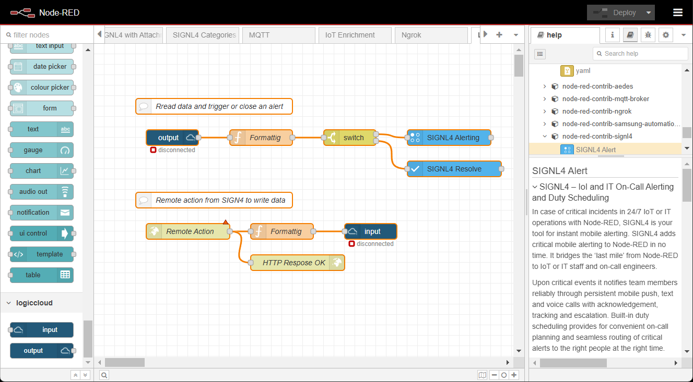

# SIGNL4 Integration with logiccloud

[logiccloud](https://logiccloud.com/en/) offers virtual PLC's (Programmable Logic Controllers) and allows you to create your PLC programs just once and then run them on any hardware platform and in the cloud without making any changes. logiccloud can be used in the most diverse areas of the automation world, e.g. in building automation, smart factory, and de-centralised systems.

Pairing logiccloud with SIGNL4 can enhance your daily operations with an extension to your team wherever it is. The integration does not only allow you to know when a critical issue has occurred but also when it was resolved no matter where you are.

## How to Integrate

For triggering SIGNL4 alerts from logiccloud you can use Node-RED. On one side you connect to logiccloud and on the other side you use the SIGNL4 node to trigger the alerts. You can find the required Node-RED nodes for logiccloud [here](https://flows.nodered.org/search?term=logiccloud) and the ones for SIGNL4 [here](https://flows.nodered.org/node/node-red-contrib-signl4).

The following flow shows how the integration might look like.

In the first part a SIGNL4 alert is triggered when data read from logiccloud meets certain conditions.

The second (optional) part gives an idea about how to use SIGNL4 remote actions to write data in logiccloud. We use an "http in" node for receiving the HTTP request of SIGNL4's remote action here. 

You can find more information on how to integrate SIGNL4 with Node-RED [here](https://docs.signl4.com/integrations/node-red/node-red.html).

The alert in SIGNL4 might look like this.

