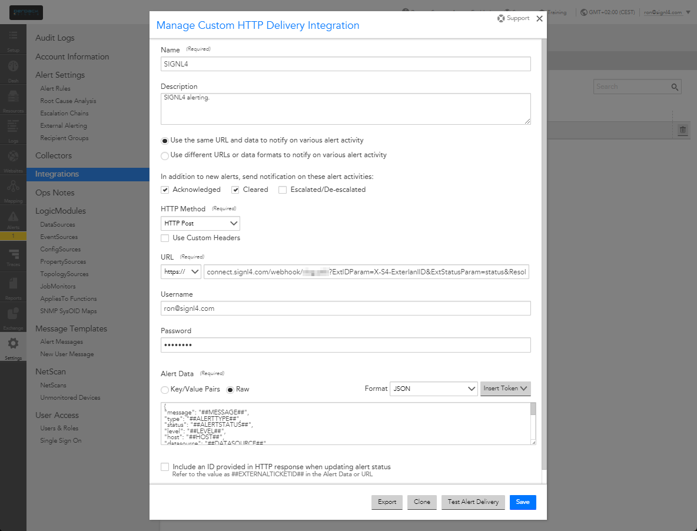
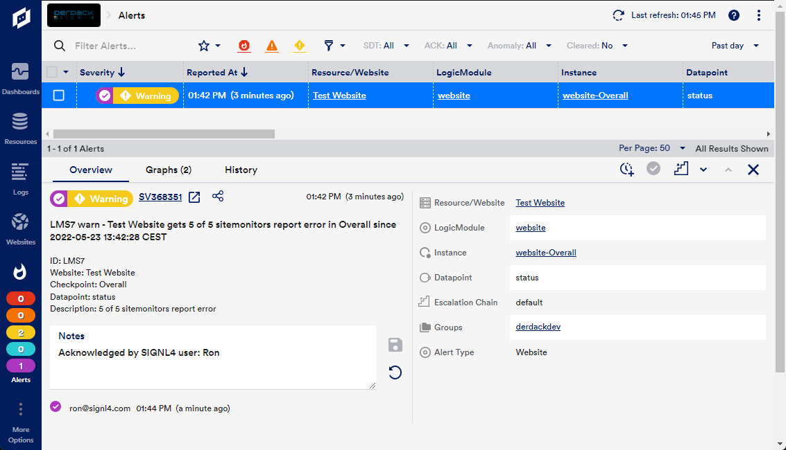

# SIGNL4 Integration with LogicMonitor

[LogicMonitor](https://www.logicmonitor.com/) is a leading SaaS-based unified observability and IT operations data collaboration platform for enterprise IT and managed service providers. It helps you gain IT insights, seamless data collaboration at scale, and visibility into networks, cloud, applications, servers, log data and more within one unified platform.

You configure SIGNL4 alerting in the LogicMonitor web portal.



In the LogicMonitor portal under Settings -> Integrations you add a new integration of type Custom HTTP Delivery.

As HTTP Method you choose HTTP Post and as URL you enter your SIGNL4 webhook URL including team secret.

```
https://connect.signl4.com/webhook/{team-secret}
```

Here, {team-secret} is your SIGNL4 team secret.

For resolving alerts in SIGNL4 when the alert gets closed in LogicMonitor you can use the following URL:

```
https://connect.signl4.com/webhook/team-secret}?ExtIDParam=X-S4-ExterlanlID&ExtStatusParam=status&ResolvedStatus=clear
```

The Alert Data (Raw and in JSON format) might look like this:

```json
{
    "message": "##MESSAGE##",
    "type": "##ALERTTYPE##",
    "status": "##ALERTSTATUS##",
    "level": "##LEVEL##",
    "host": "##HOST##",
    "datasource": "##DATASOURCE##",
    "eventsource": "##EVENTSOURCE##",
    "batchjob": "##BATCHJOB##",
    "group": "##HOSTGROUP##",
    "datapoint": "##DATAPOINT##",
    "start": "##START##",
    "finish": "##FINISH##",
    "duration": "##DURATION##",
    "value": "##VALUE##",
    "threshold": "##THRESHOLD##",
    "userdata": "##USERDATA##",
    "cmdline": "##CMDLINE##",
    "exitCode": "##EXITCODE##",
    "stdout": "##STDOUT##",
    "stderr": "##STDERR##",
    "externalid": "##EXTERNALTICKETID##",
    "X-S4-ExternalID": "##ALERTID##"
}
```

You can adapt the data according to your needs. However, do not change the parameters “”X-S4-ExternalID” and “status” as these are used to do the matching when resolving alerts.

Now you need to adapt the escalation chain or create a new one under Settings -> Escalation Chains. Here you can add (or edit) a Stage and a recipient. In the Recipient add a user and select the SIGNL4 integration as Contact Method.

In the next step you need to check your alert rules under Settings -> Alert Settings -> Alert Rules. Here you need to make sure to use the SIGN4 integration you have created above as your escalation chain.

That’s it and when a check triggers an alert your SIGNL4 team will receive the notification.



## Two-Way Connector App for LogicMonitor

This connector adds two-way functionality to SIGNL4 alerting in LogicMonitor. Alerts that are acknowledged, closed or annotated in SIGNL4 result in a status update in LogicMonitor.

You find the connector app in your SIGNL4 web portal under Apps -> LogicMonitor. The configuration of the LogicMonitor connector is straightforward. You only need a LogicMonitor API Token of type Bearer and the URL to your LogicMonitor instance. You can create the API Token in LogicMonitor under your profile settings. Please create a Bearer API Token.

The alert in SIGNL4 might look like this.


