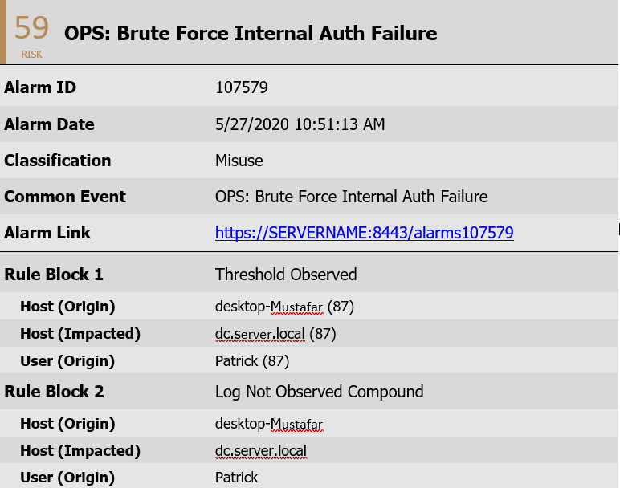
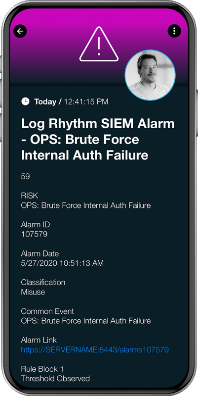

# SIGNL4 Integration with LogRythm

[LogRhythm](https://logrhythm.com/) is a SIEM platform that helps detect and stop cyber threats. The monitoring dashboard gives a great overview of your setup but where SIGNL4 comes in is at the alerting level. Currently LogRhythm will send an email to specified parties when an alert is raised. SIGNL4 allows for those emails to be directed to the right people at the right time. With on-call duty scheduling and a tiered escalation to a manager, SIGNL4 ensures that the email will not be lost in a sea of emails.

In our example we are going to forward LogRhythm alarm via email to the SIGNL4 email address.  This will alert all team members on duty via push, SMS, email and voice notifications.

SIGNL4 is a mobile alert notification app for powerful alerting, alert management and mobile assignment of work items. Get the app at [https://www.signl4.com](https://www.signl4.com/)

## Prerequisites

- A SIGNL4 ([https://www.signl4.com](https://www.signl4.com/)) account
- A LogRhythm ([https://www.Log Rhythm.com/](https://logrhythm.com/)) account

### How to Integrate

First, we need to crate a user to target alerts to. Follow these steps taken from the LogRhythm documentation to create a new user.

On the main toolbar, click "Deployment Manager".

- Click the "People" tab.On the File menu, click "New".

The "Is Person an Individual?" dialog box appears.

- If you are adding an individual, click "Yes".
- If you are adding a role, click "No".

The Person Properties dialog box appears.

Choose from the following:

- If you choose to create a Person Record, enter the person’s first, middle, and last name according to your organization’s standards, and then skip to step 6. The display name is automatically generated by the software in the following format: Last Name, First Name, and Middle Name.
- If you choose to create a Role, go on to step 5.

In the Display Name field, enter the name of the role being created (for example, Restricted Analyst or Restricted Administrator).

If not already selected, click the "Contact Methods".

In the Contact Methods tab, select the methods the alarming engine uses to contact this user or role when an alarm associated with them has been triggered.

- Select a Contact Method Type from the drop-down list.
- Enter relevant data, such as an email address, into the Contact Information field. **This is where the SIGNL4 team email address is entered.**
- To assign an Alarm Notification Policy to the user, click **Alarm Notification Policy** and select an Alarm Notification Policy. The Alarm Notification Policy is used to specify the information that will be included in the notification, as well as throttle the number of notifications in an allotted time.

**Note:** The Notification Policy Manager automatically filters out Alarm Notification Policies that do not match the type selected in Contact Method Type.

Click "Save". The selected contact method appears in the Contact Methods field.

Repeat the process as necessary to include all contact methods you want.

Click the "Additional Information" tab and type a Brief Description or Additional Details, as needed.

Click the "Permissions" tab.

Select the appropriate permissions for this user or role from the Permissions list.

Click "OK".

Alarms targeted to this user will now raise alerts within SIGNL4. Here is an example of an email that is typically received from LogRhythm.

