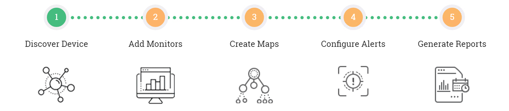
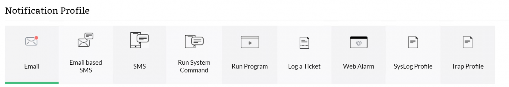
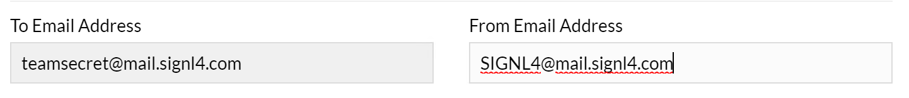
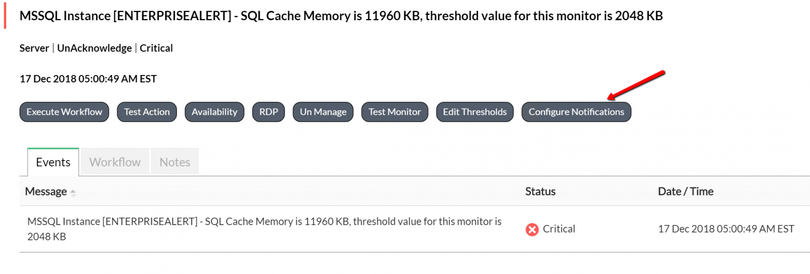

# SIGNL4 Integration with ManageEngine OpManager

[ManageEngine OpManager](https://www.manageengine.com/network-monitoring/) is an end-to-end network management software for heterogeneous, multi-vendor enterprise IT networks. It offers a unified approach to scale and manage distributed IT infrastructure, advanced fault and performance management functionality across critical IT resources viz. network devices, WAN or VoIP links, servers, virtual servers (VMware and Hyper-V), Domain controllers, M

First you need to have a Mail Server Settings for your organization in place under the Basic Settings.

Then you can create an email profile.

Monitoring – Settings -> Notifications -> Add Profile

Enter a TO and FROM email, Click Next.

Select Criteria Next

Select Category Next

Set Schedule Next

Test Action -> Save

This provides you with an email notification template where you can then associate alarms to go to. To do this access the details of an alarm that have been raised and then click on Configure Notifications.

Walk through the wizard to select the criteria and threshold, etc.  The next time this alarm is raised it will be sent to your SIGNL4 team email address and all on call users will be notified.

The alert in SIGNL4 might look like this.

