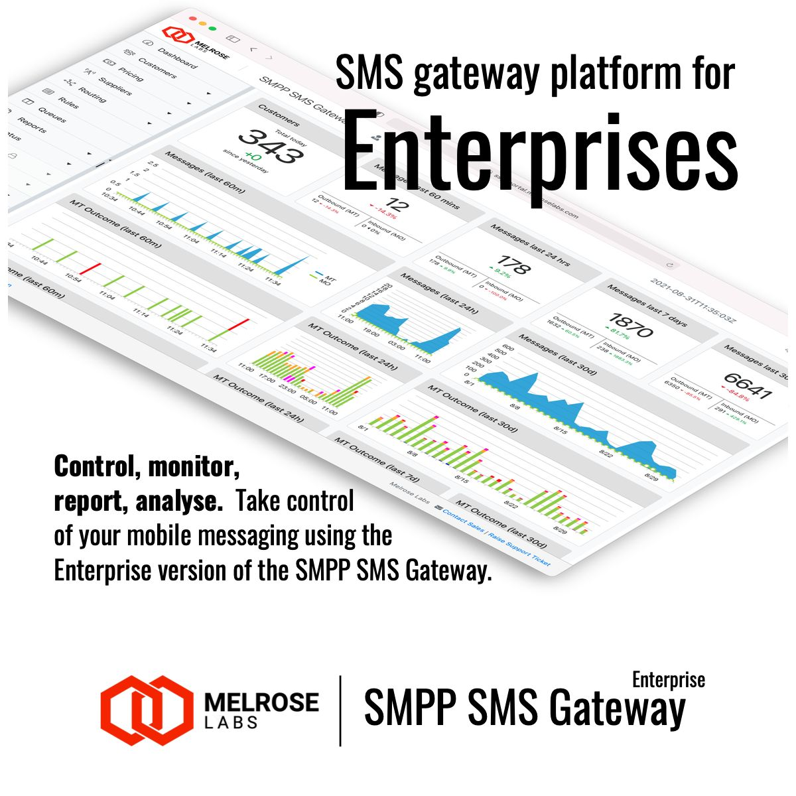

# SIGNL4 Integration with Melrose Labs

Distributed sensors or devices in the field often have no network connection and can only send SMS text messages in case a problem is detected. When an issue has been detected SIGNL4 takes care to alert the responsible user or team as quickly and as reliably as possible including acknowledgement, escalation, duty scheduling / shift planning, collaboration and more.

The integration of [Melrose Labs](https://melroselabs.com/) and SIGNL4 enables you to connect your SMS-capable devices with SIGNL4 for reliable team alerting.

When your devices detect critical situations or malfunctions they send an SMS message to Melrose Labs’ SMS gateway. The gateways then forwards the message to SIGNL4 via webhook where the alert is triggered.

In order to integrate your SMS-capable devices with SIGNL4 you need to get a virtual phone number from [Melrose Labs](https://melroselabs.com/). There you can configure the forwarding of your devices’ SMS messages to a SIGNL4 team.

## Requirements

In order to configure the SMS-to-SIGNL4 forwarding you need the following information:

- The phone numbers of all your devices that send SMS messages
- Your SIGNL4 team secret(s) for the team(s) that should receive the alerts

## Contact Melrose Labs

Please contact Melrose Labs directly to open your account and to configure the SMS-to-SIGNL4 forwarding. You can find the contact information [here](https://melroselabs.com/contact/).

Besides SMS-to-SIGNL4 Melrose Labs offers other services for example outbound mobile terminated (MT) SMS from an application to a mobile that is also passed to SIGNL4.

The alert in SIGNL4 might look like this.

