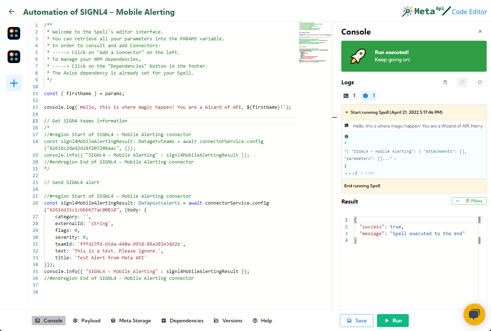

# SIGNL4 Integration with Meta API

[Meta API](https://www.meta-api.io/) is a platform for developers who want to quickly create easy to maintain APIs integrations without losing control. It allows you to build strong automation in minutes. Meta API is an open API solution to accelerate code, authentication, deployment and monitoring to let you focus on new features, not boilerplate code.

In the Meta API dashboard you can add your SIGNL4 API.

In the Meta API dashboard you can create a new Spell and add the SIGNL4 API there. You can choose what API functions you would like to use.

In order to use the SIGNL4 REST API you need the API Key. You can create this one in your SIGNL4 web portal under Teams -> Developer -> API Keys.

That’s it. Now you can test, use and integrate the SIGNL4 REST API easily.

The alert in SIGNL4 might look like this.

