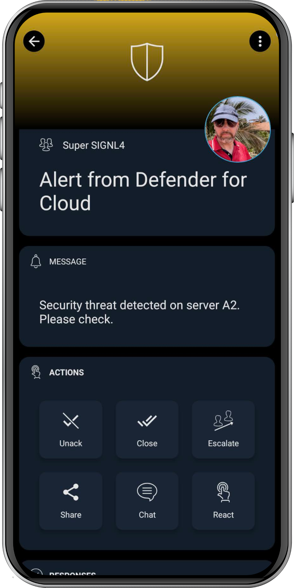

# SIGNL4 Integration with Microsoft Defender for Cloud

[Microsoft Defender for Cloud](https://www.microsoft.com/en-us/security/business/cloud-security/microsoft-defender-cloud) is a cloud-native application protection platform (CNAPP) that combines development security operations (DevSecOps), cloud security posture management (CSPM), and cloud workload protection (CWP) to safeguard resources across multicloud and hybrid environments. It provides unified security management and advanced threat protection, helping organizations strengthen their security posture and protect against modern cyber threats.

Users can enhance their security response by integrating Microsoft Defender for Cloud with SIGNL4, enabling real-time, mobile alerts and efficient collaboration for critical threat notifications.

## Use cases

Microsoft Defender for Cloud generates a variety of security alerts across different resource types, each indicating potential threats or suspicious activities within your environment. These alerts are categorized by severity—High, Medium, Low, and Informational—to help prioritize response efforts. Examples include:  
- Alerts for Windows machines: Detects activities such as execution of known malicious tools or suspicious processes running on virtual machines.
- Alerts for Linux machines: Identifies unauthorized access attempts or anomalous behaviors indicative of compromise.
- Alerts for DNS: Monitors for suspicious domain resolutions that may suggest command-and-control communication.
- Alerts for Azure VM extensions: Flags unauthorized installations or modifications of virtual machine extensions.
- Alerts for Azure App Service: Detects web application attacks, including SQL injection and cross-site scripting attempts.
- Alerts for containers (Kubernetes clusters): Identifies suspicious activities within containerized environments, such as unauthorized API calls or anomalous pod behaviors.
- Alerts for SQL Database and Azure Synapse Analytics: Monitors for potential SQL injection attacks or unauthorized data access attempts.
- Alerts for open-source relational databases: Detects suspicious login attempts or data exfiltration activities.
- Alerts for Resource Manager: Flags unauthorized changes to resource configurations or deployments.
- Alerts for Azure Storage: Identifies anomalous data access patterns or potential data leakage incidents.
- Alerts for Azure Cosmos DB: Monitors for unauthorized access or suspicious query activities.
- Alerts for Azure network layer: Detects network anomalies such as unusual port scanning or traffic patterns.

With SIGNL4 your team can now receive these alerts reliably via app push, SMS text or phone call, including escalation, duty-scheduling and collaboration.

## How does it work?

For accessing data from Defender for Cloud SIGNL4 uses the Microsoft Graph security API. The configuration of the Graph API is part of our "Microsoft Sentinel, etc." connector app. You can find it in the SIGNL4 web portal under "Integrations" -> "Gallery" -> "Microsoft Sentinel, etc.".

Make sure for "Read security events from" you select "Microsoft Graph Security API".

You can find a detailed description about how to configure the connector app [here](https://docs.signl4.com/integrations/microsoft-sentinel/microsoft-sentinel.html).

Once you have configured the connector you can activate it and SIGNL4 will read new incidents and triggers alerts accordingly.

The alert in SIGNL4 might look like this.

