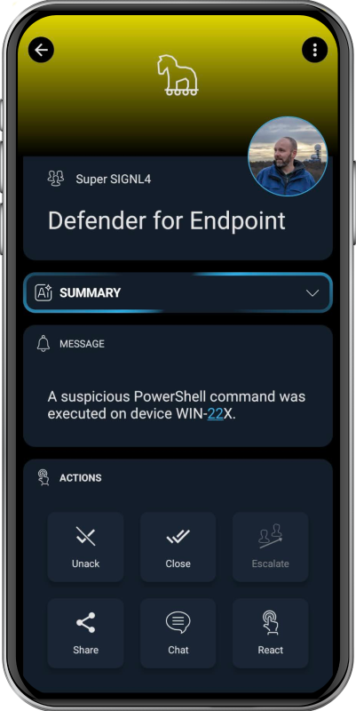

# SIGNL4 Integration with Microsoft Defender for Endpoint

[Microsoft Defender for Endpoint](https://learn.microsoft.com/en-us/defender-endpoint/microsoft-defender-endpoint) is a unified endpoint security platform for preventative protection, post-breach detection, automated investigation, and response. It enables security operations teams to identify, investigate, and respond to advanced threats on endpoints.

## Integration with SIGNL4
The integration between Microsoft Defender for Endpoint and SIGNL4 allows security alerts and incidents to be delivered in real-time to responsible teams via mobile push, SMS, or voice calls. SIGNL4 ensures alert acknowledgment, duty scheduling, and alert enrichment for quick resolution – even when teams are away from their desks.

## Use cases

Typical use cases include:

- Immediate notification of critical endpoint threats to on-call security personnel
- Streamlined after-hours alerting with duty scheduling
- Alert acknowledgment tracking and automated escalation
- Alerting field engineers or SOC staff during a security breach
- Delivery of advanced threat detection signals directly to mobile teams

## How does it work?

For accessing data from Defender for Endpoint SIGNL4 uses the Microsoft Graph security API. The configuration of the Graph API is part of our "Microsoft Sentinel, etc." connector app. You can find it in the SIGNL4 web portal under "Integrations" -> "Gallery" -> "Microsoft Sentinel, etc.".

Make sure for "Read security events from" you select "Microsoft Graph Security API".

You can find a detailed description about how to configure the connector app [here](https://docs.signl4.com/integrations/microsoft-sentinel/microsoft-sentinel.html).

Once you have configured the connector you can activate it and SIGNL4 will read new alerts and incidents and triggers alerts accordingly.

The alert in SIGNL4 might look like this.

