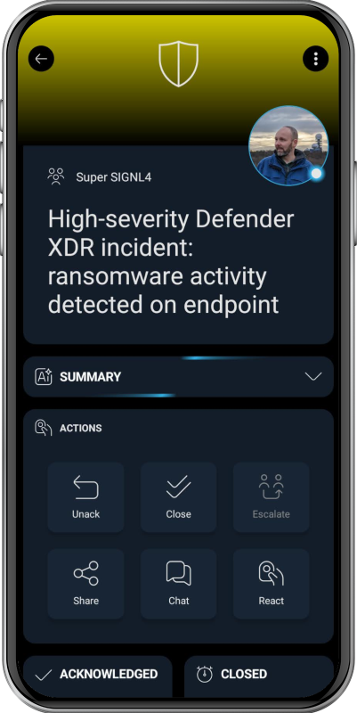

# SIGNL4 Integration with Microsoft Defender XDR

[Microsoft Defender XDR](https://www.microsoft.com/en-us/security/business/siem-and-xdr/microsoft-defender-xdr) is a unified extended detection and response solution that correlates signals across Microsoft security services. It brings together alerts, incidents, investigation, and response in the Microsoft Defender portal so security teams can detect, prioritize, and remediate attacks across users, endpoints, identities, email, cloud apps, and data.

Users can enhance their security response by integrating Microsoft Defender XDR with SIGNL4, enabling real-time mobile alerting via app push, SMS text, and voice calls. SIGNL4 adds reliable alert delivery, escalation workflows, on-call scheduling, and team collaboration for critical incident notifications, helping security teams respond faster and more effectively.

## Use cases

Microsoft Defender XDR creates alerts from suspicious or malicious activity and groups related alerts into incidents that show the broader attack story. These incidents help security teams understand scope, affected assets, severity, and recommended response actions. Examples include:  
- Tickets for endpoint threats: Detects malware, suspicious processes, ransomware activity, or compromised devices.
- Tickets for identity threats: Identifies risky sign-ins, credential theft, privilege abuse, or lateral movement.
- Tickets for email and collaboration threats: Flags phishing, malicious attachments, unsafe links, or business email compromise.
- Tickets for cloud app activity: Detects anomalous user behavior, risky OAuth apps, or suspicious data access.
- Tickets for data security events: Highlights potential data loss, insider risk, or sensitive information exposure.
- Tickets for correlated incidents: Combines related alerts from different Microsoft Defender services into one incident for faster triage.
- Tickets for expert or advanced hunting findings: Surfaces high-priority investigations and custom detections that require immediate action.

With SIGNL4 your team can now receive these alerts reliably via app push, SMS text or phone call, including escalation, duty-scheduling and collaboration.

## Features

The following featurs are supported:
- Reading incidents
- Reading updates for auto-ack / auto close
- Changing incident status based on Signl status changes
- Adding annotations from a Signl back to the incident record

## How does it work?

For accessing data from Microsoft Defender XDR SIGNL4 uses the Microsoft Graph security API. The configuration of the Graph API is part of our "Microsoft Sentinel, etc." connector app. You can find it in the SIGNL4 web portal under "Integrations" -> "Gallery" -> "Microsoft Sentinel, etc.".

Make sure for "Read security events from" you select "Microsoft Graph Security API".

You can find a detailed description about how to configure the connector app [here](https://docs.signl4.com/integrations/microsoft-sentinel/microsoft-sentinel.html).

Once you have configured the connector you can activate it and SIGNL4 will read new incidents and trigger alerts accordingly.

The alert in SIGNL4 might look like this.

