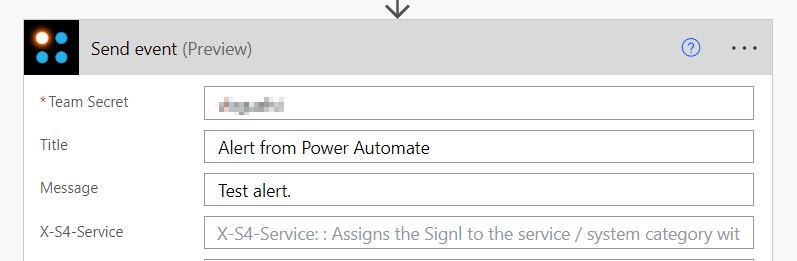

# SIGNL4 Integration with Microsoft Power Automate

SIGNL4 is compatible with [Microsoft Power Automate](https://powerautomate.microsoft.com/en-us/) through a simple connector. Once the connection is established, a user can create a flow to send out custom alerts to their SIGNL4 team.

There is a new SIGNL4 connector available that encapsulated the SIGNL4 REST API. Please use the connector called "SIGNL4 – Mobile Alerting".

The easiest way to start is to use the “Send event” action to trigger an alert.

First get Your SIGNL4 team secret / integration secret from your SIGNL4 web portal.

In Power Automate add the connector "SIGNL4 – Mobile Alerting" and there the action "Send event" to trigger an alert.

When you have the team secret / integration secret you enter this one in the action “Send event” to send an alert that then sends an alert to your team. You just need to enter any Title and Message. You can find a description of the other parameters on the [inbound webhook documentation page](https://connect.signl4.com/webhook/docs/index.html).

That’s it and you now trigger an event and receive an alert in SIGNL4.

In order to use the connector you need your SIGNL4 API key. In the SIGNL4 web portal you get your API key under Integrations -> API Key. You can then use your API key to authenticate your SIGNL4 connector in Power Automate.

[

We are constantly adding new [SIGNL4 templates to Microsoft Power Automate](https://emea.flow.microsoft.com/en-us/search/?q=signl4).

The alert in SIGNL4 might look like this.

