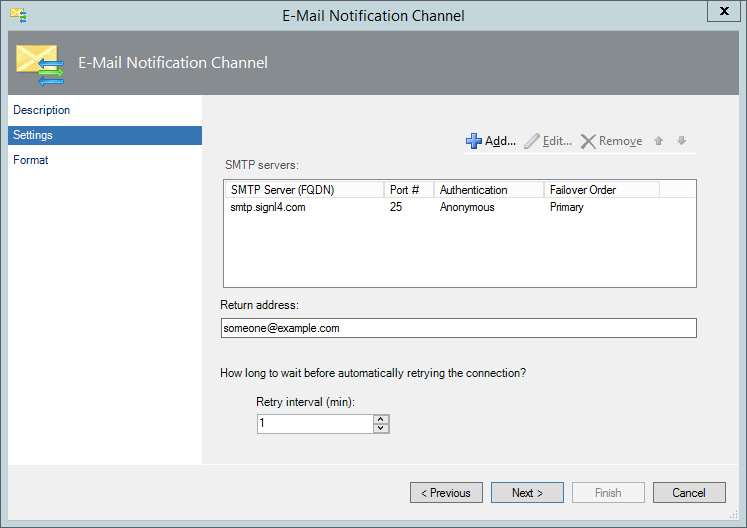
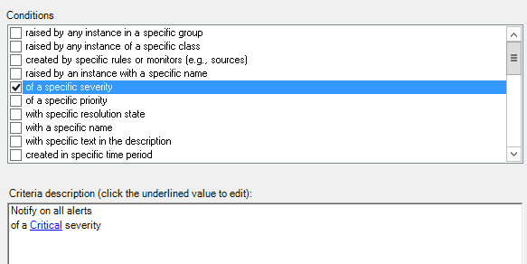
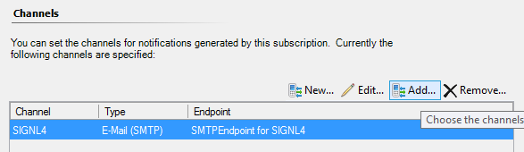

# SIGNL4 Integration with Microsoft SCOMSystem Center Operations Manager

SIGNL4 provides a convenient, out-of-the-box solution to send mobile SCOM alerts to your on duty ops team. The mobile app will send alert notifications persistently until a team member acknowledges the issue to ensure alerts are handled.

Using a SIGNL4 team-dedicated email address, [Microsoft SCOM](https://docs.microsoft.com/en-us/system-center/scom/welcome?view=sc-om-1801) can send automated push notifications to team members.

SIGNL4 provides a convenient, out-of-the-box solution to send mobile SCOM alerts to your ops teams. With SIGNL4 you can build subject expert teams and send SCOM alerts to team members on duty. With the SIGNL4 mobile app, teams easily check-in and check-out to receive SCOM alerts when they are on call. The mobile app will send alert notifications persistently until a team member acknowledges. This ownership is made transparent throughout the entire team. This way it is always ensured that alerts are being handled.

To create a SIGNL4 team to receive mobile alerts from SCOM, [get started here](https://www.signl4.com/free-trial-test/).

If you have SCOM already set up to send alerts via email you can just re-use what you’ve configured. Each SIGNL4 teams gets a dedicated email address. If not, simply follow these steps to prepare SCOM for SIGNL4.

## Prepare SCOM

In SCOM Operations Console, open the Administration section from the button left. On the left menu, find the notification section. You will have to create new records in that section which is described below in detail.

1. Create an Email "Channel".
    1. Under Channels, click "New" and select "Email (SMTP)…".
    2. Type in "SIGNL4" as name for the channel and click "Next".
    3. Click add to register a new SMTP address for the channel. Enter "smtp.signl4.com" as server address and make the box looking as in the below image. Afterwards, enter any email address as return address and set the retry interval to 1 minute. Once done, click "Next".  
        
        
    4. On the Format step you can configure which alert properties are included in the email that is sent to SIGNL4. We recommend to leave the defaults as they are. Don’t worry about readability at this stage. SIGNL4 has an intelligent parsing algorithm and ensures that SCOM alerts will look beautiful in the mobile app.
    5. Click "Finish" to let SCOM create that new E-mail channel.  
        .
2. Create a new "Subscriber".  
    The Subscriber represents your SIGNL4 team and will be the target when SCOM sends emails for new alerts it has discovered.
    
    1. Under Subscribers, click "New".
    2. Type "SIGNL4" as subscriber name and click "Next".
    3. Ensure the schedule is set to "Always send notifications" because the idea is to only have one subscriber that represents your whole SIGNL4 team. It then depends on your team members duty status if they’ll be alerted or not.
    4. Click the "Add" button on the addresses step. On the page that appears, type in "SIGNL4-Mail" and click "Next". Now select "Email (SMTP)" for the Channel Type and enter the email address of your SIGNL4 team in the field "Delivery address for selected channel".  
        You can find that email address in your SIGNL4 mobile app under "Gear settings" -> "Team"-> "APIs".  
        Once done proceed to the last wizard step for address creation. Make sure to set the schedule to "Always send notifications" for the same reasons described under bullet 3. After that click "Finish" to save this new address for your SIGNL4 Subscriber.  
        
    5. Click "Finish" to save the new subscriber in SCOM and proceed with creating a new subscription.  

3. Create a new "Subscription".  
    The subscription can contain criteria for alerts to be met in order to be send to your SIGNL4 team. The subscriptions links the E-mail channel, the SIGNL4 subscriber and your desired SCOM alerts together.
    
    1. Under Subscriptions click "New".
    2. Select a Subscription name such as "Alerts to SIGNL4 Team" and click "Next"
    3. If applicable, select criteria for alerts to be sent to your team or leave everything as is to send all alerts and click "Next". We suggest you add criteria to only send critical alerts to your team as shown below.  
        
    4. The next two wizard steps to master are "Subscribers" and "Channels". All you need to do is to add SIGNL4 Subscriber and the SIGNL4 E-mail channel which you have created earlier. Simply click "Add" (to to be confused with "New"), then search for SIGNL4 in the dialog window and take it from the search results. Once ready click "Next", review the summary and create and save this new subscription.  
        
        

## Give it a Test Drive

You can now test drive your new mobile alert notifications by simply generating an alert in SCOM. If they don’t appear automatically as part of your MP deployments, you may simply create a Windows Service monitor and e.g. stop the Print Spooler on a monitored host as we did.

You will receive a push notification on your phone.

The alert in SIGNL4 might look like this.

