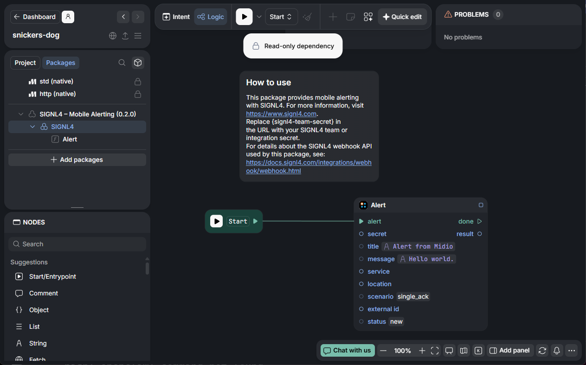

# SIGNL4 Integration with Midio

[Midio](https://midio.com/) is a visual programming platform for building and automating workflows, integrations, and AI-driven processes. It lets teams visually connect logic, data, and services to create complex systems and AI agents without traditional coding, supporting triggers, schedules, and external APIs. It blends low-code ease with powerful logic and service connections for real work automation.

SIGNL4 enhances Midio with reliable mobile alerting, including a mobile app, push notifications, SMS messages, voice calls, automated escalations, and on-call scheduling. SIGNL4 ensures that critical alerts reach the right people reliably – anytime, anywhere.

## Prerequisites

- A SIGNL4 (https://www.signl4.com/) account
- A Midio (https://midio.com/) account

## How to Integrate

If you’re familiar with Postman, the overall concept is quite similar.

You can use the HTTP Fetch node to send the HTTP POST request to SIGNL4 in order to trigger the alert.

For your convenience, there is a ready-to-use package called "SIGNL4 – Mobile Alerting". You can add this package and adapt it to suit your needs.

A project in Midio then looks like this:

Please refer to the [SIGNL4 webhook API documentation](https://docs.signl4.com/integrations/webhook/webhook.html) for more information about the parameters.

The alert in SIGNL4 might look like this.

