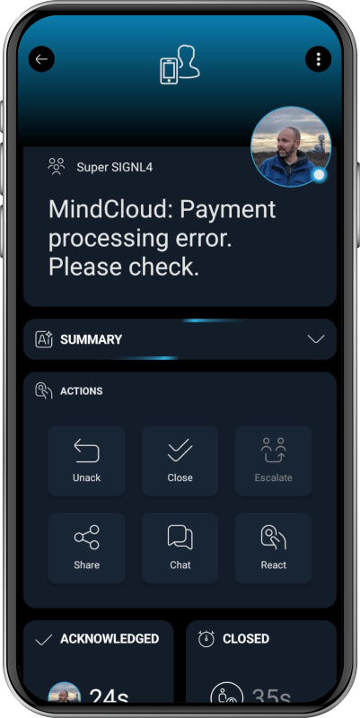

# SIGNL4 Integration with MindCloud

[MindCloud](https://mindcloud.co/) is an AI-powered iPaaS / integration platform that connects business systems like ERP, CRM, eCommerce and cloud apps, automating workflows and data flows. It also provides a delivery team to build, launch and support integrations.

SIGNL4 extends MindCloud with reliable mobile alerting, including a mobile app, push notifications, SMS messages, voice calls, automated escalations, and on-call scheduling. SIGNL4 ensures that critical alerts reach the right people reliably – anytime, anywhere.

Typical alerts sent from MindCloud to SIGNL4 depend on the workflow, but common examples include:
- ERP order exception triggers SIGNL4 alert to on-call operations staff
- Failed eCommerce checkout / payment integration creates urgent mobile alert
- CRM high-priority customer issue routes to sales / support via SIGNL4
- Warehouse or inventory sync failure notifies responsible IT team
- Cloud app / API integration outage escalates through SIGNL4 duty schedules

## Prerequisites
- A SIGNL4 (https://www.signl4.com/) account
- A MindCloud (https://mindcloud.co/) account

## How to Integrate

Integrating SIGNL4 with MindCloud is straightforward. Here’s how it works.

SIGNL4 is natively available in MindCloud, so you can easily add it to your workflow whenever you need to send critical alerts or trigger other alert-related actions.

Available SIGNL4 actions include:
- Trigger alerts
- Acknowledge alerts
- Close alerts
- List alerts
- And more

All you need to enable the SIGNL4 integration is your SIGNL4 API key.

That's it.

You can find more information on how to configure SIGNL4 mobile alerting in MindCloud [here](https://mindcloud.co/apps/signl4/integrations).

The alert in SIGNL4 might look like this.

